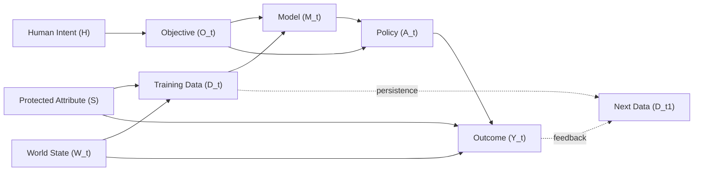

# Alignment Problem: Causal Graph for Data Representation and Algorithmic Bias

This folder now includes a machine-readable Structural Causal Model (SCM) and a deterministic audit script focused on your two core risk channels:

1. Data representation error (`D_t` does not represent the true world distribution)
2. Algorithmic bias propagation (`S -> D_t -> M_t -> A_t -> Y_t` and temporal feedback `Y_t -> D_t1`)

## Files

- `causal_graph.json`: node/edge schema, bias-sensitive paths, and intervention targets.
- `causal_graph_audit.py`: validates the graph, computes fairness gaps, simulates bias amplification, and evaluates alignment status.
- `sample_decisions.csv`: small demo dataset for fairness-gap calculations.

## Causal Structure



## Quick Start

```bash
python3 Alignment-Problem/causal_graph_audit.py \
  --spec Alignment-Problem/causal_graph.json \
  --dataset Alignment-Problem/sample_decisions.csv \
  --mediators representation_bucket \
  --execution-score 0.93 \
  --representation-score 0.82 \
  --initial-bias 0.30 \
  --feedback-strength 1.08 \
  --mitigation-strength 0.04 \
  --steps 8
```

## Output Highlights

The report includes:

- Graph validity checks (node coverage, edge integrity, DAG check on causal slice)
- Group fairness metrics
  - demographic parity gap
  - equal opportunity gap
  - false positive rate gap
  - aggregate fairness gap index
- Optional path-specific disparity decomposition
  - total group prediction gap
  - direct gap after blocking mediator paths
  - mediated gap removed ratio
  - sign-flip flag (suppression indicator after path blocking)
- Bias amplification trajectory (`bias_t -> bias_t+1`)
- Alignment decision from:
  - `EXECUTES(A,O)` threshold
  - `REPRESENTS(O,H)` threshold
  - `NOT BIASED(D)` threshold
- Intervention suggestions mapped to failed predicates

## Notes

- Temporal edges are treated as cross-time links and excluded from same-time DAG cycle checks.
- If no dataset is supplied, the audit still runs with graph validation and simulated bias dynamics.
- Path-specific decomposition uses mediator standardization and needs `--mediators` columns present in your dataset.
