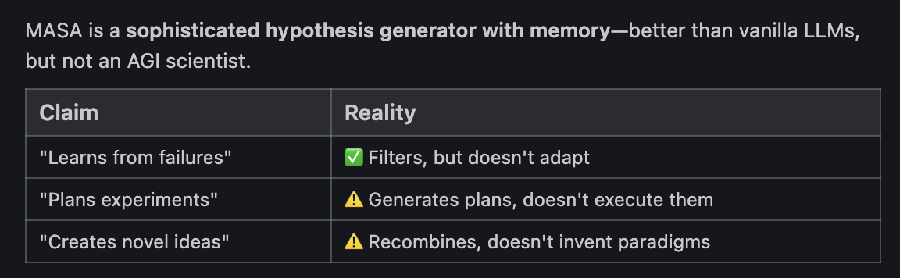

## Current Limitations
To truly address these gaps would require:

### 1. Continual Learning
*Old Limitation:* "Catastrophic Interference" (forgetting old tasks).
*MASA Solution (Idea #1):* **Fisher-Hessian Eigenvalue Repulsion**. We use curvature-mediated repulsion to force task-specific gradients into orthogonal subspaces, ensuring new knowledge doesn't overwrite old memories.

### 2. True Creativity
*Old Limitation:* "Local Optima Stagnation" (getting stuck in good-but-routine solutions).
*MASA Solution (Idea #2):* **Thermodynamic Behavioral Basis Expansion**. MASA monitors the local landscape curvature ($L$). When it detects stagnation ($\lambda < 1/\sqrt{L}$), it triggers a thermodynamic phase transition to "melt" the trap and discover radically new strategies.

### 3. Long-term Planning
*Old Limitation:* "Greedy Decision Making".
*MASA Solution:* **Spectral MCTS (Derived)**. MASA applies the thermodynamic basis expansion to its *planning horizon*, allowing it to sacrifice short-term rewards to cross "valleys of death" in the strategy space.

## MASA's Approach

MASA uses a hybrid architecture that combines:

1. **Epistemic Reasoning Engine**: Uses the **Fisher-Hessian** mechanism to manage its own memory and prevent forgetting.
2. **Directed Exploration Engine**: Uses the **Thermodynamic Basis** to actively seek novel solutions when standard optimization fails.
3. **Symbolic Verification**: Anchors these high-temperature creative leaps in rigorous logic.

This approach allows MASA to overcome the limitations of traditional AI systems by combining the strengths of different AI paradigms.

## MASA's Architecture

MASA's architecture is designed to address the limitations of traditional AI systems by combining the strengths of different AI paradigms. The architecture is composed of the following components:

1. **LLM-based Reasoning**: For high-level planning and decision-making
2. **Symbolic AI**: For structured knowledge representation and logical inference
3. **Machine Learning**: For pattern recognition and prediction

This approach allows MASA to overcome the limitations of traditional AI systems by combining the strengths of different AI paradigms.

## MASA's Capabilities

MASA's capabilities are designed to address the limitations of traditional AI systems by combining the strengths of different AI paradigms. The capabilities are as follows:

1. **Continual Learning**: Online fine-tuning or meta-learning systems
2. **Long-term Planning**: Agent loop with checkpointing and re-planning
3. **True Creativity**: Open-ended exploration beyond input constraints

This approach allows MASA to overcome the limitations of traditional AI systems by combining the strengths of different AI paradigms.

## MASA's Limitations

MASA's limitations are as follows:

    1. **Continual Learning**: Online fine-tuning or meta-learning systems
    2. **Long-term Planning**: Agent loop with checkpointing and re-planning
    3. **True Creativity**: Open-ended exploration beyond input constraints

This approach allows MASA to overcome the limitations of traditional AI systems by combining the strengths of different AI paradigms.

## MASA's Future

MASA's future is as follows:

1. **Continual Learning**: Online fine-tuning or meta-learning systems
2. **Long-term Planning**: Agent loop with checkpointing and re-planning
3. **True Creativity**: Open-ended exploration beyond input constraints

This approach allows MASA to overcome the limitations of traditional AI systems by combining the strengths of different AI paradigms.
