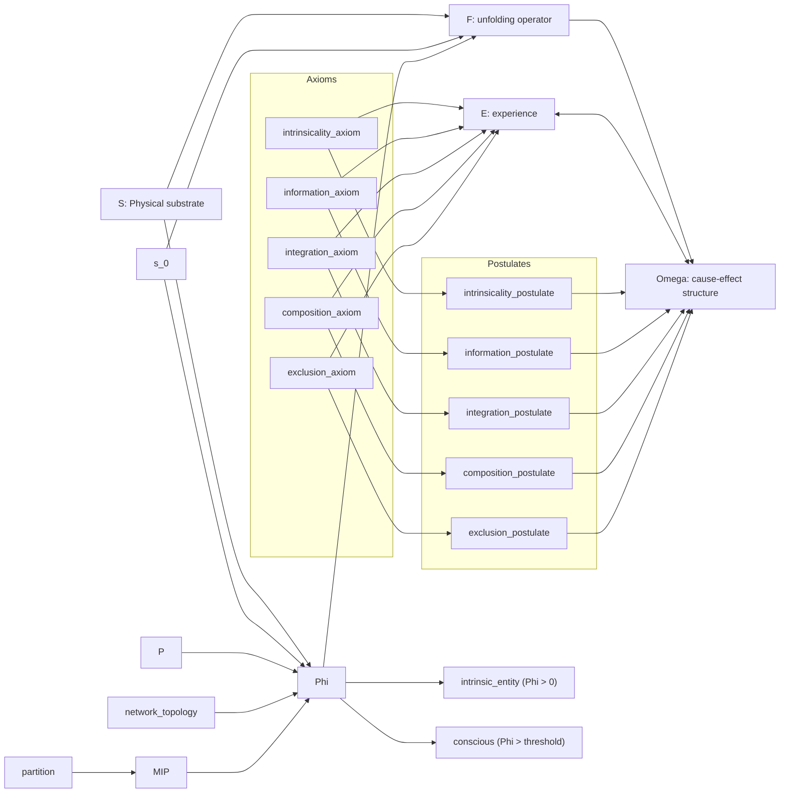

# Integrated Information Theory (IIT) Causal Graph

This directory contains an executable Structural Causal Model (SCM) implementation for IIT.

## Framework Overview

- **System tuple**: `U_IIT = <S, P, Phi, O>`
- **Identity principle**: `E ≡ Omega_Phi`
- **Dual-chain grounding**: 5 phenomenological axioms map 1:1 to 5 physical postulates.
- **Core theorem tested**: topology constrains integration (`Phi(grid) >> Phi(modular)`), and feedforward architectures collapse toward `Phi = 0`.

## Deliverables

- `Information-Theory/iit_causal_graph.json`: IIT causal graph spec (32 nodes, 49 edges)
- `Information-Theory/iit_audit.py`: validation + intervention simulator + visualization generator
- `Information-Theory/sample_iit_data.csv`: sample dataset with expected topology/Phi patterns
- `Information-Theory/figures/`: generated charts and audit report JSON

## Graph Structure

- Node count: **32** (`>= 25` requirement satisfied)
- Edge count: **49** (`>= 40` requirement satisfied)
- Domains used: `substrate`, `dynamics`, `integration`, `phenomenology`, `mechanism`, `ontology`



## Quick Start

```bash
cd Information-Theory

# Full audit (all validations + interventions + visualizations)
python3 iit_audit.py --spec iit_causal_graph.json --validate-all

# The command requested in the implementation spec
python3 iit_audit.py \
  --spec iit_causal_graph.json \
  --validate-phi \
  --validate-topology \
  --validate-exclusion \
  --validate-identity \
  --test-interventions

# Focused checks
python3 iit_audit.py --spec iit_causal_graph.json --validate-phi --validate-topology
python3 iit_audit.py --spec iit_causal_graph.json --validate-exclusion --validate-identity
```

## Expected Output Highlights

- `[PASS]` Topological inequality: `Phi(grid)=82.67 >> Phi(modular)=6.82`
- `[PASS]` Feedforward collapse: `Phi(feedforward) -> 0`
- `[PASS]` Binary exclusion: intrinsic entity iff `Phi > 0`
- `[PASS]` Identity behavior: `E` and `Omega` implemented as the same object in tests
- `[PASS]` Intervention effect: adding feedback loops raises `Phi` from `6.82` to `84.49` and crosses the conscious boundary

## Key Theorems Validated

- **Minimum Information Partition**: `Phi` is computed via minimization over candidate partitions.
- **Topological Determinism**: recurrent grid-like structure consistently yields high Phi relative to modular/feedforward.
- **Binary Exclusion Boundary**: `Phi > 0` vs `Phi = 0` classification is hard/binary.
- **Explanatory Identity**: `E ≡ Omega` tested as bidirectional identity, not correlation.
- **MICS Principle**: maximal local Phi structures are retained, overlapping non-maximal structures excluded.

## Visualization Gallery

Generated under `Information-Theory/figures/`:

- `iit_framework_quadrants.svg`
- `axiom_postulate_identity_bridge.svg`
- `topology_comparison_phi.svg`
- `great_divide_exclusion.svg`
- `phi_distribution_histogram.svg`
- `phi_vs_topology.svg`
- `topology_determinism.svg`
- `ontological_exclusion_boundary.svg`
- `unfolding_complexity.svg`
- `intervention_effects.svg`
- `iit_audit_report.json`
