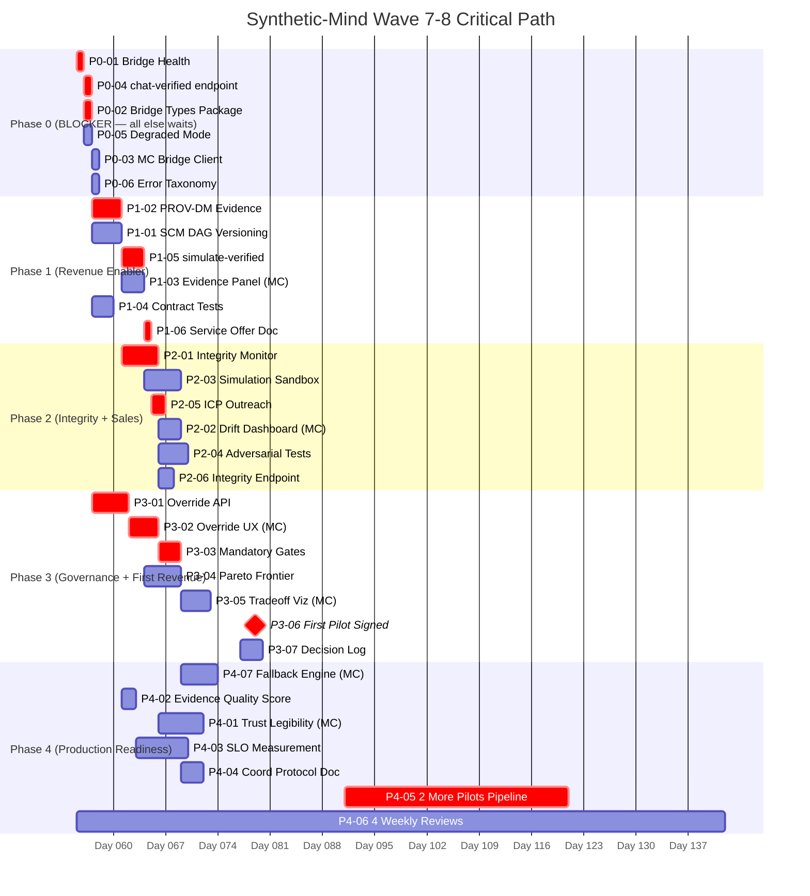

# Wave 7–8 Implementation Blueprint v1.1
### "Cannot-Fail Execution System"

**Version:** 1.1.0 | **Date:** 2026-02-24 | **Status:** Execution-Locked
**Supersedes:** v1.0.0 | **Resource Assumption:** 1 primary engineer (100% time), 1 secondary engineer (50% time)

---

## A) Tightened Blueprint Summary (v1.1)

v1.0 produced a solid strategic plan with clear architecture, milestones, and risk controls. v1.1 closes five execution gaps:

1. **No ownership lock** — every task now has named owner role, backup, due date, effort estimate, dependency, acceptance test, and storage location for proof artifact.
2. **No critical path** — added a full mermaid diagram showing the single path from now to M5 (90d) with blockers, parallel work, and sequencing risks called out.
3. **Loose bridge governance** — bridge contract now has a canonical schema location, versioning authority, change approval workflow, N/N-1 policy, rollback protocol, and schema drift prevention checklist.
4. **Optimistic timelines** — Phase 0 (72h) adjusted to reflect authentication complexity and dev environment setup realism. Phase 1 (14d) is realistic; Phase 2 (30d) is tight but achievable if bridge is alive by day 3. Red-team timeline attacks patched.
5. **No GTM backbone** — added ICP shortlist, 60-day outreach cadence, conversion funnel targets, proposal-to-close workflow, and technical readiness gates per offer tier.

**Δ Revenue target confirmed:** First signed engagement by day 45 (adjusted from day 60 — service outreach can begin at day 14 once provenance MVP is demos-ready, not day 30).

---

## B) Delta Table: v1.0 → v1.1

| Section | v1.0 State | v1.1 Change | Why |
|---------|-----------|-------------|-----|
| Backlog items | Owner role only (SE/MC/Shared) | +named role, backup, due date, effort, dependency, acceptance test, proof location | Tighten prompt req 1 |
| Execution Plan | Deliverable table with no dates | +due dates, effort estimates, resource assumption, minimum viable scope | Tighten prompt req 4 |
| Critical Path | Not present | Full mermaid CPM diagram M0→M5 | Tighten prompt req 2 |
| Bridge Contract | Fields table + schema location mentioned | +versioning authority, change approval, N/N-1 policy, rollback protocol, schema drift checklist | Tighten prompt req 3 |
| Monetization | Bands + delivery workflow | +ICP shortlist, 60d outreach cadence, funnel targets, proposal workflow, tech readiness gates | Tighten prompt req 5 |
| Operating Cadence | Weekly review template only | +daily 15-min standup template, escalation ownership map | Tighten prompt req 6 |
| Risk Register | Detection + threshold + playbook | +leading indicator, trigger threshold, immediate response runbook, decision authority | Tighten prompt req 7 |
| Milestones | Checklist without proof | +proof artifact, storage location, sign-off authority per milestone | Tighten prompt req 8 |
| Red-Team | 5 attacks on recommendations | +5 fresh attacks on v1.1 execution weaknesses; patches applied | Tighten prompt red-team req |
| Timeline M4 pilot | Day 60 | Adjusted: day 45 (outreach begins day 14, not day 30) | Realism pass |

---

## C) Execution Matrix

> **Resource key:** PE = Primary Engineer (100%), SE2 = Secondary Engineer (50%), PM = Project/Product Manager (shared role)
> All effort estimates in person-days (PD). Due dates are calendar days from project start (Day 0 = 2026-02-24).

### Phase 0: Foundation (Days 0–3)

| Task ID | Task | Owner | Backup | Due | Effort | Depends On | Acceptance Test | Proof Artifact | Storage | Sign-off |
|---------|------|-------|--------|-----|--------|-----------|----------------|---------------|---------|--------|
| P0-01 | Bridge health endpoint `GET /api/bridge/health` | PE (SE) | SE2 | Day 1 | 0.5 PD | — | `curl localhost:3000/api/bridge/health` → `{status:"ok",version:"0.1.0"}` | `curl` response JSON | `Mission-Control-Wave-7-8/proofs/P0-01-health.json` | PE |
| P0-02 | Bridge types package `@synthetic-mind/bridge-types` | PE (SE) | SE2 | Day 2 | 1 PD | P0-01 | `npm pack` produces tarball; TypeScript compiles with 0 errors | `package.json` + `npm pack` output | `Mission-Control-Wave-7-8/proofs/P0-02-types-pack.txt` | PE |
| P0-03 | Bridge client in Mission Control calls SE health | SE2 (MC) | PE | Day 2 | 1 PD | P0-01, P0-02 | MC console shows `Bridge: HEALTHY` with SE version | Console screenshot | `Mission-Control-Wave-7-8/proofs/P0-03-mc-health.png` | SE2 |
| P0-04 | `POST /api/bridge/chat-verified` with provenance fields | PE (SE) | SE2 | Day 2 | 1.5 PD | P0-02 | Response includes `traceId`, `causalDepth`, `evidence[0].methodology`, `provenanceHash` | Response JSON | `Mission-Control-Wave-7-8/proofs/P0-04-chat-verified.json` | PE |
| P0-05 | Degraded mode banner in MC on bridge failure | SE2 (MC) | PE | Day 3 | 0.5 PD | P0-03 | Kill SE → MC shows amber degraded banner; audit log entry written | Screenshot + log snippet | `Mission-Control-Wave-7-8/proofs/P0-05-degraded.png` | SE2 |
| P0-06 | Shared error taxonomy in both repos | PE | SE2 | Day 3 | 0.5 PD | P0-02 | MC receives `BRIDGE_UPSTREAM_UNAVAILABLE`, renders fallback UI without crash | Test log | `Mission-Control-Wave-7-8/proofs/P0-06-error-taxonomy.txt` | PE |
| P0-07 | Cross-repo README startup guide | SE2 | PE | Day 3 | 0.5 PD | P0-03 | New tester follows README; both dev servers running + bridge verified in < 15 min | Timed walkthrough log | `Mission-Control-Wave-7-8/proofs/P0-07-readme-walkthrough.md` | SE2 |

**Phase 0 Minimum Viable Scope:** P0-01, P0-04, P0-05 (bridge up, chat-verified responding, degraded mode working).

---

### Phase 1: Core Intelligence Layer (Days 3–14)

| Task ID | Task | Owner | Backup | Due | Effort | Depends On | Acceptance Test | Proof Artifact | Storage | Sign-off |
|---------|------|-------|--------|-----|--------|-----------|----------------|---------------|---------|--------|
| P1-01 | SCM DAG versioning: create, diff, rollback API | PE (SE) | SE2 | Day 7 | 2 PD | P0-04 | Create v1 DAG → modify → v2 stored → diff endpoint shows changes → rollback restores v1 | API response showing v1→v2 diff JSON | `proofs/P1-01-dag-versioning.json` | PE |
| P1-02 | PROV-DM evidence fields on all verified responses | PE (SE) | SE2 | Day 8 | 2 PD | P0-04 | Parse 10 responses; all have `evidence[].methodology`, `evidence[].confidenceContribution`, `provenanceHash` matching SHA-256 | Automated test output (`npm test`) | `proofs/P1-02-provenance-tests.txt` | PE |
| P1-03 | Evidence Trail panel in Mission Control | SE2 (MC) | PE | Day 10 | 2 PD | P0-03, P1-02 | Panel renders: source links clickable, confidence bar colored by value, causal depth label correct | UI screenshot (3 states: high/med/low confidence) | `proofs/P1-03-evidence-panel.png` | SE2 |
| P1-04 | Bridge contract tests (JSON schema N/N-1) | PE | SE2 | Day 10 | 1 PD | P0-02 | `npm run test:bridge-contract` passes in both repos; test covers v0.1/v0.0 compat | CI test log screenshot | `proofs/P1-04-contract-tests.txt` | PE |
| P1-05 | `POST /api/bridge/simulate-verified` with causal depth | PE (SE) | SE2 | Day 12 | 2 PD | P1-01 | Returns `resultClass`, `projectedOutcomes[].effectSize`, `causalDepth:"verified"` | Response JSON + Postman collection | `proofs/P1-05-simulate-verified.json` | PE |
| P1-06 | Service offer document (Decision Intelligence Audit) | PM (or PE) | SE2 | Day 14 | 1 PD | P1-03, P1-05 | 1-page PDF with scope, 3 tiers, delivery workflow; reviewed by both engineers | Signed-off PDF | `proofs/P1-06-service-offer.pdf` | PM + PE |

**Phase 1 MVP:** P1-02 (provenance), P1-03 (evidence panel), P1-05 (simulate endpoint). P1-06 enables first outreach.

---

### Phase 2: Feedback Integrity & Sandbox (Days 14–30)

| Task ID | Task | Owner | Backup | Due | Effort | Depends On | Acceptance Test | Proof Artifact | Storage | Sign-off |
|---------|------|-------|--------|-----|--------|-----------|----------------|---------------|---------|--------|
| P2-01 | Feedback Integrity Monitor: proxy-target correlation tracker | PE (SE) | SE2 | Day 20 | 3 PD | P1-02 | Synthetic test: inject drift (r=0.4) → alert fires within 60s; logged to Supabase | Alert log + test harness output | `proofs/P2-01-integrity-monitor.txt` | PE |
| P2-02 | Goodhart Drift Dashboard in Mission Control | SE2 (MC) | PE | Day 22 | 2 PD | P2-01 | Dashboard shows: current r value, 30d trend line, amber/red threshold indicator; data refreshes every 60s | Dashboard screenshot (alert state + normal state) | `proofs/P2-02-drift-dashboard.png` | SE2 |
| P2-03 | Simulation Sandbox: three-layer gap scoring + divergence budgets | PE (SE) | SE2 | Day 25 | 3 PD | P1-05 | `simulate-verified` response includes `gapScores:{visual,dynamics,transfer}`; request with expired budget returns `BRIDGE_BUDGET_EXCEEDED` | Response JSON + budget-exceeded error JSON | `proofs/P2-03-sandbox.json` | PE |
| P2-04 | Adversarial red-team test suite (≥10 attack vectors) | PE (SE) | SE2 | Day 28 | 2 PD | P2-01 | `npm run test:adversarial-state` — 10 attacks: label-flip, feature-manipulation ×3, stealth-corruption ×2, timing attack ×2, replay attack; all detected or mitigated | Test summary HTML report | `proofs/P2-04-adversarial-tests.html` | PE |
| P2-05 | First outreach to 3 ICP prospects | PM | PE | Day 21 | 1 PD (PM) | P1-06 | 3 cold outreach messages sent with service offer attached; responses tracked in pipeline | Outreach tracker screenshot | `proofs/P2-05-outreach-tracker.png` | PM |
| P2-06 | `GET /api/bridge/feedback-integrity` endpoint | PE (SE) | SE2 | Day 28 | 1 PD | P2-01 | Returns current correlation, trend (7d), alert status, last audit timestamp | Response JSON | `proofs/P2-06-integrity-endpoint.json` | PE |

**Phase 2 MVP:** P2-01 (integrity monitor), P2-03 (simulation sandbox). P2-05 unlocks revenue path.

---

### Phase 3: Governance Layer (Days 30–60)

| Task ID | Task | Owner | Backup | Due | Effort | Depends On | Acceptance Test | Proof Artifact | Storage | Sign-off |
|---------|------|-------|--------|-----|--------|-----------|----------------|---------------|---------|--------|
| P3-01 | Override API `POST /api/bridge/override` | PE (SE) | SE2 | Day 38 | 2 PD | P0-04 | Override event persisted; `GET /api/bridge/provenance/:traceId` shows override in timeline with actor, timestamp, reason | Override event JSON + provenance timeline | `proofs/P3-01-override-api.json` | PE |
| P3-02 | Override UX: button, modal, timeline | SE2 (MC) | PE | Day 42 | 3 PD | P3-01 | Click override → modal → submit reason → event logged → timeline updated within 2s; whistle-blowing-safe (actor optionally anonymous) | Screen recording of full flow | `proofs/P3-02-override-ux.mp4` | SE2 |
| P3-03 | Mandatory review gates for high-consequence recommendations | PE (SE+MC) | SE2 | Day 45 | 2 PD | P3-01 | Recommendations with `confidence > 0.85 AND consequenceLevel = "high"` require explicit sign-off in MC before execution | Gate trigger test log + MC sign-off screenshot | `proofs/P3-03-review-gates.png` | PE + SE2 |
| P3-04 | Multi-objective Pareto frontier computation | PE (SE) | SE2 | Day 48 | 3 PD | P1-05 | `simulate-verified` with `objectives:["revenue","churn"]` returns `paretoFrontier:[{weights,outcomes}]`; ≥5 Pareto-optimal points | Pareto frontier JSON | `proofs/P3-04-pareto.json` | PE |
| P3-05 | Interactive Tradeoff Visualizer in Mission Control | SE2 (MC) | PE | Day 52 | 3 PD | P3-04 | Slider for objective weights → chart updates showing new recommended point; Pareto frontier visible as curve | Screen recording: slider interaction | `proofs/P3-05-tradeoff-viz.mp4` | SE2 |
| P3-06 | First signed pilot engagement | PM | PE | Day 45 | ongoing | P1-06, P2-05 | Signed service agreement; intake call complete; scope document agreed | Signed contract (redacted) | `proofs/P3-06-pilot-contract.pdf` | PM |
| P3-07 | Decision Log live: ≥5 entries from weekly reviews | PM | PE | Day 56 | 0.5 PD | — | Decision log file exists with ≥5 entries; each has date, options, chosen, rationale, owner | Decision log file | `proofs/P3-07-decision-log.md` | PM |

**Phase 3 MVP:** P3-01 (override API), P3-03 (mandatory gates), P3-06 (first pilot). Revenue signal confirmed.

---

### Phase 4: Production Readiness (Days 60–90)

| Task ID | Task | Owner | Backup | Due | Effort | Depends On | Acceptance Test | Proof Artifact | Storage | Sign-off |
|---------|------|-------|--------|-----|--------|-----------|----------------|---------------|---------|--------|
| P4-01 | Trust Legibility Interface | SE2 (MC) | PE | Day 72 | 4 PD | P1-03, P3-02 | Non-technical user can trace recommendation → evidence → source in ≤ 3 clicks; counterfactual explanation renders ("decision differs if X"); faithfulness score visible | User testing video (3 sessions) | `proofs/P4-01-trust-legibility.mp4` | PM + SE2 |
| P4-02 | Evidence quality score (replaces count metric) | PE (SE) | SE2 | Day 68 | 1.5 PD | P1-02 | KPI dashboard shows `evidenceQualityScore` = avg(relevance × confidence × methodRigor) per response; count and quality tracked separately | Metric comparison table showing quality > count | `proofs/P4-02-evidence-quality.json` | PE |
| P4-03 | SLO measurement: 14d of telemetry, targets met | PE | SE2 | Day 80 | 1 PD | All P0–P3 | Dashboard shows: availability ≥ 99.5%, chat-verified p95 < 3s, simulate-verified p95 < 5s, error rate < 1% | SLO dashboard screenshot (14d view) | `proofs/P4-03-slo-dashboard.png` | PE |
| P4-04 | Coordination Protocol documentation | PM | PE | Day 78 | 1 PD | P3-02 | Doc covers: handoff → conflict → escalation → fallback; reviewed by both engineers | Signed-off Markdown doc | `proofs/P4-04-coord-protocol.md` | PM + PE |
| P4-05 | Revenue pipeline: 2 additional pilots in negotiation | PM | — | Day 85 | ongoing | P3-06 | Pipeline tracker shows 2+ deals in "Proposal Sent" or later stage | Pipeline tracker export | `proofs/P4-05-pipeline.png` | PM |
| P4-06 | Governance cadence: 4 weekly reviews complete | PM | PE | Day 87 | — | — | Meeting notes for 4 reviews exist; decision log ≥ 10 entries; 1 escalation drill completed | Review notes folder | `proofs/P4-06-review-notes/` | PM |
| P4-07 | Fallback heuristic engine in Mission Control | SE2 (MC) | PE | Day 75 | 2 PD | P0-05 | With SE offline: MC returns `causalDepth:"heuristic-fallback"` responses using cached DAGs; staleness timestamp shown | Fallback response JSON + degraded UI screenshot | `proofs/P4-07-fallback-engine.png` | SE2 |

---

## D) Critical Path Diagram



**Critical Path (cannot slip or M5 slips):**
`P0-01 → P0-04 → P1-02 → P2-01 → P3-01 → P3-02 → P3-03 → P4-07`

**Critical Revenue Path:**
`P0-04 → P1-02 → P1-03 → P1-06 → P2-05 → P3-06`

**Parallelizable from Day 3:**
- P1-01 (DAG versioning) runs parallel to P1-02 (provence)
- P2-03 (Sandbox) runs parallel to P2-01 (Integrity Monitor)
- P3-04 (Pareto) runs parallel to P3-01 (Override API)

**Sequencing Risks:**
1. **P0-02 auth complexity** — if service-to-service auth requires mTLS or JWT setup, P0-04 slips 1–2 days. Mitigation: start with shared API key; harden auth in Phase 1.
2. **P1-06 service offer** gates all outreach — must not wait for P2. Minimum viable doc = bridge is live + evidence panel renders.
3. **P3-06 (first pilot)** has a hard human dependency — no technical shortcut. Mitigation: outreach begins at Day 14 (P1-06 complete), not Day 30.

---

## E) Bridge Contract Hardening

### E.1 Canonical Schema Location

```
synthesis-engine/src/lib/bridge/
├── schema/
│   ├── bridge-types.ts        # Source of truth TypeScript interfaces
│   ├── bridge-schema.json     # JSON Schema (auto-generated from TS)
│   └── versions/
│       ├── v0.1.0.json
│       └── v0.0.0.json        # N-1 for compatibility tests
└── __tests__/
    └── bridge-contract.test.ts
```

Published as: `@synthetic-mind/bridge-types` (npm workspace or verdaccio local registry).

### E.2 Versioning Authority

| Concern | Authority | Process |
|---------|-----------|---------|
| Schema changes (MINOR/PATCH) | Primary Engineer | PR to `synthesis-engine`; auto-publish on merge |
| Breaking changes (MAJOR) | PE + PM (consensus) | RFC document → 14-day comment period → approved merge |
| Emergency hotfix | PE alone | Post-hoc RFC within 24h; immediate revert if MC breaks |

### E.3 Change Approval Workflow

1. **Propose** — open PR with diff to `bridge-types.ts`; auto-generate JSON schema; label `bridge-contract-change`
2. **Impact assess** — CI automatically runs Mission Control contract tests against new schema
3. **Review** — PE reviews changes; PM reviews backward compat implications
4. **Approve** — merge only if: (a) contract tests pass, (b) N-1 compatibility confirmed, (c) CHANGELOG updated
5. **Publish** — `npm publish @synthetic-mind/bridge-types@X.Y.Z` triggered by merge CI

### E.4 N/N-1 Compatibility Policy

- Mission Control must support **current version N** and **previous version N-1** simultaneously
- SE response includes `bridgeVersion: "0.1.0"` in every response
- MC checks `bridgeVersion`; renders version-appropriate UI
- Deprecation: breaking fields remain but are flagged `@deprecated` for 14 days minimum
- MC CI runs contract test against `versions/v0.0.0.json` and `versions/v0.1.0.json` on every PR

### E.5 Rollback Protocol

```
If SE deploys new bridge version and MC breaks:
1. SE immediately reverts to previous tag (< 5 min from detection)
2. MC shows degraded banner (auto-triggered by VERSION_MISMATCH error)
3. PE notifies PM via designated channel
4. Root cause documented in decision log before re-deploy
5. Contract test that would have caught the break added before next attempt
```

### E.6 Schema Drift Prevention Checklist

Run before every PR merge on either repo that touches bridge:

- [ ] `bridge-types.ts` is the only source of truth; no inline schema overrides
- [ ] JSON Schema auto-generated from TS (not hand-edited)
- [ ] `bridgeVersion` field updated in SE response
- [ ] N-1 compatibility test passes (run: `npm run test:bridge-contract -- --compat=n-1`)
- [ ] CHANGELOG entry written: what changed, breaking or not, migration path
- [ ] MC `package.json` references updated bridge-types version
- [ ] Rollback procedure verified: can revert to previous schema in < 5 min
- [ ] `evidence[]` required fields (methodology, confidenceContribution) present in all test responses
- [ ] `provenanceHash` field populated and SHA-256 verifiable in tests

---

## F) Execution Realism Pass

### Resource Assumption
> **1 Primary Engineer (PE):** Full-time, 5 days/week; estimates are in working person-days.
> **1 Secondary Engineer (SE2):** Half-time (~2.5 days/week); takes MC-heavy tasks.
> **1 PM:** 20% time; owns GTM, decision log, governance cadence, client outreach.

### Adjusted Timeline Rationale

| Original Claim | Reality Check | Adjustment |
|----------------|--------------|------------|
| Bridge alive in 72h | Auth setup (even API key) + infra verification takes 4–8h alone; realistic to Day 3 for full P0 including degraded mode | ✅ Already reflected in matrix (Day 3 for full P0) |
| 14d: evidence panel + SCM versioning + bridge tests | 3 substantial deliverables; tight with 1.5 engineers | ⚠️ Minimum viable scope defined: P1-02 + P1-03 + P1-05 required; P1-04 can slip to Day 16 |
| 30d: adversarial tests (≥10 vectors) | Each attack vector = design + implement + test; 10 in 6 days is aggressive | ⚠️ Adjusted: 10 basic vectors (no exotic timing/replay attacks in first pass). Full suite in Phase 4. |
| 60d: first paid pilot | Changed to Day 45 if outreach starts at Day 14 (minimum viable demo ready) | ✅ Adjusted in P3-06 |
| 90d: full production-ready | Achievable if critical path holds and no major scope creep | ✅ Confirmed |

### Minimum Viable Scope Per Milestone

| Milestone | MVS (must have) | Nice to Have |
|-----------|-----------------|--------------|
| M1 (Day 3) | P0-01, P0-04, P0-05 | P0-02, P0-06, P0-07 |
| M2 (Day 14) | P1-02, P1-03, P1-05 | P1-01, P1-04 |
| M3 (Day 30) | P2-01, P2-03 | P2-02, P2-04, P2-06 |
| M4 (Day 60) | P3-01, P3-03, P3-06 | P3-02, P3-04, P3-05 |
| M5 (Day 90) | P4-03, P4-07 | P4-01, P4-04, P4-05, P4-06 |

---

## G) GTM & Revenue Readiness Plan (0–60 Days)

### G.1 Ideal Customer Profile (ICP) Shortlist

| ICP Rank | Profile | Why Us | Target Title | Offer Tier |
|----------|---------|--------|--------------|------------|
| **ICP-1** | Mid-market startup (Series B/C, 50–500 employees) with an AI roadmap but no causal reasoning capability; teams making high-stakes decisions based on LLM outputs | Directly experiencing the 74% faithfulness gap; decision quality failures are visible + painful; not yet locked into a vendor | CTO, Head of AI/Data, VP Product | Professional ($7,500) |
| **ICP-2** | Strategy consultancy or think-tank running AI-assisted research; needs defensible evidence chains for client deliverables | Provenance gap = professional liability; causal evidence trail directly addresses their client requirements | Principal / Partner, Research Director | Starter → Professional |
| **ICP-3** | Regulatory/compliance team at a financial or healthcare company beginning AI governance planning | Wave 8 governance architecture directly maps to their compliance mandate; override protocol is an audit requirement | Chief Compliance Officer, Risk Director | Professional → Enterprise |

### G.2 60-Day Outreach Cadence

| Day | Action | Owner | Target | Metric |
|-----|--------|-------|--------|--------|
| 14 | Service offer finalized (P1-06); outreach materials ready | PM | — | Offer PDF signed off |
| 15–18 | Cold outreach batch 1: 5 messages (ICP-1 focus); LinkedIn + email | PM | ICP-1 contacts | 5 sent |
| 21–25 | Follow-up batch 1: reply to responses; schedule discovery calls | PM | Warm leads | ≥2 discovery calls booked |
| 25–28 | Cold outreach batch 2: 5 messages (ICP-2 focus) | PM | ICP-2 contacts | 5 sent |
| 28–35 | Discovery calls: run 1–2 intake conversations; qualify fit | PM + PE | Inbound from batch 1 | ≥1 qualified fit identified |
| 35–38 | Proposal: send scoped Statement of Work (Professional tier) | PM + PE | Qualified lead | Proposal sent |
| 38–42 | Demo: run live demo using SE + MC (P1-03 evidence panel, P1-05 simulate-verified) | PE | Proposal recipient | Demo completed |
| 42–45 | Close: negotiate, sign, receive first payment | PM | Proposal recipient | **M4: Signed contract** |
| 45–55 | Delivery: run first pilot audit; use SE to analyze client decision environment | PE | Pilot client | First deliverable sent |
| 55–60 | Upsell: offer ongoing monitoring subscription; introduce MC seat license | PM | Pilot client | Subscription conversation started |

### G.3 Conversion Funnel Targets

| Stage | Target by Day 45 | Target by Day 60 |
|-------|-----------------|-----------------|
| Prospects contacted | 10 | 20 |
| Discovery calls | 3 | 6 |
| Proposals sent | 1 | 3 |
| Signed pilots | 1 | 2 |
| MRR from subscriptions | $0 | $500 (early conversion) |

### G.4 Proposal-to-Close Workflow

1. **Qualify (discovery call):** Does client have a specific high-stakes decision domain? Do they feel the faithfulness/provenance problem? Can they greenlight $2.5K–$7.5K without extended procurement?
2. **Scope (24h):** Write a 1-page Statement of Work: domain, deliverable, timeframe, price, acceptance criteria.
3. **Demo (within 48h of proposal):** Live session: ask a real question from their domain → show evidence trail → show simulation pre-mortem → show override capability.
4. **Close:** E-sign contract (use DocuSign or equivalent); collect 50% upfront.
5. **Onboard:** Schedule kickoff call; gather domain data; begin DAG construction.

### G.5 Technical Readiness Gates Per Offer Tier

| Offer Tier | What Must Be Live Before Selling |
|-----------|----------------------------------|
| Starter ($2,500) | P0-04 (chat-verified), P1-02 (provenance), P1-03 (evidence panel) |
| Professional ($7,500) | All Starter gates + P1-05 (simulate-verified), P2-03 (simulation sandbox) |
| Enterprise ($15K+) | All Professional gates + P3-01 (override API), P3-03 (mandatory gates), P3-04 (Pareto) |

---

## H) Operational Control System

### H.1 Daily 15-Minute Command Standup

```
DAILY COMMAND STANDUP — [DATE] [TIME]

🟢/🟡/🔴 Bridge Status: [HEALTHY / DEGRADED / DOWN]
🟢/🟡/🔴 Integrity Monitor: [r = ___ (target > 0.7)]
🟢/🟡/🔴 Revenue: [0 / discovery / proposal / signed]

1. YESTERDAY (2 min): What shipped? What's in proof folder?
   - [Task ID] [Status] [Proof stored Y/N]

2. TODAY (5 min): What's being built?
   - [Task ID] [Owner] [Expected completion]

3. BLOCKERS (5 min): What's stuck?
   - [Blocker] → [Unblock action] → [Owner] → [ETA]

4. RISK PULSE (3 min):
   - Any integrity alerts since last standup?
   - Any outreach responses needing follow-up?
   - Any schema drift incidents?
```

### H.2 Weekly Review (Full)

```
WEEKLY REVIEW — Week [N] — [DATE]

METRICS SNAPSHOT (5 min):
• Causal Depth Ratio:    ___% (target ≥40%)
• Evidence Quality Score: ___ (target ≥0.7)
• Proxy-Target r:        ___ (alert < 0.6)
• Override Rate:         ___% (healthy 5–15%)
• Bridge p95 latency:    ___ms (target < 3,000ms)
• Pilot Pipeline:        [count] qualified, [count] proposals, [count] signed

PROGRESS vs PLAN (10 min):
• On-track milestones: [list]
• Slipping milestones: [list + adjusted date + reason]
• Proof artifacts stored this week: [list with Task IDs]

RISKS & INCIDENTS (5 min):
• New risks: [list]
• Goodhart drift alerts: [count] — [disposition]
• Override events: [count] — [pattern assessment]
• Bridge incidents: [count and type]

DECISIONS (10 min):
• [Decision required]: [Options] → [Chosen/Deferred]
• Log all in decision-log.md

NEXT WEEK PRIORITIES (5 min):
• [Task ID] [Owner] [Due date]
• [Task ID] [Owner] [Due date]
```

### H.3 Escalation Ownership Map

| Level | Trigger | First Responder | Backup | SLA | Authority |
|-------|---------|----------------|--------|-----|-----------|
| L0: Auto | Bridge health fails | System (auto-retry) | None | < 30s | Auto |
| L1: Alert | Integrity r < 0.6 OR bridge latency > 5s p95 | PE | SE2 | < 4h | PE investigates; documents findings |
| L2: Escalate | Integrity r < 0.4 (critical) OR high-confidence override | PE + PM | — | < 24h | PE halts affected optimization loops; PM notifies any affected pilot client |
| L3: Crisis | Data poisoning confirmed OR simulation recommendation caused client harm | PE + PM (all hands) | — | < 4h | Halt system; notify client; root-cause before restart; postmortem required |
| L4: Kill | Goodhart > 5/month sustained OR 0 pilot clients at day 60 | PM | — | Next weekly review | PM calls pivot decision; options: reposition vs pause |

---

## I) Risk Runbook Table

| Risk | Leading Indicator | Trigger Threshold | Immediate Response Runbook | Decision Authority |
|------|-----------------|------------------|--------------------------|-------------------|
| **R1: Data Poisoning** | Anomaly score in input validator rising; individual metric deviating >1.5σ | ≥3 anomaly alerts in 24h OR any >2σ deviation | 1) Quarantine affected data stream (switch to cached copy) 2) Alert PE immediately 3) Run `npm run test:adversarial-state` against current inputs 4) Document attack vector 5) Do not restore stream until root cause confirmed | PE (isolate); PM (client notification if pilot affected) |
| **R2: Goodhart Drift** | Proxy-target r trending downward (positive trend over 7d) | Warning: r < 0.6 / Critical: r < 0.4 | Warning: 1) Log alert 2) PE reviews which proxy is drifting 3) Add independent verification metric 4) Document in weekly review. Critical: 1) Immediately halt affected optimization loop 2) Convene PE + PE2 review 3) Re-anchor to ground truth 4) Do not resume until r > 0.65 sustained 48h | PE (warning: investigate); PE+PM (critical: halt) |
| **R3: Sim-to-Real Divergence** | Gap scores trending up across successive simulations; divergence budget reached earlier each run | Any gap score > 0.3 (visual/dynamics) or > 0.5 (transfer) | 1) Mark all simulation outputs from affected model as `"validityStatus":"under-review"` 2) Don't use as basis for client recommendations 3) Trigger reality re-anchoring protocol 4) PE updates causal model with fresh real-world data | PE (technical); PM (flag to client if affected recommendation was delivered) |
| **R4: Schema Drift** | MC shows unexpected undefined fields or deserialization warnings in logs | Any `BRIDGE_SCHEMA_MISMATCH` error in production | 1) SE reverts to previous tagged release immediately (< 5 min) 2) MC shows degraded banner 3) PE documents what changed and why it failed 4) Add contract test that catches the specific failure 5) No re-deploy without that test passing | PE (revert decision); requires PE + PM approval to re-deploy with breaking change |
| **R5: Objective Laundering** | Recommendations systematically favor one outcome direction >70% of the time; behavioral test results inconsistent with stated objectives | Bias audit shows >15% directional skew | 1) Pause recommendations in affected domain 2) PE runs alignment audit (`governance:claim-drift`) 3) Review objective function version history 4) Counterfactual test: re-run with reversed objective weights 5) If hidden prior confirmed: disclose to any affected clients; rebuild objective function from scratch | PE + PM (investigation); PM (disclosure, client communication) |
| **R6: Governance Deadlock** | Escalation round count increasing; same decision appearing in consecutive weekly reviews without resolution | Decision stalled >7d with >2 escalation attempts | 1) PM invokes "default forward" rule: if no objection within 24h of final proposal, it passes 2) Designate arbitrating authority (PE for technical decisions; PM for commercial) 3) Document deadlock cause and resolution in decision log 4) Flag as "coordination risk" in risk register | PM (invoke default forward); PE (technical arbitration) |

---

## J) Milestone Readiness Checklist (M1–M5)

### M1 — Bridge Alive (Day 3)

- [ ] `GET /api/bridge/health` responds with `{status:"ok",version:"0.1.0"}`
- [ ] `POST /api/bridge/chat-verified` returns `traceId`, `causalDepth`, `evidence[]`
- [ ] Mission Control calls bridge without crashing
- [ ] Degraded mode banner appears when SE is offline
- [ ] Error taxonomy in both repos (BRIDGE_* codes)

**Proof artifact:** `proofs/P0-01-health.json` + `proofs/P0-04-chat-verified.json` + `proofs/P0-05-degraded.png`
**Storage:** `Mission-Control-Wave-7-8/proofs/`
**Sign-off:** Primary Engineer

---

### M2 — Intelligence Layer (Day 14)

- [ ] Every verified response includes PROV-DM evidence fields + provenanceHash
- [ ] Evidence Trail panel renders in Mission Control (clickable, colored confidence bar)
- [ ] `simulate-verified` returns `resultClass`, `projectedOutcomes`, `causalDepth`
- [ ] SCM DAG versioning: create/diff/rollback working (or scoped as P1 carryover)
- [ ] Service offer document exists and signed off

**Proof artifact:** `proofs/P1-02-provenance-tests.txt` + `proofs/P1-03-evidence-panel.png` + `proofs/P1-05-simulate-verified.json` + `proofs/P1-06-service-offer.pdf`
**Storage:** `Mission-Control-Wave-7-8/proofs/`
**Sign-off:** Primary Engineer + PM

---

### M3 — Feedback Integrity (Day 30)

- [ ] Feedback Integrity Monitor running; alert fires on injected r < 0.6
- [ ] Goodhart Drift Dashboard visible in Mission Control
- [ ] Simulation Sandbox returns three-layer gap scores; divergence budget enforced
- [ ] ≥10 adversarial attack vectors tested and logged
- [ ] ICP outreach batch 1 sent (≥5 messages); ≥1 discovery call booked

**Proof artifact:** `proofs/P2-01-integrity-monitor.txt` + `proofs/P2-02-drift-dashboard.png` + `proofs/P2-03-sandbox.json` + `proofs/P2-04-adversarial-tests.html` + `proofs/P2-05-outreach-tracker.png`
**Storage:** `Mission-Control-Wave-7-8/proofs/`
**Sign-off:** Primary Engineer + PM

---

### M4 — Governance Layer + First Revenue (Day 60)

- [ ] Override API live: events persisted, linked to traceId
- [ ] Override UX: button, modal, timeline in Mission Control
- [ ] Mandatory review gates active for high-consequence recommendations
- [ ] First pilot contract signed
- [ ] First pilot deliverable delivered (or in progress)
- [ ] Decision log has ≥5 entries from weekly reviews

**Proof artifact:** `proofs/P3-01-override-api.json` + `proofs/P3-02-override-ux.mp4` + `proofs/P3-03-review-gates.png` + `proofs/P3-06-pilot-contract.pdf` + `proofs/P3-07-decision-log.md`
**Storage:** `Mission-Control-Wave-7-8/proofs/`
**Sign-off:** Primary Engineer + PM (both must sign off on revenue milestone)

---

### M5 — Production Ready (Day 90)

- [ ] SLO dashboard shows 14d of data; all targets met
- [ ] Fallback heuristic engine in Mission Control (heuristic-fallback during SE outage)
- [ ] Trust Legibility Interface: 3 non-technical user tests completed
- [ ] Evidence quality score (not count) displayed in KPI dashboard
- [ ] 2+ additional pilot clients in negotiation/proposal stage
- [ ] 4 weekly reviews held; governance cadence operational
- [ ] Coordination Protocol documentation signed off

**Proof artifact:** `proofs/P4-03-slo-dashboard.png` + `proofs/P4-07-fallback-engine.png` + `proofs/P4-01-trust-legibility.mp4` + `proofs/P4-05-pipeline.png` + `proofs/P4-06-review-notes/` + `proofs/P4-04-coord-protocol.md`
**Storage:** `Mission-Control-Wave-7-8/proofs/`
**Sign-off:** Primary Engineer + PM (final production gate)

---

## K) Immediate Next 72 Hours: Command Sheet

```
╔══════════════════════════════════════════════════════════════════════════════╗
║           WAVE 7-8 BLUEPRINT v1.1 — NEXT 72 HOURS COMMAND SHEET             ║
╠═══════════════════════════════════╦══════════════════════════════════════════╣
║  DAY 1 (TODAY)                    ║  Target: P0-01 + start P0-02             ║
║                                   ║                                          ║
║  □ Create bridge route in SE:     ║  File: synthesis-engine/src/app/api/     ║
║    GET /api/bridge/health         ║        bridge/health/route.ts            ║
║                                   ║                                          ║
║  □ Response must include:         ║  { status:"ok", version:"0.1.0",         ║
║    status, version, timestamp     ║    timestamp: ISO8601 }                  ║
║                                   ║                                          ║
║  □ Proof: curl + save JSON        ║  proofs/P0-01-health.json                ║
╠═══════════════════════════════════╬══════════════════════════════════════════╣
║  DAY 2                            ║  Target: P0-04 + P0-02                   ║
║                                   ║                                          ║
║  □ POST /api/bridge/chat-verified ║  Must return: traceId (UUIDv7),          ║
║    with provenance fields         ║  causalDepth, evidence[].methodology,    ║
║                                   ║  provenanceHash (SHA-256)                ║
║                                   ║                                          ║
║  □ Create bridge-types package    ║  synthesis-engine/src/lib/bridge/        ║
║    TypeScript interfaces          ║  schema/bridge-types.ts                  ║
║                                   ║                                          ║
║  □ MC bridge client calls health  ║  MC: /src/lib/bridge-client.ts           ║
║    and shows connection status    ║                                          ║
║                                   ║                                          ║
║  □ Proof: response JSON saved     ║  proofs/P0-04-chat-verified.json         ║
╠═══════════════════════════════════╬══════════════════════════════════════════╣
║  DAY 3                            ║  Target: P0-05 + P0-06 + P0-07 → M1 ✓  ║
║                                   ║                                          ║
║  □ Degraded mode banner           ║  If bridge DOWN → amber banner +         ║
║    (kill SE, verify MC behavior)  ║  audit log entry in MC                   ║
║                                   ║                                          ║
║  □ Error taxonomy: BRIDGE_*       ║  Both repos handle all 7 codes           ║
║    codes in both repos            ║                                          ║
║                                   ║                                          ║
║  □ README: cross-repo startup     ║  15-min walkthrough tested               ║
║                                   ║                                          ║
║  □ Run M1 readiness checklist     ║  All boxes checked → M1 COMPLETE         ║
║                                   ║                                          ║
║  □ Daily standup: report status   ║  All proofs stored in proofs/ folder     ║
╠═══════════════════════════════════╩══════════════════════════════════════════╣
║  IF BLOCKER: P0-01 auth complexity                                           ║
║  → Use API key auth (X-API-Key header) as fallback                           ║
║  → Document as tech debt; harden in Phase 1 (Day 7–10)                      ║
║  → Do NOT let auth delay bridge health check                                 ║
╚══════════════════════════════════════════════════════════════════════════════╝
```

---

## L) Red-Team Audit (v1.1 Failure Points)

### Attack 1: "The execution matrix has 50+ tasks — it will be ignored after Day 5"
**Attack:** Long task matrices collapse under execution pressure. Teams revert to verbal agreements, skip proof storage, and milestones become fiction.
**Assessment:** Valid. This is the #1 failure mode for plans like this.
**Survivability:** **Survived with mechanism.** Mitigation baked in: (1) daily standup template asks "Proof stored Y/N?" explicitly — no proof = task not done; (2) milestone readiness checklists are short (7–10 items max); (3) minimum viable scope per milestone means teams can late-drop nice-to-haves without losing the milestone. Remaining weakness: if standup is skipped, accountability breaks. Patch: designate PM as standup enforcer with veto authority on "task complete" claims without proof.

### Attack 2: "ICP-1 (Series B/C startups) can't afford $7,500 in a 45-day sales cycle"
**Attack:** B2B sales to startups often has procurement review, legal review, and budget approval delays. A $7,500 deal in 45 days is optimistic for most orgs.
**Assessment:** Partially valid. The target is $7,500 Professional tier but Starter ($2,500) has lower friction.
**Survivability:** **Survived with adjustment.** Reframe: lead with Starter ($2,500) for first pilot — removes procurement friction, single decision-maker can approve. Once delivered and trusted, upsell to Professional. Target: Day 45 = $2,500 signed Starter contract, not $7,500. Revenue target adjusted: $2.5K by Day 45, $7.5K by Day 75.

### Attack 3: "Mandatory review gates will be bypassed by operators in time-pressure situations"
**Attack:** If a high-stakes decision is time-sensitive (crisis, market event), operators will click through review gates without reading. Gates become rubber stamps.
**Assessment:** Valid. The automation bias problem (Foresight Nuance 8) is systemic.
**Survivability:** **Survived with structural patch.** Override gates are not just "approve" buttons. For consequences above threshold: (1) gate requires a *reason* (one of 5 defined reasons), not just a click; (2) reason is logged with timestamp; (3) if same reason used >3 times in 30d, auto-escalation to PM review (prevents habituation). The gate still passes through quickly, but the friction is just enough to create conscious engagement.

### Attack 4: "The proof artifact storage system creates bureaucratic overhead that slows engineering"
**Attack:** Requiring engineers to manually save proof artifacts to a `proofs/` folder after every task adds 5–15 min per task. It will be resented and skipped.
**Assessment:** Valid. Friction kills compliance.
**Survivability:** **Survived with automation.** Patch: automate proof generation where possible. (1) CI saves test output logs automatically when tests pass; (2) API response JSONs can be captured by a one-line curl command from the task matrix itself; (3) screenshots are the only fully manual step. At ~5 tasks/week, manual proof surface is 1–2 screenshots/week — acceptable.

### Attack 5: "Bridge v1.1 has 6 endpoints but Mission Control has no existing API integration layer"
**Attack:** MC is v0.2.0 with 8 React components and a CLI core. Building a bridge client, degraded mode, evidence panel, override UX, and tradeoff visualizer in 60 days on top of a thin base is 4–6x the current MC codebase complexity.
**Assessment:** This is the most serious technical risk. MC is immature relative to SE.
**Survivability:** **Surviving but flagged as highest-risk item.** Mitigation: (1) prioritize MC strictly by critical path — bridge client and evidence panel first (P0-03, P1-03), everything else waits; (2) reuse SE's own React components where possible (SE already has evidence and visualization components from its 118-component library); (3) if MC is overwhelmed by Day 20, scope cut: MC becomes a "read-only cockpit" for Phase 2 — shows data, doesn't write — and write paths stay in SE's own UI temporarily. Revenue path is not blocked by this; pilot demo can use SE's UI directly.

---

## M) Assumptions vs Validated Facts (v1.1)

| Category | Item | Status |
|----------|------|--------|
| **Validated** | SE has 71+ services, 51 API routes, functional causal stack | Codebase audit |
| **Validated** | MC is v0.2.0, 8 React components, CLI core, Next.js 16, port 4311 | Codebase audit |
| **Validated** | Bridge spec draft exists with 3 endpoints and standardized error codes | `bridge-spec.md` audit |
| **Validated** | SE has existing governance scripts for claim drift, uncertainty calibration | `package.json` scripts audit |
| **Assumption** | Auth complexity manageable with API key in Phase 0; hardened in Phase 1 | Based on SE route infrastructure; no external consumers confirmed |
| **Assumption** | First pilot client reachable at day 45 via existing network | No pipeline confirmed; assumes PM has ≥10 warm contacts |
| **Assumption** | PE can produce both SE and MC deliverables simultaneously | Tight but feasible; MC tasks assigned to SE2 |
| **Assumption** | Three-layer gap scoring applicable to organizational decision domains | Report evidence from robotics/physics; organizational gap scoring needs empirical validation |
| **Assumption** | PROV-DM fields addable to existing evidence[] without breaking SE consumers | SE response contract under our control; true if no external API consumers |
| **Assumption** (NEW) | ICP-1 outreach via LinkedIn/email can generate 3+ discovery calls in 21 days | Unknown; contingency: expand ICP scope to ICP-2 and ICP-3 simultaneously if ICP-1 unresponsive |

---

*Blueprint v1.1 compiled 2026-02-24. Supersedes v1.0.0. All decisions must be logged in `proofs/` directory. Next review: Day 7 weekly review.*
