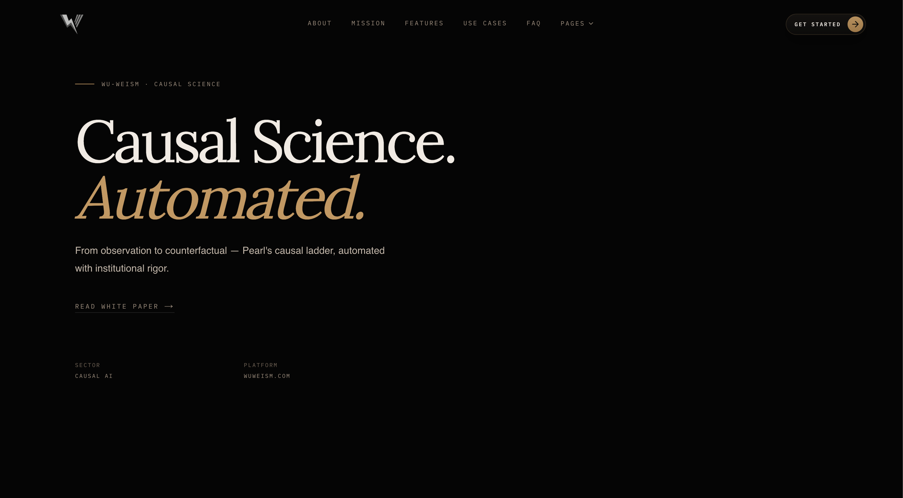

<table>
  <tr>
    <td width="180" align="center" valign="middle">
      
    </td>
    <td valign="middle">
      <p><sub>MASA WORKBENCH</sub></p>
      <h1>Wu-Weism</h1>
      <p><strong>Wu-Weism</strong> is the public-facing product identity for the MASA workbench. <code>crucible</code> is the internal codename for the repository and engineering platform behind it. Causal science, auditable reasoning, and closed-loop research workflows. </p>
    </td>
  </tr>
</table>

<p align="center">
  
  
  
  
  
</p>

<p align="center">
  
</p>

## What This Repository Is

This repository is the implementation surface for MASA-style workflows:

- causal and epistemic analysis interfaces
- claim, provenance, and governance ledgers
- SCM-oriented APIs, validation, and promotion flows
- benchmark, integrity, and drift-check automation
- domain surfaces for legal, lab, education, and hybrid synthesis work

The repo name does not need to match the app domain. Public-facing surfaces should use `Wu-Weism`; internal engineering references can continue using `crucible`.

## Current Product Surface

The application currently exposes a multi-surface workbench rather than a single narrow tool:

- `/` public landing page
- `/chat` research chat and workbench shell
- `/hybrid` hybrid synthesis interface
- `/epistemic` epistemic analysis dashboard
- `/legal` legal reasoning surface
- `/lab` lab experimentation surface
- `/education` education analysis surface
- `/pdf-synthesis` document analysis workflow
- `/claims` claim ledger and claim detail routes

API and orchestration layers live under `src/app/api/`, including SCM, claims, chat, synthesis, bridge, legal reasoning, lab, education, benchmark, and MCP-related endpoints.

## Architecture at a Glance

### Product Identity

- `Wu-Weism`: app, site, and user-facing identity
- `MASA`: the research and reasoning methodology behind the system
- `crucible`: internal codename for the repo and platform implementation

### Technical Stack

- Next.js App Router
- TypeScript across frontend, services, and automation scripts
- Supabase/Postgres for persistence and governance data
- Vitest for test coverage
- GitHub Actions and local governance scripts for integrity checks

### System Shape

The system is organized around three practical layers:

1. Interface layer in `src/app/` and `src/components/`
2. Platform and service logic in `src/lib/`
3. Governance, migration, validation, and promotion flows in `scripts/` and `supabase/migrations/`

## Capabilities and Direction

### What Exists Today

- workbench routes for chat, hybrid synthesis, epistemic, legal, lab, education, claims, and PDF synthesis
- Supabase migrations for vector memory, claim ledgers, persistent memory, hypothesis lifecycle governance, counterfactual traces, scientific integrity signoffs, SCM promotion governance, SCM reports, and related platform state
- automation scripts for claim drift scanning, law falsification, uncertainty calibration, causal method selection, persistent memory integrity, migration audits, SCM promotion, and schema/consistency validation

### What Is Still Evolving

- broader cross-domain SCM platform coverage
- deeper separation of observational, interventional, and counterfactual runtimes
- broader domain-specific SCM instrumentation across Legal, Lab, and Education

The important distinction is practical: the repo already contains meaningful governance and causal infrastructure, while some broader platform ambitions are still being shaped and expanded.

## Getting Started

### Prerequisites

- Node.js 20+
- npm
- a Supabase project for local or shared development
- provider credentials for the AI paths you intend to exercise

### Install

```bash
npm install
```

### Run Locally

```bash
npm run dev
```

Open [http://localhost:3000](http://localhost:3000).

## Development Workflows

### Core Commands

```bash
npm run dev
npm run build
npm run lint
npm run test
```

### Governance and Validation Commands

```bash
npm run validate:schemas
npm run validate:consistency
npm run validate:all
npm run governance:claim-drift
npm run governance:law-falsification
npm run governance:uncertainty-cal
npm run governance:causal-method
npm run governance:hybrid-novelty-proof
npm run governance:persistent-memory-integrity
npm run promote:scm -- --help
```

### SCM and Migration Support

```bash
npm run seed:framework-scms
npm run audit:migrations
```

## Repository Map

| Path | Purpose |
| --- | --- |
| `src/app/` | Routes, layouts, and API handlers |
| `src/components/` | UI building blocks for landing and workbench surfaces |
| `src/lib/` | Services, causal logic, orchestration, and platform utilities |
| `scripts/` | Validation, governance, ledger, and SCM operational tooling |
| `supabase/migrations/` | Database schema evolution and platform state |
| `docs/` | Specs, audits, route policy, and governance artifacts |
| `public/` | brand assets, landing imagery, and white-paper/static files |
| `openclaw-skills/` | skill and agent support assets used by the wider system |

## Governance Posture

This repository is not trying to be a generic chat wrapper. The code and docs show a stronger governance posture than that:

- claims can be tracked and reconciled
- migrations are audited
- route drift is documented
- integrity and provenance are explicit concerns
- SCM promotion has dedicated validation and governance surfaces

If you are onboarding into the codebase, start by reading the routes, scripts, and docs together. The platform makes more sense as a governed system than as a standard frontend app.
