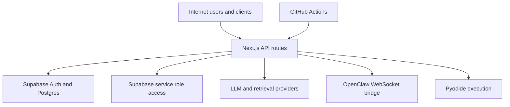

## Executive summary
The highest-risk pattern is inconsistent server-side trust enforcement across API surfaces: several endpoints are strongly authenticated, while others accept unauthenticated requests yet perform privileged reads/writes or expensive computation. The most critical themes are (1) service-role exposure through server routes and fallback key selection, (2) telemetry/data integrity poisoning on open ingestion endpoints, and (3) unauthenticated diagnostic/automation paths that can be abused for reconnaissance, DoS, or state manipulation.

## Scope and assumptions
- In-scope paths: `/Users/lesz/Documents/Synthetic-Mind/synthesis-engine/src/app/api/**`, `/Users/lesz/Documents/Synthetic-Mind/synthesis-engine/src/lib/**`, `/Users/lesz/Documents/Synthetic-Mind/synthesis-engine/src/middleware.ts`, `/Users/lesz/Documents/Synthetic-Mind/synthesis-engine/supabase/migrations/**`, `/Users/lesz/Documents/Synthetic-Mind/synthesis-engine/.github/workflows/**`.
- Out-of-scope: frontend styling/UI-only files except when they claim to provide access control; local developer machine hardening; third-party provider internal controls.
- Assumption: deployment is internet reachable (Vercel/Next.js default) and API routes are directly accessible.
- Assumption: some tables (for example `scm_reports`) may predate current migrations; migration coverage is incomplete in-repo.
- Assumption: `SUPABASE_SERVICE_ROLE_KEY` is present in production for server features.
- Assumption: anonymous abuse prevention (WAF/CDN rules/IP throttles) is not guaranteed unless explicitly implemented in route code.

Open questions that would materially change risk ranking:
- Is this service intentionally public, or restricted behind VPN/allowlist/internal gateway?
- Is `BRIDGE_VERIFICATION_TOKEN` always configured in production for `/api/bridge/chat-verified`?
- Are unauthenticated endpoints (`/api/scm/autopsy`, `/api/verify-db`, `/api/reports/analyze`, education endpoints) intended for production use, or only internal/demo?

## System model
### Primary components
- Next.js App Router API layer orchestrating chat, synthesis, legal, SCM, lab, and telemetry endpoints.
- Supabase Auth + Postgres accessed via three patterns:
  - cookie-bound server client (`createServerSupabaseClient`) for user-scoped access.
  - browser SSR client (`createClient`) used in some server paths.
  - service-role admin client (`createServerSupabaseAdminClient`) for RLS-bypassing writes.
- Scientific/AI services:
  - LLM adapters (Anthropic/OpenAI/Gemini).
  - retrieval providers (Brave, Serper, Semantic Scholar/OpenAlex, PubChem, RCSB, UniProt, AlphaFold).
  - protocol execution with Pyodide (`validateProtocol`).
- OpenClaw WebSocket bridge to daemon/gateway (`OPENCLAW_WS_URL`, default `ws://127.0.0.1:18789`).
- CI pipelines in GitHub Actions invoking governance scripts with secrets.

### Data flows and trust boundaries
- Internet client -> Next.js API routes
  - Data: user prompts, attachments/base64, metadata headers, bridge telemetry payloads.
  - Channel: HTTPS + SSE (`text/event-stream`).
  - Security guarantees: route-dependent auth; inconsistent enforcement.
  - Validation: mixed; strong in some routes (`zod`, payload limits), weak/absent in others.
  - Evidence: `/Users/lesz/Documents/Synthetic-Mind/synthesis-engine/src/app/api/synthesize/route.ts:25`, `/Users/lesz/Documents/Synthetic-Mind/synthesis-engine/src/app/api/causal-chat/route.ts:354`, `/Users/lesz/Documents/Synthetic-Mind/synthesis-engine/src/app/api/reports/analyze/route.ts:7`.
- Next.js API routes -> Supabase (user-scoped session client)
  - Data: user/session rows, report fetches, chat persistence, trace fetches.
  - Channel: Supabase HTTPS.
  - Security guarantees: cookie/session auth + DB RLS (if configured and migrated).
  - Validation: request-level checks vary; DB policy is safety net.
  - Evidence: `/Users/lesz/Documents/Synthetic-Mind/synthesis-engine/src/lib/supabase/server.ts:6`, `/Users/lesz/Documents/Synthetic-Mind/synthesis-engine/src/app/api/reports/[reportId]/route.ts:9`.
- Next.js API/service layer -> Supabase admin/service-role client
  - Data: governance audits, reports, autopsy outputs, scientific pipeline artifacts.
  - Channel: Supabase HTTPS.
  - Security guarantees: server secret possession only; bypasses RLS by design.
  - Validation: entirely route/service-controlled.
  - Evidence: `/Users/lesz/Documents/Synthetic-Mind/synthesis-engine/src/lib/supabase/server-admin.ts:3`, `/Users/lesz/Documents/Synthetic-Mind/synthesis-engine/src/lib/services/scm-report-orchestrator.ts:34`, `/Users/lesz/Documents/Synthetic-Mind/synthesis-engine/src/app/api/scm/autopsy/route.ts:20`.
- Next.js API routes -> external APIs
  - Data: queries/prompts, potentially user-derived content, identifiers.
  - Channel: HTTPS outbound fetch.
  - Security guarantees: provider auth keys, some timeout/retry controls.
  - Validation: partial (provider/query shaping), broad egress allowed.
  - Evidence: `/Users/lesz/Documents/Synthetic-Mind/synthesis-engine/src/lib/services/retrieval-orchestrator-service.ts:107`, `/Users/lesz/Documents/Synthetic-Mind/synthesis-engine/src/lib/services/chat-web-grounding.ts:179`, `/Users/lesz/Documents/Synthetic-Mind/synthesis-engine/src/lib/services/scientific-gateway.ts:495`.
- Next.js OpenClaw status/search routes -> WebSocket daemon
  - Data: search commands/results, connection metadata.
  - Channel: WebSocket.
  - Security guarantees: route auth on search route only; status/test routes unauthenticated.
  - Validation: minimal in status/test.
  - Evidence: `/Users/lesz/Documents/Synthetic-Mind/synthesis-engine/src/app/api/openclaw/status/route.ts:12`, `/Users/lesz/Documents/Synthetic-Mind/synthesis-engine/src/lib/services/openclaw-bridge.ts:58`.
- Next.js protocol/scientific tooling -> Pyodide runtime
  - Data: generated or user-provided python code fragments.
  - Channel: in-process execution.
  - Security guarantees: sandbox intent + coarse pattern denylist.
  - Validation: denylist checks only in `/api/validate-protocol`; other call paths can construct python dynamically.
  - Evidence: `/Users/lesz/Documents/Synthetic-Mind/synthesis-engine/src/app/api/validate-protocol/route.ts:32`, `/Users/lesz/Documents/Synthetic-Mind/synthesis-engine/src/lib/services/scientific-gateway.ts:347`.
- CI runner -> project scripts with secrets
  - Data: Supabase service role keys, provider keys, governance outputs.
  - Channel: GitHub Actions runner environment.
  - Security guarantees: GitHub secrets scoping.
  - Validation: workflow-level; not runtime-facing.
  - Evidence: `/Users/lesz/Documents/Synthetic-Mind/synthesis-engine/.github/workflows/m6-health-check.yml:35`.

#### Diagram

## Assets and security objectives
| Asset | Why it matters | Security objective (C/I/A) |
|---|---|---|
| Supabase service role key and server-admin clients | Compromise enables full-table bypass of RLS and privileged writes | C, I |
| User-owned chat/legal/scientific records | Cross-tenant data exposure or tampering affects trust and compliance | C, I |
| Governance artifacts (promotion audits, integrity signoffs, autopsy reports) | Drives model promotion and scientific integrity decisions | I |
| Bridge verification telemetry | Can influence trust/provenance interpretation if poisoned | I |
| Counterfactual traces and claim ledger links | Used to justify intervention-capable outputs | I |
| API availability for synthesis/chat/legal routes | Core UX relies on long-running compute/stream operations | A |
| CI secrets and workflow outputs | Exposure can leak credentials and operational posture | C, I |
| Session files under `data/sessions` (epistemic) | Unauthorized read/write can leak or alter agent artifacts | C, I |

## Attacker model
### Capabilities
- Remote unauthenticated HTTP caller can hit public API routes and send large/complex payloads.
- Authenticated low-privilege user can invoke user-scoped routes repeatedly and attempt metadata poisoning.
- Attacker can craft payloads for JSON/form-data/base64 attachments and LLM prompt surfaces.
- Attacker can exploit misconfigurations (unset bridge token, permissive network access, missing migrations).

### Non-capabilities
- No assumed direct shell access to app host.
- No assumed direct database credential theft from repo (keys are env-driven).
- No assumed compromise of third-party providers themselves.

## Entry points and attack surfaces
| Surface | How reached | Trust boundary | Notes | Evidence (repo path / symbol) |
|---|---|---|---|---|
| `/api/causal-chat` | Authenticated POST/SSE | Internet -> API -> Supabase/LLM | Strong auth check present | `/Users/lesz/Documents/Synthetic-Mind/synthesis-engine/src/app/api/causal-chat/route.ts:354` |
| `/api/synthesize` | Authenticated multipart POST/SSE | Internet -> API -> PDF parser | Auth required, but invalid MIME only emits warning and continues processing | `/Users/lesz/Documents/Synthetic-Mind/synthesis-engine/src/app/api/synthesize/route.ts:61` |
| `/api/hybrid-synthesize` | Multipart POST/SSE | Internet -> API -> LLM/Supabase | Uses `x-user-id` header fallback; no hard auth reject | `/Users/lesz/Documents/Synthetic-Mind/synthesis-engine/src/app/api/hybrid-synthesize/route.ts:56` |
| `/api/bridge/chat-verified` | POST + open CORS OPTIONS | Internet -> API -> service-role write | Authorization optional if env token absent; wildcard CORS | `/Users/lesz/Documents/Synthetic-Mind/synthesis-engine/src/app/api/bridge/chat-verified/route.ts:26` |
| `/api/scm/autopsy` | POST | Internet -> API -> admin DB writes | Explicitly passcode-based assumption, no server auth gate | `/Users/lesz/Documents/Synthetic-Mind/synthesis-engine/src/app/api/scm/autopsy/route.ts:18` |
| `/api/reports/analyze` | POST/SSE | Internet -> API -> admin orchestrator | No explicit auth check before orchestration/persistence | `/Users/lesz/Documents/Synthetic-Mind/synthesis-engine/src/app/api/reports/analyze/route.ts:7` |
| `/api/reports/[reportId]` and export | GET/POST | Internet -> API -> DB | Uses server client but no route-level auth check | `/Users/lesz/Documents/Synthetic-Mind/synthesis-engine/src/app/api/reports/[reportId]/route.ts:9` |
| `/api/verify-db` | GET | Internet -> API -> DB | Returns debug row/domain data without auth | `/Users/lesz/Documents/Synthetic-Mind/synthesis-engine/src/app/api/verify-db/route.ts:53` |
| `/api/openclaw/status` and `/api/openclaw/test` | GET | Internet -> API -> WS bridge | Unauthenticated bridge import/connect/status exposure | `/Users/lesz/Documents/Synthetic-Mind/synthesis-engine/src/app/api/openclaw/status/route.ts:12` |
| `/api/education/analyze-student` | POST | Internet -> API -> privileged DB client | No auth, writes profile and logs access with null accessor | `/Users/lesz/Documents/Synthetic-Mind/synthesis-engine/src/app/api/education/analyze-student/route.ts:66` |
| `/api/education/optimize-intervention` | POST | Internet -> API -> privileged DB client | No auth, reads/writes student/intervention data | `/Users/lesz/Documents/Synthetic-Mind/synthesis-engine/src/app/api/education/optimize-intervention/route.ts:129` |
| `/api/validate-protocol` | POST | Internet -> API -> Pyodide | No auth; denylist-based code checks only | `/Users/lesz/Documents/Synthetic-Mind/synthesis-engine/src/app/api/validate-protocol/route.ts:9` |
| `/api/epistemic/session*` and `/api/epistemic/chat` | POST/GET | Internet -> API -> local filesystem | Unauthenticated session creation/read/processing | `/Users/lesz/Documents/Synthetic-Mind/synthesis-engine/src/app/api/epistemic/chat/route.ts:5` |

## Top abuse paths
1. Telemetry poisoning via bridge endpoint
   1. Attacker sends forged verification payloads to `/api/bridge/chat-verified`.
   2. If `BRIDGE_VERIFICATION_TOKEN` is unset, request is accepted.
   3. Service-role route writes records to `bridge_verification_log`.
   4. Downstream trust analytics consume polluted telemetry.
2. Unauthenticated autopsy/gov write path
   1. Attacker calls `/api/scm/autopsy` with arbitrary model/domain payload.
   2. Route uses admin Supabase client and `userId = "system"`.
   3. Report/actions are persisted as trusted system artifacts.
   4. Governance dashboards become noisy or misleading.
3. Hybrid synthesis identity spoofing
   1. Caller sets `x-user-id` header to another user id.
   2. Route falls back to header when auth user is unavailable.
   3. Synthesis/claim ledger artifacts may be attributed to spoofed identity.
4. Public diagnostics recon and service probing
   1. Attacker calls `/api/verify-db`, `/api/openclaw/status`, `/api/openclaw/test` repeatedly.
   2. Learns DB hydration state and bridge connectivity/runtime details.
   3. Uses information for targeted abuse or denial attempts.
5. Resource exhaustion through large uploads on synthesis paths
   1. Attacker posts multiple large files to `/api/synthesize` or `/api/hybrid-synthesize`.
   2. Route reads full `arrayBuffer()` with no hard total-size controls.
   3. CPU/memory and long-running workers saturate, degrading service.
6. Protocol execution abuse
   1. Attacker submits crafted protocol payloads to `/api/validate-protocol`.
   2. Denylist is bypassed with syntactic variants.
   3. Pyodide workload causes high CPU/memory and queue starvation.
7. Python string injection in scientific gateway
   1. Authenticated copilot caller provides sequence including quote/control chars.
   2. Sequence is interpolated directly into python source string.
   3. Unintended python executes in validation runtime.
8. Epistemic session abuse and possible path misuse
   1. Unauthenticated caller creates/queries sessions and drives `processTurn`.
   2. Session ids are mapped into filesystem paths under `data/sessions`.
   3. Unauthorized artifact creation/read and local storage growth occur.

## Threat model table
| Threat ID | Threat source | Prerequisites | Threat action | Impact | Impacted assets | Existing controls (evidence) | Gaps | Recommended mitigations | Detection ideas | Likelihood | Impact severity | Priority |
|---|---|---|---|---|---|---|---|---|---|---|---|---|
| TM-001 | External unauthenticated caller | Public API reachability; endpoint enabled | Invoke unauthenticated privileged routes (`scm/autopsy`, `reports/analyze`, education endpoints) | Unauthorized report generation, data tampering, governance pollution | Governance artifacts, user data integrity, DB state | Feature flags gate some paths (`feature-flags.ts`), but not auth | No server-side auth/RBAC on several high-impact routes | Require `auth.getUser` or signed service token on all non-public routes; add explicit RBAC per route; deny by default middleware for `/api/**` except allowlist | Alert on requests to sensitive routes without auth cookie; per-route anomaly counters; audit for `user_id = system` writes | high | high | critical |
| TM-002 | External attacker / cross-origin script | `BRIDGE_VERIFICATION_TOKEN` absent/misconfigured | Poison telemetry via `/api/bridge/chat-verified` with forged metadata | Integrity degradation in provenance/trust telemetry | Bridge log integrity, downstream trust decisions | Optional token check, schema validation (`zod`) | Token is optional (`if !token return true`), CORS `*`, service-role write path | Make token mandatory in non-dev; enforce HMAC signature + timestamp nonce; restrict CORS origins; rate-limit endpoint; segregate ingestion queue | Monitor tokenless writes, source/verdict outliers, high-cardinality `source`/`request_id` anomalies | high | medium | high |
| TM-003 | Auth bypass/spoofing caller | Can set custom headers; auth backend degraded/missing | Supply spoofed `x-user-id` on `/api/hybrid-synthesize` | Mis-attribution of synthesis and claim artifacts | Claim ledger integrity, user ownership | Attempts auth via Supabase first | Header fallback enables identity spoof when auth unavailable; no final `401` requirement | Remove header trust for identity; require authenticated user id only; if auth unavailable return 401; sign internal headers if needed | Log and alert when header id != auth user id; metric for hybrid calls without authenticated principal | medium | high | high |
| TM-004 | External attacker | Public diagnostics enabled | Probe `/api/verify-db`, `/api/openclaw/status`, `/api/openclaw/test` for internal state | Recon for targeted attacks; potential bridge abuse/SSRF-like pivot via ws URL | Service metadata confidentiality, availability | None meaningful at route boundary | No auth; verbose status/debug output | Require auth/admin role for diagnostics; strip sensitive fields; disable in production via env flag | Alert on repeated diagnostic route access and non-internal origin usage | high | medium | high |
| TM-005 | External attacker leveraging open compute routes | Can send large multipart/base64 requests | Trigger memory/CPU pressure via file-heavy synthesis/analysis | DoS and latency spikes | API availability, worker capacity | Some limits in legal route and chat attachment bridge | `/api/synthesize` and `/api/hybrid-synthesize` lack hard file-size/total-size enforcement; hybrid constants unused | Enforce max files, per-file bytes, total bytes, mime allowlist, per-file timeout and concurrency caps consistently across all upload routes | Track request body size, parse duration, OOM/restart signals, 5xx spike by endpoint | high | medium | high |
| TM-006 | External caller using protocol endpoints | Public access to `/api/validate-protocol` | Submit malicious/high-cost python payloads; bypass string denylist | Compute exhaustion, sandbox abuse risk | Availability, compute budget | Denylist patterns + Pyodide sandbox intent | No auth/rate limits; denylist can be bypassed; no strict AST policy | Require auth and per-user quotas; replace denylist with parser/AST policy; hard timeout + memory limits + job isolation | Alert on repeated validation failures/timeouts and long execution tails | medium | medium | medium |
| TM-007 | Authenticated user abusing lab tool input | Authenticated access to lab copilot tools | Inject sequence into interpolated python string in `analyzeProteinSequence` | Unintended python execution in sandbox context; unstable outputs | Tool integrity, availability | Route auth + request schema for tool wrapper | Unsafe string interpolation into python source | Escape/encode sequence safely (JSON serialization or base64 decode in python); enforce strict amino-acid charset regex | Monitor invalid-sequence failures, unusual stderr signatures, execution time spikes | medium | medium | medium |
| TM-008 | External unauthenticated caller | Public access to epistemic routes | Create/read sessions and drive server-side session processing; possible path misuse | Unauthorized data access/modification, local disk growth | Session artifacts, local storage, service availability | UUID-based session creation in normal flow | No auth on session/chat endpoints; path join with untrusted session id patterns | Require auth for epistemic APIs; enforce UUID format on route params; normalize and reject path traversal tokens; per-user quotas and cleanup jobs | Alert on high session churn from same IP and session id format anomalies | high | medium | high |
| TM-009 | Mixed: unauthenticated caller + misconfigured DB policy | Missing/partial migrations or weak RLS | Access report data through routes without explicit auth checks | Confidentiality breach of reports and claims | Report confidentiality and provenance | Some routes use server client + expected RLS | `scm_reports` policy definitions not present in migrations repo; route-level auth absent | Add explicit route auth check; codify all report table DDL and RLS in migrations; CI check for policy coverage drift | Add policy-audit CI job; monitor report access by unauthenticated contexts | medium | high | high |

## Criticality calibration
For this repository/context:
- critical
  - Unauthenticated path can perform service-role-backed writes or governance-changing operations.
  - Cross-tenant data read/write possible due route auth omission plus RLS bypass.
  - Examples: unauthenticated autopsy/report generation with admin client; bridge telemetry poisoning at scale.
- high
  - Privileged behavior requires one weak precondition (misconfig, fallback path, missing token) and materially impacts trust/integrity.
  - Diagnostics or compute endpoints enable meaningful recon/DoS against core UX.
  - Examples: hybrid identity spoof via header fallback; public verify-db/openclaw diagnostics; upload-size DoS on synthesis.
- medium
  - Abuse likely contained to availability degradation or scoped integrity issues with partial controls present.
  - Exploit requires authenticated user role or specific payload crafting.
  - Examples: protocol validator denylist bypass attempts; sequence-to-python interpolation abuse in lab tools.
- low
  - Requires unlikely chained preconditions and has limited blast radius.
  - Existing controls strongly reduce exploitability.
  - Examples: minor metadata leakage from non-sensitive fields, noisy but non-impactful endpoint misuse.

## Focus paths for security review
| Path | Why it matters | Related Threat IDs |
|---|---|---|
| `/Users/lesz/Documents/Synthetic-Mind/synthesis-engine/src/app/api/scm/autopsy/route.ts` | Unauthenticated admin-client write path with `userId="system"` | TM-001 |
| `/Users/lesz/Documents/Synthetic-Mind/synthesis-engine/src/app/api/reports/analyze/route.ts` | No route auth before expensive orchestrator invocation | TM-001, TM-005, TM-009 |
| `/Users/lesz/Documents/Synthetic-Mind/synthesis-engine/src/lib/services/scm-report-orchestrator.ts` | Uses service-role client for pipeline persistence | TM-001, TM-009 |
| `/Users/lesz/Documents/Synthetic-Mind/synthesis-engine/src/lib/services/report-synthesizer-service.ts` | Service-role report persistence and optional user attribution | TM-001, TM-009 |
| `/Users/lesz/Documents/Synthetic-Mind/synthesis-engine/src/app/api/bridge/chat-verified/route.ts` | Optional auth token + wildcard CORS + service-role writes | TM-002 |
| `/Users/lesz/Documents/Synthetic-Mind/synthesis-engine/supabase/migrations/20260305_bridge_verification_log.sql` | Service-role-only policy; endpoint trust entirely in app layer | TM-002 |
| `/Users/lesz/Documents/Synthetic-Mind/synthesis-engine/src/app/api/hybrid-synthesize/route.ts` | Header-based identity fallback and missing hard auth reject | TM-003, TM-005 |
| `/Users/lesz/Documents/Synthetic-Mind/synthesis-engine/src/app/api/verify-db/route.ts` | Unauthenticated debug output from database | TM-004 |
| `/Users/lesz/Documents/Synthetic-Mind/synthesis-engine/src/app/api/openclaw/status/route.ts` | Unauthenticated bridge connectivity probing | TM-004 |
| `/Users/lesz/Documents/Synthetic-Mind/synthesis-engine/src/app/api/openclaw/test/route.ts` | Unauthenticated internal service import introspection | TM-004 |
| `/Users/lesz/Documents/Synthetic-Mind/synthesis-engine/src/lib/services/openclaw-bridge.ts` | WS endpoint configurable via env; connection/reconnect behavior | TM-004 |
| `/Users/lesz/Documents/Synthetic-Mind/synthesis-engine/src/app/api/synthesize/route.ts` | Missing size/time limits; MIME warning without strict reject | TM-005 |
| `/Users/lesz/Documents/Synthetic-Mind/synthesis-engine/src/lib/science/chat-scientific-bridge.ts` | Good reference implementation for file caps/timeouts/concurrency | TM-005 |
| `/Users/lesz/Documents/Synthetic-Mind/synthesis-engine/src/app/api/validate-protocol/route.ts` | Public protocol execution path with denylist-only checks | TM-006 |
| `/Users/lesz/Documents/Synthetic-Mind/synthesis-engine/src/lib/services/scientific-gateway.ts` | Python string interpolation in sequence analysis | TM-007 |
| `/Users/lesz/Documents/Synthetic-Mind/synthesis-engine/src/app/api/epistemic/session/route.ts` | Unauthenticated session creation | TM-008 |
| `/Users/lesz/Documents/Synthetic-Mind/synthesis-engine/src/app/api/epistemic/chat/route.ts` | Unauthenticated server-side processing path | TM-008 |
| `/Users/lesz/Documents/Synthetic-Mind/synthesis-engine/src/lib/epistemic/server-session-manager.ts` | Filesystem path construction and session artifact writes | TM-008 |
| `/Users/lesz/Documents/Synthetic-Mind/synthesis-engine/src/lib/supabase/public-server.ts` | Service-role fallback in nominally public read client | TM-001, TM-009 |
| `/Users/lesz/Documents/Synthetic-Mind/synthesis-engine/src/middleware.ts` | Fail-open auth middleware behavior when env/auth resolution fails | TM-009 |
