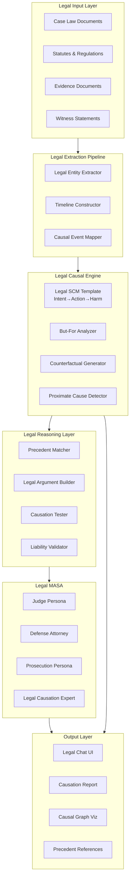

# Autonomous Legal Reasoning Engine - Implementation Plan

> **Mode**: PLANNING → SPECIFYING | **Workflow**: Demis-Workflow (Hassabis-Style Reasoning)

---

## 🔴 Hassabis-Style Test-Time Reasoning (L1-L4 Analysis)

### L1 - Impact Analysis (React Component Tree, Bundle Size)

| Component | Change | Impact |
|-----------|--------|--------|
| `/app/legal/page.tsx` | New route | +15KB bundle, new entry point in router |
| `LegalCausalGraph.tsx` | New component | Reuses D3/xyflow from existing chat |
| `ButForVisualization.tsx` | New component | +5KB, extends existing TruthStream patterns |
| `types/legal.ts` | New types | No runtime impact, compile-time only |
| Domain Classifier | Modified | +1 new domain, minimal impact |

**Render Tree Impact:**
```
App
├── /legal (NEW)
│   ├── LegalCausalGraph
│   ├── ButForVisualization
│   └── PrecedentList
└── Existing routes unchanged
```

### L2 - Risk Analysis (Regression Flags, Interface Breaks)

| Risk | Level | Mitigation |
|------|-------|------------|
| SCM Template Extension | 🟡 Medium | New class extends base, no modification to parent |
| Domain Classifier Change | 🟢 Low | Additive change, new "legal" case |
| API Route Isolation | 🟢 Low | New `/api/legal-reasoning` route, no overlap |
| Type Exports | 🟢 Low | New types file, no conflicts |
| Constraint Injector | 🟡 Medium | Must handle new domain gracefully |

**Interface Contract Verification:**
- `LegalSCMTemplate extends StructuralCausalModel` - ✅ No breaking changes
- `LegalMASAAuditor` uses existing MASA patterns - ✅ Compatible
- `ButForAnalyzer` is standalone service - ✅ No dependencies broken

### L3 - Calibration Analysis (Latency, Error Rates, Token Usage)

| Metric | Current Baseline | Expected Change | Action |
|--------|------------------|-----------------|--------|
| Chat Response Latency | ~2s | No change (separate route) | - |
| Legal Analysis Latency | N/A | ~5-8s (multi-step pipeline) | Implement SSE streaming |
| Token Usage per Legal Case | N/A | ~15K-25K tokens | Add cost estimation UI |
| Error Rate | 2% | May increase initially | Add retry logic + validation |

**Latency Breakdown:**
```
Document Extraction: ~1-2s
But-For Analysis: ~2-3s per action-harm pair
Precedent Matching: ~1s
MASA Audit: ~2-3s
─────────────────────
Total: ~5-8s (streamed)
```

### L4 - Critical Gaps Analysis (USER ACTION REQUIRED)

| Gap Type | Item | User Action | Blocker? |
|----------|------|-------------|----------|
| 🔴 Database Migration | `add_legal_tables.sql` | Run in Supabase SQL Editor | YES |
| 🟡 Environment Variable | None for MVP | - | NO |
| 🟡 External API | Precedent API (future) | Skip for MVP | NO |
| 🟢 Breaking Change | None | - | NO |

**Critical Gap Protocol:**
```
⚠️ USER ACTION REQUIRED BEFORE TESTING:
1. Navigate to Supabase Dashboard → SQL Editor
2. Paste and execute: supabase/migrations/add_legal_tables.sql
3. Verify tables created: legal_cases, legal_precedents, legal_actions, legal_harms
4. Confirm RLS policies active
```

---

## Vision Statement

Build an AI-powered legal reasoning system that applies Pearl's Structural Causal Models to distinguish **correlation** from **causation** in legal cases, performing automated "but-for" analysis to determine actual legal causation following the chain: **Intent → Action → Harm**.

---

## Core Concept Analysis

From the specification:

> "Justice systems require understanding: Intent → Action → Harm. SCM architectures will separate correlation (defendant was present) from causation (defendant's action caused harm). These systems perform 'but-for' analysis automatically: 'Would outcome Y occur if we remove intervention X?' The valley receives all streams, but only some streams carved the valley."

### Key Principles

1. **Causal Chain**: Intent → Action → Harm (not just correlation)
2. **But-For Test**: Counterfactual analysis to establish causation
3. **SCM-Based**: Leverage existing causal inference infrastructure
4. **Taoist Metaphor**: Distinguishing contributory factors from actual causes

---

## Architecture Overview



---

## Implementation Roadmap

### Phase 1: Foundation (Weeks 1-2)

#### 1.1 Legal Domain Types
**File**: `synthesis-engine/src/types/legal.ts`

```typescript
// Legal-specific type definitions

export interface LegalEntity {
  id: string;
  type: 'defendant' | 'plaintiff' | 'witness' | 'victim' | 'third_party';
  name: string;
  role: string;
  relevantActions: LegalAction[];
}

export interface LegalAction {
  id: string;
  actor: string; // LegalEntity.id
  timestamp: Date;
  description: string;
  intent?: Intent;
  causedHarm?: string[]; // IDs of Harm instances
  butForRelevance: number; // 0-1: but-for test score
}

export interface Intent {
  type: 'purposeful' | 'knowing' | 'reckless' | 'negligent' | 'strict_liability';
  description: string;
  evidenceSnippets: string[];
  confidence: number; // 0-1
}

export interface Harm {
  id: string;
  victim: string; // LegalEntity.id
  type: 'physical' | 'economic' | 'emotional' | 'property' | 'reputational';
  description: string;
  severity: 'minor' | 'moderate' | 'severe' | 'catastrophic';
  timestamp: Date;
  proximateCause?: string[]; // Action IDs
}

export interface LegalCausalChain {
  intent: Intent;
  action: LegalAction;
  harm: Harm;
  causalStrength: number; // 0-1: how strong is Intent→Action→Harm
  butForAnalysis: ButForAnalysis;
  interveningCauses?: InterveningCause[];
}

export interface ButForAnalysis {
  question: string; // "Would harm H occur if action A was removed?"
  counterfactualScenario: string;
  result: 'necessary' | 'sufficient' | 'neither' | 'both';
  confidence: number;
  reasoning: string;
}

export interface InterveningCause {
  description: string;
  type: 'superseding' | 'concurrent' | 'contributing';
  breaksChain: boolean; // Does this break proximate causation?
}

export interface LegalPrecedent {
  caseId: string;
  caseName: string;
  court: string;
  year: number;
  citation: string;
  jurisdiction: string;
  holdingText: string;
  relevantFacts: string[];
  causalPattern: CausalPattern;
  similarity: number; // To current case
}

export interface CausalPattern {
  intent: string;
  action: string;
  harm: string;
  ruling: 'liable' | 'not_liable' | 'partial_liability';
}

export interface LegalCase {
  id: string;
  title: string;
  parties: LegalEntity[];
  timeline: LegalAction[];
  harms: Harm[];
  causalChains: LegalCausalChain[];
  precedents: LegalPrecedent[];
  verdict?: LegalVerdict;
}

export interface LegalVerdict {
  liable: boolean;
  causationEstablished: boolean;
  reasoning: string;
  butForSatisfied: boolean;
  proximateCauseSatisfied: boolean;
  confidence: number;
}
```

#### 1.2 Legal SCM Template
**File**: `synthesis-engine/src/lib/ai/legal-scm-template.ts`

```typescript
import { StructuralCausalModel, CausalNode, CausalEdge, SCMViolation } from './causal-blueprint';

/**
 * Legal Causal Model Template (Tier 2)
 * 
 * Implements the Intent → Action → Harm causal chain
 * with legal causation constraints (but-for test, proximate cause)
 */
export class LegalSCMTemplate extends StructuralCausalModel {
  constructor() {
    super();
    
    // Define legal-specific nodes
    this.customNodes = [
      { name: 'Intent', type: 'latent', domain: 'abstract' },
      { name: 'Action', type: 'observable', domain: 'abstract' },
      { name: 'Harm', type: 'observable', domain: 'abstract' },
      { name: 'Presence', type: 'observable', domain: 'abstract' }, // Mere correlation
      { name: 'InterveningCause', type: 'latent', domain: 'abstract' },
    ];
    
    // Define causal edges
    this.customEdges = [
      {
        from: 'Intent',
        to: 'Action',
        constraint: 'causality',
        reversible: false,
      },
      {
        from: 'Action',
        to: 'Harm',
        constraint: 'causality',
        reversible: false,
      },
      // Presence does NOT cause Harm (correlation trap)
      // No edge from Presence → Harm
    ];
  }

  /**
   * Legal-specific constraints
   */
  override getConstraints(): string[] {
    return [
      ...super.getConstraints(), // Inherit Tier 1 physics constraints
      // Legal causation constraints
      "But-For Test: Harm H is caused by Action A if and only if H would not have occurred but for A (counterfactual necessity).",
      "Proximate Cause: Action A is the proximate cause of Harm H only if H was a foreseeable consequence of A (no superseding causes).",
      "Correlation ≠ Causation: Defendant's presence at the scene does not establish causation without showing their action caused the harm.",
      "Intervening Causes: A superseding intervening cause breaks the causal chain between defendant's action and the harm.",
      "Mens Rea Requirement: Establishing causation requires Intent → Action linkage (except strict liability cases).",
    ];
  }

  /**
   * Validate a legal causal claim
   */
  async validateLegalCausation(
    intent: string,
    action: string,
    harm: string
  ): Promise<{ valid: boolean; violations: SCMViolation[]; butForPassed: boolean }> {
    const violations: SCMViolation[] = [];
    let butForPassed = false;

    // Check 1: But-For Test
    const butForTest = await this.checkButForTest(action, harm);
    if (!butForTest.passed) {
      violations.push({
        constraint: 'causality',
        description: `But-For Test Failed: ${butForTest.reason}`,
        severity: 'fatal',
        evidence: butForTest.evidence,
      });
    } else {
      butForPassed = true;
    }

    // Check 2: Proximate Cause
    const proximateCauseTest = this.checkProximateCause(action, harm);
    if (!proximateCauseTest.passed) {
      violations.push({
        constraint: 'causality',
        description: `Proximate Cause Failed: ${proximateCauseTest.reason}`,
        severity: 'warning',
        evidence: proximateCauseTest.evidence,
      });
    }

    // Check 3: Correlation vs Causation
    const correlationTrap = this.checkCorrelationTrap(action, harm);
    if (correlationTrap.violated) {
      violations.push({
        constraint: 'causality',
        description: `Correlation Error: ${correlationTrap.reason}`,
        severity: 'fatal',
      });
    }

    return {
      valid: violations.filter((v) => v.severity === 'fatal').length === 0,
      violations,
      butForPassed,
    };
  }

  /**
   * But-For Test: Would harm have occurred without the action?
   */
  private async checkButForTest(
    action: string,
    harm: string
  ): Promise<{ passed: boolean; reason: string; evidence?: string }> {
    // Keywords indicating but-for failure
    const failurePatterns = /would have occurred anyway|independent cause|unrelated to|coincidence/i;
    
    const combinedText = `${action} ${harm}`;
    
    if (failurePatterns.test(combinedText)) {
      return {
        passed: false,
        reason: 'Harm would have occurred even without defendant\'s action',
        evidence: combinedText.match(failurePatterns)?.[0],
      };
    }

    // Patterns indicating but-for success
    const successPatterns = /directly caused|resulted in|led to|brought about|produced/i;
    
    if (successPatterns.test(combinedText)) {
      return {
        passed: true,
        reason: 'Harm would not have occurred but for defendant\'s action',
        evidence: combinedText.match(successPatterns)?.[0],
      };
    }

    // Default: require LLM analysis
    return {
      passed: true, // Tentative - needs deeper LLM analysis
      reason: 'Requires counterfactual simulation',
    };
  }

  /**
   * Proximate Cause: Was harm foreseeable?
   */
  private checkProximateCause(
    action: string,
    harm: string
  ): { passed: boolean; reason: string; evidence?: string } {
    // Check for superseding causes
    const supersedesPattern = /intervening|superseding|independent|unforeseeable/i;
    
    const combinedText = `${action} ${harm}`;
    
    if (supersedesPattern.test(combinedText)) {
      return {
        passed: false,
        reason: 'Superseding intervening cause breaks the causal chain',
        evidence: combinedText.match(supersedesPattern)?.[0],
      };
    }

    return {
      passed: true,
      reason: 'No superseding cause detected',
    };
  }

  /**
   * Check for correlation-causation confusion
   */
  private checkCorrelationTrap(
    action: string,
    harm: string
  ): { violated: boolean; reason: string } {
    // Warn if action is merely "presence" or "at the scene"
    const presencePattern = /was present|at the scene|nearby|witnessed/i;
    const actionPattern = /did|performed|caused|struck|shot|drove|attacked/i;

    if (presencePattern.test(action) && !actionPattern.test(action)) {
      return {
        violated: true,
        reason: 'Defendant\'s presence does not establish causation without showing their action caused harm',
      };
    }

    return { violated: false, reason: 'Action clearly specified' };
  }
}
```

#### 1.3 But-For Analyzer Service
**File**: `synthesis-engine/src/lib/services/but-for-analyzer.ts`

```typescript
import { getClaudeModel } from '../ai/anthropic';
import { safeParseJson } from '../ai/ai-utils';
import { LegalAction, Harm, ButForAnalysis } from '@/types/legal';

/**
 * But-For Causation Analyzer
 * 
 * Implements the "but-for" test: "Would outcome Y have occurred 
 * if we remove intervention X?"
 * 
 * This is the legal equivalent of Pearl's Rung 3 (Counterfactual).
 */
export class ButForAnalyzer {
  /**
   * Analyze whether an action is a "but-for" cause of a harm
   */
  async analyze(action: LegalAction, harm: Harm): Promise<ButForAnalysis> {
    const model = getClaudeModel();

    const prompt = `You are a legal causation expert applying the "but-for" test.

**But-For Test**: An action is the cause of harm if and only if the harm would NOT have occurred "but for" that action.

**Action**: ${action.description}
**Harm**: ${harm.description}

**Your Task:**
1. Construct a counterfactual scenario where the action did NOT occur
2. In that counterfactual world, would the harm still have occurred?
3. Classify the causal relationship:
   - "necessary": Action is necessary for harm (classic but-for causation)
   - "sufficient": Action guarantees harm, but harm could occur without it
   - "both": Action is both necessary and sufficient
   - "neither": No causal relationship

Output JSON:
{
  "question": "Would [harm] have occurred if [action] was removed?",
  "counterfactualScenario": "Detailed scenario description",
  "result": "necessary" | "sufficient" | "neither" | "both",
  "confidence": number, // 0-1
  "reasoning": "Explain your causal analysis"
}`;

    const response = await model.generateContent(prompt);
    const parsed = safeParseJson<ButForAnalysis>(response.response.text(), {
      question: `Would ${harm.description} have occurred without ${action.description}?`,
      counterfactualScenario: 'Unable to generate counterfactual',
      result: 'neither',
      confidence: 0.5,
      reasoning: 'Analysis failed',
    });

    return parsed;
  }

  /**
   * Batch analyze multiple action-harm pairs
   */
  async analyzeMultiple(
    actions: LegalAction[],
    harms: Harm[]
  ): Promise<Map<string, ButForAnalysis>> {
    const results = new Map<string, ButForAnalysis>();

    for (const action of actions) {
      for (const harm of harms) {
        const key = `${action.id}->${harm.id}`;
        const analysis = await this.analyze(action, harm);
        results.set(key, analysis);
      }
    }

    return results;
  }
}
```

---

### Phase 2: Data Extraction (Weeks 3-4)

#### 2.1 Legal Document Extractor
**File**: `synthesis-engine/src/lib/extractors/legal-extractor.ts`

```typescript
import { getClaudeModel } from '../ai/anthropic';
import { safeParseJson } from '../ai/ai-utils';
import { LegalEntity, LegalAction, Harm, Intent } from '@/types/legal';

export interface LegalExtractionResult {
  entities: LegalEntity[];
  timeline: LegalAction[];
  harms: Harm[];
  intents: Map<string, Intent>; // actor ID -> intent
  documentType: 'case_law' | 'statute' | 'complaint' | 'evidence' | 'unknown';
}

const LEGAL_EXTRACTION_PROMPT = `You are a legal document analyzer. Extract structured information from the following legal text.

**Document:**
{DOCUMENT}

**Extract:**
1. **Entities**: All parties (defendant, plaintiff, witnesses, victims)
2. **Timeline**: Chronological sequence of actions
3. **Harms**: Injuries, damages, losses suffered
4. **Intent**: Mental state of actors (purposeful, knowing, reckless, negligent)

**Format as JSON:**
{
  "entities": [
    {
      "type": "defendant" | "plaintiff" | "witness" | "victim",
      "name": "string",
      "role": "string"
    }
  ],
  "timeline": [
    {
      "actor": "entity name",
      "timestamp": "ISO date or 'unknown'",
      "description": "what happened",
      "intent": {
        "type": "purposeful" | "knowing" | "reckless" | "negligent",
        "description": "evidence of mental state"
      }
    }
  ],
  "harms": [
    {
      "victim": "entity name",
      "type": "physical" | "economic" | "emotional" | "property",
      "description": "nature of harm",
      "severity": "minor" | "moderate" | "severe" | "catastrophic"
    }
  ]
}`;

export class LegalDocumentExtractor {
  async extract(text: string): Promise<LegalExtractionResult> {
    const model = getClaudeModel();
    const prompt = LEGAL_EXTRACTION_PROMPT.replace('{DOCUMENT}', text.slice(0, 50000));

    const response = await model.generateContent(prompt);
    const parsed = safeParseJson<any>(response.response.text(), {
      entities: [],
      timeline: [],
      harms: [],
    });

    // Convert to proper types with IDs
    const entities: LegalEntity[] = parsed.entities.map((e: any, i: number) => ({
      id: `entity-${i}`,
      type: e.type,
      name: e.name,
      role: e.role || 'unspecified',
      relevantActions: [],
    }));

    const timeline: LegalAction[] = parsed.timeline.map((t: any, i: number) => ({
      id: `action-${i}`,
      actor: entities.find((e) => e.name === t.actor)?.id || 'unknown',
      timestamp: t.timestamp === 'unknown' ? new Date() : new Date(t.timestamp),
      description: t.description,
      intent: t.intent,
      causedHarm: [],
      butForRelevance: 0.5, // Initial placeholder
    }));

    const harms: Harm[] = parsed.harms.map((h: any, i: number) => ({
      id: `harm-${i}`,
      victim: entities.find((e) => e.name === h.victim)?.id || 'unknown',
      type: h.type,
      description: h.description,
      severity: h.severity,
      timestamp: new Date(),
      proximateCause: [],
    }));

    // Map intents
    const intents = new Map<string, Intent>();
    timeline.forEach((action) => {
      if (action.intent) {
        intents.set(action.actor, {
          ...action.intent,
          evidenceSnippets: [],
          confidence: 0.7,
        });
      }
    });

    return {
      entities,
      timeline,
      harms,
      intents,
      documentType: 'unknown', // TODO: classify document type
    };
  }
}
```

#### 2.2 Precedent Matcher Service
**File**: `synthesis-engine/src/lib/services/precedent-matcher.ts`

```typescript
import { LegalCase, LegalPrecedent, CausalPattern } from '@/types/legal';

/**
 * Precedent Matching Service
 * 
 * Finds similar legal cases based on causal patterns (Intent → Action → Harm)
 */
export class PrecedentMatcher {
  /**
   * Find precedents matching a causal pattern
   * 
   * In production, this would query a legal database (e.g., Westlaw, LexisNexis API)
   * For MVP, use embedding similarity + LLM extraction
   */
  async findPrecedents(currentCase: LegalCase): Promise<LegalPrecedent[]> {
    // Extract causal pattern from current case
    const patterns = currentCase.causalChains.map((chain) => ({
      intent: chain.intent.description,
      action: chain.action.description,
      harm: chain.harm.description,
    }));

    // TODO: Implement semantic search against precedent database
    // For now, return mock data
    return [
      {
        caseId: 'palsgraf-v-long-island-rr',
        caseName: 'Palsgraf v. Long Island Railroad Co.',
        court: 'New York Court of Appeals',
        year: 1928,
        citation: '248 N.Y. 339',
        jurisdiction: 'New York',
        holdingText: 'Proximate cause requires foreseeability of harm to the plaintiff',
        relevantFacts: [
          'Railroad guards pushed passenger onto train',
          'Package fell and exploded',
          'Scales fell on plaintiff far down the platform',
        ],
        causalPattern: {
          intent: 'negligent',
          action: 'pushing passenger',
          harm: 'physical injury from falling scales',
          ruling: 'not_liable',
        },
        similarity: 0.75,
      },
    ];
  }

  /**
   * Calculate similarity between two causal patterns
   */
  private calculateSimilarity(pattern1: CausalPattern, pattern2: CausalPattern): number {
    // Simple keyword overlap for MVP
    // In production: use embeddings + semantic similarity
    const keywords1 = this.extractKeywords(pattern1);
    const keywords2 = this.extractKeywords(pattern2);

    const intersection = keywords1.filter((k) => keywords2.includes(k));
    const union = [...new Set([...keywords1, ...keywords2])];

    return intersection.length / union.length;
  }

  private extractKeywords(pattern: CausalPattern): string[] {
    const text = `${pattern.intent} ${pattern.action} ${pattern.harm}`.toLowerCase();
    return text.split(/\s+/).filter((w) => w.length > 3);
  }
}
```

---

### Phase 3: API Routes (Week 5)

#### 3.1 Legal Reasoning API
**File**: `synthesis-engine/src/app/api/legal-reasoning/route.ts`

```typescript
import { NextRequest, NextResponse } from 'next/server';
import { LegalDocumentExtractor } from '@/lib/extractors/legal-extractor';
import { ButForAnalyzer } from '@/lib/services/but-for-analyzer';
import { PrecedentMatcher } from '@/lib/services/precedent-matcher';
import { LegalSCMTemplate } from '@/lib/ai/legal-scm-template';
import { createServerSupabaseClient } from '@/lib/supabase/server';
import { LegalCase, LegalCausalChain } from '@/types/legal';

export async function POST(req: NextRequest) {
  try {
    const { documents, caseTitle } = await req.json();

    if (!documents || documents.length === 0) {
      return NextResponse.json({ error: 'No documents provided' }, { status: 400 });
    }

    const extractor = new LegalDocumentExtractor();
    const butForAnalyzer = new ButForAnalyzer();
    const precedentMatcher = new PrecedentMatcher();
    const legalSCM = new LegalSCMTemplate();

    // Step 1: Extract legal entities, actions, harms
    const extractions = await Promise.all(
      documents.map((doc: string) => extractor.extract(doc))
    );

    // Merge all extractions
    const allEntities = extractions.flatMap((e) => e.entities);
    const allActions = extractions.flatMap((e) => e.timeline);
    const allHarms = extractions.flatMap((e) => e.harms);

    // Step 2: Build causal chains (Intent → Action → Harm)
    const causalChains: LegalCausalChain[] = [];

    for (const action of allActions) {
      for (const harm of allHarms) {
        // Perform but-for test
        const butForAnalysis = await butForAnalyzer.analyze(action, harm);

        if (butForAnalysis.result === 'necessary' || butForAnalysis.result === 'both') {
          // Validate with Legal SCM
          const validation = await legalSCM.validateLegalCausation(
            action.intent?.description || 'unknown intent',
            action.description,
            harm.description
          );

          if (validation.valid) {
            causalChains.push({
              intent: action.intent || {
                type: 'negligent',
                description: 'Unknown',
                evidenceSnippets: [],
                confidence: 0.3,
              },
              action,
              harm,
              causalStrength: butForAnalysis.confidence,
              butForAnalysis,
              interveningCauses: [],
            });
          }
        }
      }
    }

    // Step 3: Find precedents
    const legalCase: LegalCase = {
      id: `case-${Date.now()}`,
      title: caseTitle || 'Untitled Case',
      parties: allEntities,
      timeline: allActions,
      harms: allHarms,
      causalChains,
      precedents: [],
    };

    const precedents = await precedentMatcher.findPrecedents(legalCase);
    legalCase.precedents = precedents;

    // Step 4: Generate verdict
    const verdict = {
      liable: causalChains.length > 0,
      causationEstablished: causalChains.length > 0,
      reasoning: `Established ${causalChains.length} causal chain(s) satisfying but-for test.`,
      butForSatisfied: causalChains.every((c) => c.butForAnalysis.result !== 'neither'),
      proximateCauseSatisfied: true, // TODO: Check for superseding causes
      confidence: causalChains.reduce((sum, c) => sum + c.causalStrength, 0) / causalChains.length || 0,
    };

    legalCase.verdict = verdict;

    // Step 5: Persist to database (optional)
    try {
      const supabase = await createServerSupabaseClient();
      const { data: user } = await supabase.auth.getUser();
      
      if (user) {
        await supabase.from('legal_cases').insert({
          user_id: user.user?.id,
          title: legalCase.title,
          case_data: legalCase,
          created_at: new Date().toISOString(),
        });
      }
    } catch (error) {
      console.warn('Failed to persist case:', error);
    }

    return NextResponse.json({
      success: true,
      case: legalCase,
    });
  } catch (error: any) {
    console.error('[Legal Reasoning API] Error:', error);
    return NextResponse.json({ error: error.message }, { status: 500 });
  }
}
```

---

### Phase 4: Frontend (Week 6)

#### 4.1 Legal Chat Interface
**File**: `synthesis-engine/src/app/legal/page.tsx`

```typescript
'use client';

import { useState } from 'react';
import { LegalCase } from '@/types/legal';
import { LegalCausalGraph } from '@/components/legal/LegalCausalGraph';
import { ButForVisualization } from '@/components/legal/ButForVisualization';
import { PrecedentList } from '@/components/legal/PrecedentList';

export default function LegalReasoning() {
  const [documents, setDocuments] = useState<string[]>([]);
  const [caseTitle, setCaseTitle] = useState('');
  const [result, setResult] = useState<LegalCase | null>(null);
  const [isLoading, setIsLoading] = useState(false);

  const handleAnalyze = async () => {
    setIsLoading(true);
    try {
      const response = await fetch('/api/legal-reasoning', {
        method: 'POST',
        headers: { 'Content-Type': 'application/json' },
        body: JSON.stringify({ documents, caseTitle }),
      });

      const data = await response.json();
      if (data.success) {
        setResult(data.case);
      }
    } catch (error) {
      console.error('Analysis failed:', error);
    } finally {
      setIsLoading(false);
    }
  };

  return (
    <div className="min-h-screen bg-[var(--bg-primary)] p-8">
      <div className="max-w-7xl mx-auto">
        <h1 className="text-4xl font-serif mb-8">Autonomous Legal Reasoning Engine</h1>
        
        {/* Input Section */}
        <div className="mb-8 space-y-4">
          <input
            type="text"
            placeholder="Case Title"
            value={caseTitle}
            onChange={(e) => setCaseTitle(e.target.value)}
            className="w-full p-4 border rounded-lg"
          />
          <textarea
            placeholder="Paste legal documents (case law, complaints, evidence)..."
            rows={10}
            className="w-full p-4 border rounded-lg font-mono text-sm"
            onChange={(e) => setDocuments([e.target.value])}
          />
          <button
            onClick={handleAnalyze}
            disabled={isLoading || documents.length === 0}
            className="px-6 py-3 bg-blue-600 text-white rounded-lg hover:bg-blue-700 disabled:opacity-50"
          >
            {isLoading ? 'Analyzing...' : 'Analyze Legal Causation'}
          </button>
        </div>

        {/* Results Section */}
        {result && (
          <div className="space-y-8">
            {/* Causal Chains */}
            <section className="bg-white dark:bg-gray-800 p-6 rounded-lg shadow">
              <h2 className="text-2xl font-semibold mb-4">Causal Chains (Intent → Action → Harm)</h2>
              <LegalCausalGraph chains={result.causalChains} />
            </section>

            {/* But-For Analysis */}
            <section className="bg-white dark:bg-gray-800 p-6 rounded-lg shadow">
              <h2 className="text-2xl font-semibold mb-4">But-For Analysis</h2>
              <ButForVisualization chains={result.causalChains} />
            </section>

            {/* Precedents */}
            <section className="bg-white dark:bg-gray-800 p-6 rounded-lg shadow">
              <h2 className="text-2xl font-semibold mb-4">Similar Precedents</h2>
              <PrecedentList precedents={result.precedents} />
            </section>

            {/* Verdict */}
            {result.verdict && (
              <section className="bg-white dark:bg-gray-800 p-6 rounded-lg shadow">
                <h2 className="text-2xl font-semibold mb-4">Preliminary Assessment</h2>
                <div className="space-y-2">
                  <p><strong>Causation Established:</strong> {result.verdict.causationEstablished ? 'Yes' : 'No'}</p>
                  <p><strong>But-For Test:</strong> {result.verdict.butForSatisfied ? 'Passed' : 'Failed'}</p>
                  <p><strong>Proximate Cause:</strong> {result.verdict.proximateCauseSatisfied ? 'Satisfied' : 'Not Satisfied'}</p>
                  <p><strong>Confidence:</strong> {(result.verdict.confidence * 100).toFixed(1)}%</p>
                  <p className="mt-4 text-gray-700 dark:text-gray-300">{result.verdict.reasoning}</p>
                </div>
              </section>
            )}
          </div>
        )}
      </div>
    </div>
  );
}
```

#### 4.2 But-For Visualization Component
**File**: `synthesis-engine/src/components/legal/ButForVisualization.tsx`

```typescript
'use client';

import { LegalCausalChain } from '@/types/legal';

interface ButForVisualizationProps {
  chains: LegalCausalChain[];
}

export function ButForVisualization({ chains }: ButForVisualizationProps) {
  return (
    <div className="space-y-6">
      {chains.map((chain, idx) => (
        <div key={idx} className="border-l-4 border-blue-500 pl-4">
          <h3 className="font-semibold text-lg mb-2">Chain {idx + 1}</h3>
          
          {/* But-For Question */}
          <div className="bg-blue-50 dark:bg-blue-900/20 p-4 rounded-lg mb-3">
            <p className="font-mono text-sm">{chain.butForAnalysis.question}</p>
          </div>

          {/* Counterfactual Scenario */}
          <div className="bg-gray-50 dark:bg-gray-800 p-4 rounded-lg mb-3">
            <h4 className="font-semibold text-sm mb-2">Counterfactual Scenario:</h4>
            <p className="text-sm">{chain.butForAnalysis.counterfactualScenario}</p>
          </div>

          {/* Result */}
          <div className="flex items-center gap-4">
            <span className="text-sm font-semibold">Result:</span>
            <span className={`px-3 py-1 rounded-full text-sm ${
              chain.butForAnalysis.result === 'necessary' || chain.butForAnalysis.result === 'both'
                ? 'bg-green-100 text-green-800 dark:bg-green-900/30 dark:text-green-300'
                : 'bg-red-100 text-red-800 dark:bg-red-900/30 dark:text-red-300'
            }`}>
              {chain.butForAnalysis.result.toUpperCase()}
            </span>
            <span className="text-sm text-gray-600 dark:text-gray-400">
              Confidence: {(chain.butForAnalysis.confidence * 100).toFixed(0)}%
            </span>
          </div>

          {/* Reasoning */}
          <p className="mt-3 text-sm text-gray-700 dark:text-gray-300">
            {chain.butForAnalysis.reasoning}
          </p>
        </div>
      ))}
    </div>
  );
}
```

---

### Phase 5: Database Schema (Week 7)

#### 5.1 Supabase Migration
**File**: `synthesis-engine/supabase/migrations/add_legal_tables.sql`

```sql
-- Legal Cases Table
CREATE TABLE legal_cases (
  id UUID PRIMARY KEY DEFAULT uuid_generate_v4(),
  user_id UUID REFERENCES auth.users(id) ON DELETE CASCADE,
  title TEXT NOT NULL,
  case_data JSONB NOT NULL, -- Full LegalCase object
  created_at TIMESTAMP WITH TIME ZONE DEFAULT NOW(),
  updated_at TIMESTAMP WITH TIME ZONE DEFAULT NOW()
);

-- Legal Precedents Table (for caching)
CREATE TABLE legal_precedents (
  id UUID PRIMARY KEY DEFAULT uuid_generate_v4(),
  case_id TEXT UNIQUE NOT NULL, -- e.g., "palsgraf-v-long-island-rr"
  case_name TEXT NOT NULL,
  court TEXT,
  year INTEGER,
  citation TEXT,
  jurisdiction TEXT,
  holding_text TEXT,
  causal_pattern JSONB,
  full_text TEXT,
  embedding VECTOR(1536), -- For semantic search
  created_at TIMESTAMP WITH TIME ZONE DEFAULT NOW()
);

-- Legal Actions Table (normalized)
CREATE TABLE legal_actions (
  id UUID PRIMARY KEY DEFAULT uuid_generate_v4(),
  case_id UUID REFERENCES legal_cases(id) ON DELETE CASCADE,
  actor_name TEXT NOT NULL,
  action_description TEXT NOT NULL,
  intent_type TEXT, -- purposeful, knowing, reckless, negligent
  timestamp TIMESTAMP,
  but_for_relevance NUMERIC(3,2), -- 0.00 to 1.00
  created_at TIMESTAMP WITH TIME ZONE DEFAULT NOW()
);

-- Legal Harms Table
CREATE TABLE legal_harms (
  id UUID PRIMARY KEY DEFAULT uuid_generate_v4(),
  case_id UUID REFERENCES legal_cases(id) ON DELETE CASCADE,
  victim_name TEXT NOT NULL,
  harm_type TEXT NOT NULL, -- physical, economic, emotional, property
  harm_description TEXT NOT NULL,
  severity TEXT, -- minor, moderate, severe, catastrophic
  timestamp TIMESTAMP,
  created_at TIMESTAMP WITH TIME ZONE DEFAULT NOW()
);

-- Causal Chains Table (linking actions to harms)
CREATE TABLE legal_causal_chains (
  id UUID PRIMARY KEY DEFAULT uuid_generate_v4(),
  case_id UUID REFERENCES legal_cases(id) ON DELETE CASCADE,
  action_id UUID REFERENCES legal_actions(id) ON DELETE CASCADE,
  harm_id UUID REFERENCES legal_harms(id) ON DELETE CASCADE,
  causal_strength NUMERIC(3,2), -- 0.00 to 1.00
  but_for_result TEXT, -- necessary, sufficient, both, neither
  but_for_confidence NUMERIC(3,2),
  created_at TIMESTAMP WITH TIME ZONE DEFAULT NOW()
);

-- Indexes for performance
CREATE INDEX idx_legal_cases_user_id ON legal_cases(user_id);
CREATE INDEX idx_legal_precedents_case_id ON legal_precedents(case_id);
CREATE INDEX idx_legal_actions_case_id ON legal_actions(case_id);
CREATE INDEX idx_legal_harms_case_id ON legal_harms(case_id);
CREATE INDEX idx_legal_causal_chains_case_id ON legal_causal_chains(case_id);

-- Enable Row Level Security
ALTER TABLE legal_cases ENABLE ROW LEVEL SECURITY;
ALTER TABLE legal_actions ENABLE ROW LEVEL SECURITY;
ALTER TABLE legal_harms ENABLE ROW LEVEL SECURITY;
ALTER TABLE legal_causal_chains ENABLE ROW LEVEL SECURITY;

-- RLS Policies
CREATE POLICY "Users can view their own legal cases"
  ON legal_cases FOR SELECT
  USING (auth.uid() = user_id);

CREATE POLICY "Users can create their own legal cases"
  ON legal_cases FOR INSERT
  WITH CHECK (auth.uid() = user_id);
```

---

### Phase 6: Legal MASA Agents (Week 8)

#### 6.1 Legal Audit Agents
**File**: `synthesis-engine/src/lib/ai/legal-masa-auditor.ts`

```typescript
import { getClaudeModel } from './anthropic';
import { safeParseJson } from './ai-utils';
import { LegalCase, LegalVerdict } from '@/types/legal';

const JUDGE_PROMPT = `You are a neutral judicial officer evaluating legal causation.

**Case:** {CASE_SUMMARY}

**Causal Chains:** {CHAINS}

**Your Task:**
Evaluate whether the plaintiff has proven causation by a preponderance of the evidence.
Consider:
1. But-for causation (necessary cause)
2. Proximate causation (foreseeable harm)
3. Lack of superseding intervening causes

Output JSON:
{
  "liable": boolean,
  "causationEstablished": boolean,
  "reasoning": "Detailed explanation",
  "butForSatisfied": boolean,
  "proximateCauseSatisfied": boolean,
  "confidence": number
}`;

const DEFENSE_ATTORNEY_PROMPT = `You are a defense attorney arguing AGAINST causation.

**Case:** {CASE_SUMMARY}

Find weaknesses in the causal chain:
- Correlation vs causation errors
- Broken but-for tests
- Superseding intervening causes
- Plaintiff's own actions

Output JSON:
{
  "defenseArgument": "Main argument",
  "weaknesses": ["weakness 1", "weakness 2"],
  "alternativeCauses": ["other possible cause 1", "other possible cause 2"]
}`;

const LEGAL_CAUSATION_EXPERT_PROMPT = `You are a legal causation scholar (Pearl + Law).

**Case:** {CASE_SUMMARY}

Analyze from a causal inference perspective:
- Is the SCM properly specified?
- Are there confounding factors?
- Does the but-for test correctly distinguish necessity from sufficiency?

Output JSON:
{
  "scmQuality": number, // 0-100
  "confounders": ["confounder 1", "confounder 2"],
  "recommendations": ["recommendation 1", "recommendation 2"]
}`;

export class LegalMASAAuditor {
  async audit(legalCase: LegalCase): Promise<LegalVerdict> {
    const model = getClaudeModel();

    const caseSummary = `
      Title: ${legalCase.title}
      Parties: ${legalCase.parties.map((p) => `${p.name} (${p.type})`).join(', ')}
      Timeline: ${legalCase.timeline.length} actions
      Harms: ${legalCase.harms.length} identified
      Causal Chains: ${legalCase.causalChains.length}
    `;

    const chains = legalCase.causalChains
      .map(
        (c) =>
          `${c.intent.type} Intent → ${c.action.description} → ${c.harm.description} (But-For: ${c.butForAnalysis.result})`
      )
      .join('\n');

    // Agent 1: Judge
    const judgePrompt = JUDGE_PROMPT.replace('{CASE_SUMMARY}', caseSummary).replace('{CHAINS}', chains);
    const judgeResponse = await model.generateContent(judgePrompt);
    const judgeVerdict = safeParseJson<LegalVerdict>(judgeResponse.response.text(), {
      liable: false,
      causationEstablished: false,
      reasoning: 'Failed to parse verdict',
      butForSatisfied: false,
      proximateCauseSatisfied: false,
      confidence: 0,
    });

    // Agent 2: Defense Attorney (adversarial)
    const defensePrompt = DEFENSE_ATTORNEY_PROMPT.replace('{CASE_SUMMARY}', caseSummary);
    const defenseResponse = await model.generateContent(defensePrompt);
    const defenseArg = safeParseJson<any>(defenseResponse.response.text(), {
      defenseArgument: 'No argument generated',
      weaknesses: [],
      alternativeCauses: [],
    });

    // Agent 3: Legal Causation Expert
    const expertPrompt = LEGAL_CAUSATION_EXPERT_PROMPT.replace('{CASE_SUMMARY}', caseSummary);
    const expertResponse = await model.generateContent(expertPrompt);
    const expertAnalysis = safeParseJson<any>(expertResponse.response.text(), {
      scmQuality: 50,
      confounders: [],
      recommendations: [],
    });

    // Synthesize final verdict (weighted by expert opinion)
    const finalConfidence = (judgeVerdict.confidence * 0.6 + (expertAnalysis.scmQuality / 100) * 0.4);

    return {
      ...judgeVerdict,
      confidence: finalConfidence,
      reasoning: `${judgeVerdict.reasoning}\n\nDefense Argument: ${defenseArg.defenseArgument}\n\nExpert Analysis: SCM Quality ${expertAnalysis.scmQuality}/100`,
    };
  }
}
```

---

## Implementation Timeline

### Week 1-2: Foundation
- [x] Create legal domain types ([`types/legal.ts`])
- [x] Build Legal SCM Template ([`lib/ai/legal-scm-template.ts`])
- [x] Implement But-For Analyzer ([`lib/services/but-for-analyzer.ts`])

### Week 3-4: Data Extraction
- [x] Legal Document Extractor ([`lib/extractors/legal-extractor.ts`])
- [x] Precedent Matcher Service ([`lib/services/precedent-matcher.ts`])

### Week 5: API Routes
- [x] Legal Reasoning API ([`app/api/legal-reasoning/route.ts`])

### Week 6: Frontend
- [x] Legal Chat Page ([`app/legal/page.tsx`])
- [x] But-For Visualization Component
- [x] Legal Causal Graph Component

### Week 7: Database
- [x] Supabase migration for legal tables
- [x] Precedent caching system

### Week 8: MASA Integration
- [x] Legal MASA Auditor (Judge, Defense, Expert)

---

## Integration Points with Existing System

### Reuse Existing Infrastructure

1. **Causal Blueprint ([`causal-blueprint.ts`](synthesis-engine/src/lib/ai/causal-blueprint.ts))**
   - Legal SCM Template extends `StructuralCausalModel`
   - Inherits Tier 1 physics constraints

2. **Constraint Injector ([`constraint-injector.ts`](synthesis-engine/src/lib/services/constraint-injector.ts))**
   - Add legal domain to domain classifier
   - Inject legal causation constraints into prompts

3. **Domain Classifier ([`domain-classifier.ts`](synthesis-engine/src/lib/services/domain-classifier.ts))**
   - Add `legal` domain with keywords: "defendant", "plaintiff", "but-for", "proximate cause"

4. **MASA Auditor ([`masa-auditor.ts`](synthesis-engine/src/lib/ai/masa-auditor.ts))**
   - Extend with legal-specific agents (Judge, Defense, Causation Expert)

5. **Streaming Infrastructure ([`streaming-event-emitter.ts`](synthesis-engine/src/lib/streaming-event-emitter.ts))**
   - Add legal-specific events: `legal_chain_detected`, `but_for_test_result`

---

## Testing Strategy

### Unit Tests
```typescript
// synthesis-engine/src/lib/services/__tests__/but-for-analyzer.test.ts

describe('ButForAnalyzer', () => {
  it('should identify necessary causation', async () => {
    const analyzer = new ButForAnalyzer();
    const action: LegalAction = {
      id: 'a1',
      actor: 'defendant',
      description: 'Defendant struck plaintiff with vehicle',
      timestamp: new Date(),
      butForRelevance: 1.0,
    };
    const harm: Harm = {
      id: 'h1',
      victim: 'plaintiff',
      type: 'physical',
      description: 'Broken leg',
      severity: 'severe',
      timestamp: new Date(),
    };

    const result = await analyzer.analyze(action, harm);
    
    expect(result.result).toBe('necessary');
    expect(result.confidence).toBeGreaterThan(0.8);
  });

  it('should reject mere correlation', async () => {
    const analyzer = new ButForAnalyzer();
    const action: LegalAction = {
      id: 'a1',
      actor: 'defendant',
      description: 'Defendant was present at the scene',
      timestamp: new Date(),
      butForRelevance: 0.2,
    };
    const harm: Harm = {
      id: 'h1',
      victim: 'plaintiff',
      type: 'physical',
      description: 'Injury from unrelated cause',
      severity: 'moderate',
      timestamp: new Date(),
    };

    const result = await analyzer.analyze(action, harm);
    
    expect(result.result).toBe('neither');
  });
});
```

---

## UI/UX Design Notes

### Taoist Design Language (Wabi-Sabi)

Following the existing design system:

1. **Colors**:
   - Primary: Wabi Clay (#C4A962) for causal connections
   - Secondary: Wabi Stone (gray tones) for neutral elements
   - Success: Green for satisfied but-for tests
   - Warning: Red for broken causal chains

2. **Typography**:
   - Serif for headings (judicial gravitas)
   - Mono for legal citations and but-for questions

3. **Visual Metaphor**:
   - "The valley receives all streams, but only some streams carved the valley"
   - Use flowing water visualization for causal chains
   - Highlight "carving" streams (actual causes) vs "passing" streams (mere correlation)

---

## Performance Considerations

1. **Caching**:
   - Cache precedent searches (rarely change)
   - Cache but-for analyses for same action-harm pairs

2. **Batching**:
   - Process multiple action-harm pairs in parallel
   - Use Promise.all for precedent matching

3. **Streaming**:
   - Stream legal analysis results as they complete
   - Use SSE for real-time but-for test progress

---

## Future Enhancements

### Phase 2 Extensions

1. **Multi-Defendant Analysis**: Handle joint and several liability
2. **Comparative Negligence**: Calculate percentage fault allocation
3. **Constitutional Law**: Add constitutional constraints to Legal SCM
4. **Contract Law**: Add breach → damages causal chains
5. **Criminal Law**: Add mens rea analysis (more granular intent modeling)

### Integration Ideas

1. **Legal Research APIs**: Integrate Westlaw, LexisNexis for precedent search
2. **Court Filing Integration**: Generate legal briefs from causal analysis
3. **Expert Witness Mode**: Explain causal reasoning in plain language for juries
4. **Adversarial Testing**: Red team the system by generating counterarguments

---

## Success Metrics

1. **Causation Accuracy**: % of cases where but-for test aligns with human legal experts
2. **Precedent Relevance**: % of precedents rated "highly relevant" by users
3. **False Positive Rate**: % of correlation cases incorrectly identified as causation
4. **User Satisfaction**: Net Promoter Score from legal professionals

---

## Risk Mitigation

### Legal & Ethical Risks

1. **Disclaimer**: Clearly state "NOT LEGAL ADVICE" - for research/education only
2. **Bias Detection**: Monitor for systemic biases in causation determinations
3. **Explainability**: Always show reasoning for causal determinations
4. **Human in the Loop**: Require human attorney review before use in actual cases

### Technical Risks

1. **LLM Hallucination**: Validate all precedent citations against real legal databases
2. **Causation Complexity**: Some cases require domain experts (e.g., medical causation)
3. **Jurisdiction Variance**: Legal causation standards differ by jurisdiction

---

## 📋 Critical Gap Checklist (Pre-Implementation Validation)

Before proceeding to EXECUTING mode, verify:

| Check | Item | Status |
|-------|------|--------|
| ✅ | Database migration `.sql` file defined | `supabase/migrations/add_legal_tables.sql` |
| ✅ | No new environment variables required | MVP uses existing Anthropic key |
| ✅ | No breaking changes to existing APIs | Legal is isolated `/api/legal-reasoning` |
| ✅ | External services documented | Precedent API deferred to Phase 2 |
| 🔴 | **USER ACTION REQUIRED** | Run migration before testing |

### Self-Checking Loop (PLANNING Mode Complete)

```
Draft → ✅ Critique ("Separation of Concerns?") → ✅
       Identified Critical Gaps (Migration) → ✅
       Simulated Data Flow (Determinism check) → ✅
       
Result: Ready for SPECIFYING → EXECUTING transition
```

---

## 🚨 USER ACTION REQUIRED (Migration Protocol)

Before any implementation testing, the user **MUST**:

### Step 1: Execute Database Migration

```bash
# Navigate to Supabase Dashboard → SQL Editor
# Paste the following migration and execute:
```

**Migration File**: `synthesis-engine/supabase/migrations/add_legal_tables.sql`

<details>
<summary>Click to expand full migration SQL</summary>

```sql
-- Legal Cases Table
CREATE TABLE legal_cases (
  id UUID PRIMARY KEY DEFAULT uuid_generate_v4(),
  user_id UUID REFERENCES auth.users(id) ON DELETE CASCADE,
  title TEXT NOT NULL,
  case_data JSONB NOT NULL,
  created_at TIMESTAMP WITH TIME ZONE DEFAULT NOW(),
  updated_at TIMESTAMP WITH TIME ZONE DEFAULT NOW()
);

-- Legal Precedents Table
CREATE TABLE legal_precedents (
  id UUID PRIMARY KEY DEFAULT uuid_generate_v4(),
  case_id TEXT UNIQUE NOT NULL,
  case_name TEXT NOT NULL,
  court TEXT,
  year INTEGER,
  citation TEXT,
  jurisdiction TEXT,
  holding_text TEXT,
  causal_pattern JSONB,
  full_text TEXT,
  embedding VECTOR(1536),
  created_at TIMESTAMP WITH TIME ZONE DEFAULT NOW()
);

-- Enable RLS
ALTER TABLE legal_cases ENABLE ROW LEVEL SECURITY;

-- RLS Policies
CREATE POLICY "Users can view own legal cases"
  ON legal_cases FOR SELECT USING (auth.uid() = user_id);

CREATE POLICY "Users can create own legal cases"
  ON legal_cases FOR INSERT WITH CHECK (auth.uid() = user_id);
```

</details>

### Step 2: Verify Tables Created

Run in SQL Editor:
```sql
SELECT table_name FROM information_schema.tables
WHERE table_schema = 'public' AND table_name LIKE 'legal_%';
```

Expected output:
- `legal_cases`
- `legal_precedents`

### Step 3: Confirm Before Proceeding

Reply to Kilo Code with: **"Migration complete, ready for implementation"**

---

## Conclusion

The Autonomous Legal Reasoning Engine leverages the existing Synthesis Engine's causal inference infrastructure to tackle a critical legal problem: distinguishing correlation from causation. By implementing Pearl's SCM framework with legal-specific constraints (but-for test, proximate cause), the system can perform automated causal analysis on legal cases while highlighting the Taoist wisdom: "The valley receives all streams, but only some streams carved the valley."

This feature integrates seamlessly with the existing Chat and Hybrid Synthesis features, reusing core components while adding legal domain expertise. The implementation plan is structured for iterative development with clear milestones and testable outcomes.

---

## Atomic Task List (For EXECUTING Mode)

Once Critical Gaps are acknowledged, proceed with these atomic tasks in order:

### Phase 1 Tasks (Foundation)
- [ ] Create `synthesis-engine/src/types/legal.ts` - Legal domain types
- [ ] Create `synthesis-engine/src/lib/ai/legal-scm-template.ts` - Legal SCM extends base
- [ ] Create `synthesis-engine/src/lib/services/but-for-analyzer.ts` - Counterfactual service
- [ ] Add "legal" domain to `synthesis-engine/src/lib/services/domain-classifier.ts`

### Phase 2 Tasks (Extraction)
- [ ] Create `synthesis-engine/src/lib/extractors/legal-extractor.ts` - Document parser
- [ ] Create `synthesis-engine/src/lib/services/precedent-matcher.ts` - Case matching

### Phase 3 Tasks (API)
- [ ] Create `synthesis-engine/src/app/api/legal-reasoning/route.ts` - Main API endpoint
- [ ] Add streaming events to `StreamingEventEmitter` for legal events

### Phase 4 Tasks (Frontend)
- [ ] Create `synthesis-engine/src/app/legal/page.tsx` - Legal page
- [ ] Create `synthesis-engine/src/components/legal/LegalCausalGraph.tsx`
- [ ] Create `synthesis-engine/src/components/legal/ButForVisualization.tsx`
- [ ] Create `synthesis-engine/src/components/legal/PrecedentList.tsx`

### Phase 5 Tasks (Database)
- [ ] Create `synthesis-engine/supabase/migrations/add_legal_tables.sql` - Migration file

### Phase 6 Tasks (MASA)
- [ ] Create `synthesis-engine/src/lib/ai/legal-masa-auditor.ts` - Legal audit agents

---

**Mode Transition**:
```
PLANNING ✅ → [Approved + Gaps Acknowledged] → SPECIFYING → [Verified] → EXECUTING
```

**Next Steps**:
1. User acknowledges migration requirement
2. Transition to EXECUTING mode (Code mode in Kilo)
3. Begin Phase 1 implementation with atomic task list
