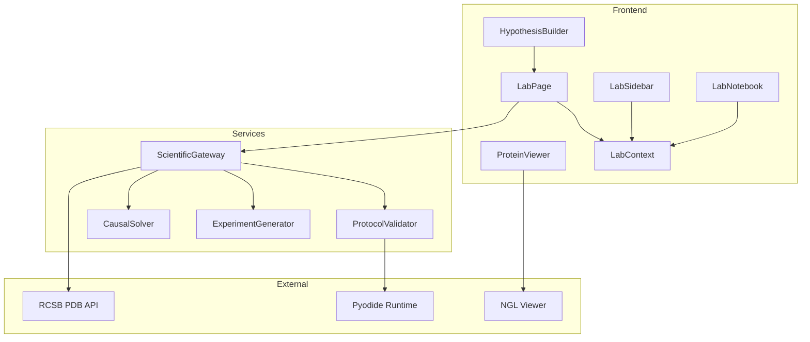
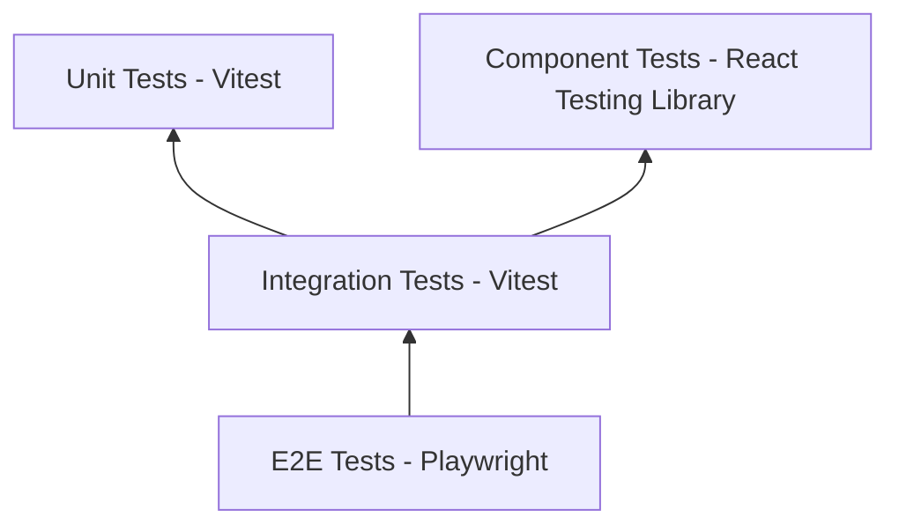

# Bio-Computation Lab: Production Readiness Audit & Implementation Plan

**Version:** 1.0  
**Date:** February 2026  
**Status:** Comprehensive Audit & Roadmap

---

## Executive Summary

The Bio-Computation Lab is a sophisticated "in silico" biology environment within the Synthetic-Mind platform. While the current implementation demonstrates strong architectural foundations and an elegant "Liquid Glass" UI design system, several critical gaps must be addressed before production deployment.

This document provides a comprehensive audit of the current state, identifies gaps across multiple dimensions, and proposes a detailed implementation plan aligned with the Liquid Glass design philosophy.

---

## Part 1: Current State Analysis

### 1.1 Architectural Overview



### 1.2 Implemented Features

| Feature | Status | Quality | Notes |
|---------|--------|---------|-------|
| Protein Structure Fetching | ✅ Working | Good | Direct RCSB API integration |
| 3D Protein Visualization | ✅ Working | Good | NGL viewer with dynamic script loading |
| Sequence Analysis | ✅ Working | Moderate | Pyodide/Biopython execution |
| Ligand Docking | ⚠️ Stub | N/A | Deterministic hash-based mock |
| Hypothesis Builder | ✅ Working | Good | ReactFlow-based graph editor |
| Provenance Notebook | ✅ Working | Good | Immutable experiment logging |
| Liquid Glass UI | ✅ Working | Excellent | Comprehensive design system |
| Offline Detection | ✅ Working | Basic | Browser online/offline events |

### 1.3 Code Quality Assessment

| Component | Lines of Code | Complexity | Test Coverage |
|-----------|---------------|------------|---------------|
| [`LabPage.tsx`](synthesis-engine/src/app/lab/page.tsx) | 229 | Medium | ❌ None |
| [`LabContext.tsx`](synthesis-engine/src/lib/contexts/LabContext.tsx) | 95 | Low | ❌ None |
| [`LabSidebar.tsx`](synthesis-engine/src/components/lab/LabSidebar.tsx) | 73 | Low | ❌ None |
| [`LabNotebook.tsx`](synthesis-engine/src/components/lab/LabNotebook.tsx) | 78 | Low | ❌ None |
| [`ProteinViewer.tsx`](synthesis-engine/src/components/lab/ProteinViewer.tsx) | 80 | Medium | ❌ None |
| [`HypothesisBuilder.tsx`](synthesis-engine/src/components/lab/HypothesisBuilder.tsx) | 150 | Medium | ❌ None |
| [`scientific-gateway.ts`](synthesis-engine/src/lib/services/scientific-gateway.ts) | 430 | High | ⚠️ Partial |
| [`globals.css`](synthesis-engine/src/app/globals.css) | 1500+ | Low | N/A |

---

## Part 2: Gap Analysis

### 2.1 Critical Gaps (Production Blockers)

#### G1. No Real Docking Engine
**Current State:** The [`dockLigand()`](synthesis-engine/src/lib/services/scientific-gateway.ts:396) function returns deterministic mock data based on input hashing.

**Impact:** Users cannot perform actual molecular docking simulations.

**Recommendation:** Integrate AutoDock Vina via WebAssembly or server-side execution.

#### G2. No Persistence Layer
**Current State:** All experiment history is stored in React context (memory only).

**Impact:** Data loss on page refresh; no experiment reproducibility across sessions.

**Recommendation:** Implement Supabase-backed persistence for experiment records.

#### G3. No User Authentication Integration
**Current State:** Hardcoded `user_id: 'manual-test'` in all experiments.

**Impact:** No user attribution; cannot track individual research workflows.

**Recommendation:** Integrate with existing Supabase auth system.

#### G4. No Error Recovery Mechanism
**Current State:** Basic try/catch with console.error logging.

**Impact:** Poor user experience on failures; no retry mechanisms.

**Recommendation:** Implement comprehensive error boundaries and retry logic.

### 2.2 High Priority Gaps

#### G5. Incomplete Tool Activation
**Current State:** Sidebar tools are clickable but dont open dedicated panels.

**Impact:** Users must use DEV buttons instead of intuitive tool selection.

**Recommendation:** Implement tool-specific input panels with forms.

#### G6. No Input Validation UI
**Current State:** No client-side validation for PDB IDs, SMILES strings, or sequences.

**Impact:** Poor UX; API errors only shown after submission.

**Recommendation:** Add real-time input validation with visual feedback.

#### G7. Missing Loading States
**Current State:** Only NGL viewer has loading state; other operations lack feedback.

**Impact:** Users dont know when operations are in progress.

**Recommendation:** Add skeleton loaders and progress indicators.

#### G8. No Result Visualization
**Current State:** Sequence analysis results shown as raw JSON.

**Impact:** Poor data interpretation experience.

**Recommendation:** Add charts and formatted result displays.

### 2.3 Medium Priority Gaps

#### G9. No Experiment Export
**Current State:** No way to export notebook or experiment data.

**Impact:** Cannot share or archive research.

**Recommendation:** Add PDF/JSON export functionality.

#### G10. No Hypothesis Simulation Backend
**Current State:** Hypothesis builder creates mock simulations.

**Impact:** Cannot test actual causal hypotheses.

**Recommendation:** Connect to CausalSolver for real simulations.

#### G11. Limited Accessibility
**Current State:** No ARIA labels, keyboard navigation, or screen reader support.

**Impact:** Non-compliant with accessibility standards.

**Recommendation:** Implement WCAG 2.1 AA compliance.

#### G12. No Internationalization
**Current State:** All strings hardcoded in English.

**Impact:** Limited global accessibility.

**Recommendation:** Add i18n support with next-intl.

### 2.4 Low Priority Gaps

#### G13. No Dark Mode Toggle in Lab
**Current State:** Lab uses CSS variables but no toggle exposed.

**Impact:** Users cannot switch themes within lab.

**Recommendation:** Add theme toggle to lab shell.

#### G14. No Keyboard Shortcuts
**Current State:** All interactions require mouse.

**Impact:** Reduced efficiency for power users.

**Recommendation:** Add keyboard shortcuts for common actions.

#### G15. No Tutorial/Onboarding
**Current State:** No guidance for new users.

**Impact:** Steep learning curve.

**Recommendation:** Add interactive onboarding tour.

---

## Part 3: Testing & Validation Strategy

### 3.1 Testing Pyramid



### 3.2 Unit Test Requirements

| Module | Test Cases Needed | Priority |
|--------|-------------------|----------|
| `ScientificGateway` | 25+ | Critical |
| `LabContext` reducer | 10+ | High |
| Input validators | 15+ | High |
| Data transformers | 10+ | Medium |
| Hash utilities | 5+ | Medium |

**Example Test Cases:**

```typescript
// Unit Test: PDB ID Validation
describe('validatePdbId', () => {
  it('should accept valid 4-character PDB IDs', () => {
    expect(validatePdbId('4HHB')).toBe(true);
    expect(validatePdbId('1CRN')).toBe(true);
  });
  
  it('should reject invalid PDB IDs', () => {
    expect(validatePdbId('')).toBe(false);
    expect(validatePdbId('ABC')).toBe(false);
    expect(validatePdbId('ABCDE')).toBe(false);
    expect(validatePdbId('4hhb')).toBe(false); // lowercase
  });
});

// Unit Test: SMILES Validation
describe('validateSmiles', () => {
  it('should accept valid SMILES strings', () => {
    expect(validateSmiles('CCO')).toBe(true); // Ethanol
    expect(validateSmiles('CC(=O)OC1=CC=CC=C1C(=O)O')).toBe(true); // Aspirin
  });
  
  it('should reject invalid SMILES', () => {
    expect(validateSmiles('')).toBe(false);
    expect(validateSmiles('invalid[[[')).toBe(false);
  });
});
```

### 3.3 Component Test Requirements

| Component | Test Cases Needed | Key Scenarios |
|-----------|-------------------|---------------|
| `LabPage` | 15+ | Tool switching, structure loading, error states |
| `LabSidebar` | 8+ | Tool selection, active state, offline indicator |
| `LabNotebook` | 10+ | Empty state, experiment display, scrolling |
| `ProteinViewer` | 12+ | Loading, rendering, error handling, resize |
| `HypothesisBuilder` | 15+ | Node creation, edge connection, simulation trigger |

**Example Component Test:**

```typescript
// Component Test: LabNotebook
describe('LabNotebook', () => {
  it('should display empty state when no experiments', () => {
    render(<LabNotebook />);
    expect(screen.getByText(/no experiments recorded/i)).toBeInTheDocument();
  });
  
  it('should display experiment with correct causal role badge', () => {
    const mockExperiment = {
      id: 'test-1',
      tool_name: 'dock_ligand',
      causal_role: 'intervention',
      status: 'success',
      input_json: { pdbId: '4HHB' },
      created_at: new Date().toISOString()
    };
    
    render(<LabNotebook />, { 
      wrapper: ({ children }) => (
        <LabProvider initialState={{ experimentHistory: [mockExperiment] }}>
          {children}
        </LabProvider>
      )
    });
    
    expect(screen.getByText('DO(X)')).toBeInTheDocument();
    expect(screen.getByText('dock_ligand')).toBeInTheDocument();
  });
});
```

### 3.4 Integration Test Requirements

| Integration | Test Cases Needed | Key Scenarios |
|-------------|-------------------|---------------|
| Lab + ScientificGateway | 10+ | Full workflow from UI to backend |
| ScientificGateway + RCSB API | 5+ | Real API calls, error handling |
| ScientificGateway + Pyodide | 8+ | Python execution, timeout handling |
| LabContext + Persistence | 10+ | Save/load experiments |

### 3.5 E2E Test Requirements

| User Flow | Test Cases Needed | Key Scenarios |
|-----------|-------------------|---------------|
| Protein Fetch Workflow | 5+ | Enter PDB ID, fetch, visualize, close |
| Sequence Analysis Workflow | 5+ | Enter sequence, analyze, view results |
| Docking Workflow | 5+ | Enter inputs, run docking, view results |
| Hypothesis Building | 8+ | Add nodes, connect, simulate |
| Full Experiment Cycle | 10+ | Complete research workflow |

**Example E2E Test:**

```typescript
// E2E Test: Protein Fetch Workflow
test('user can fetch and visualize a protein structure', async ({ page }) => {
  await page.goto('/lab');
  
  // Click Protein Fetch tool
  await page.click('[data-testid="tool-fetch_structure"]');
  
  // Enter PDB ID
  await page.fill('[data-testid="pdb-id-input"]', '4HHB');
  
  // Submit
  await page.click('[data-testid="fetch-button"]');
  
  // Wait for structure to load
  await expect(page.locator('[data-testid="protein-viewer"]')).toBeVisible({ timeout: 10000 });
  
  // Verify notebook entry
  await expect(page.locator('[data-testid="notebook-entry"]')).toContainText('fetch_protein_structure');
  await expect(page.locator('[data-testid="causal-badge"]')).toContainText('OBS(Y)');
});
```

### 3.6 Performance Testing

| Metric | Target | Measurement Method |
|--------|--------|-------------------|
| Initial Load Time | < 3s | Lighthouse |
| Time to Interactive | < 5s | Lighthouse |
| NGL Viewer Load | < 2s | Custom timing |
| Sequence Analysis | < 10s | Custom timing |
| Memory Usage | < 500MB | Chrome DevTools |

### 3.7 Security Testing

| Area | Test Cases | Priority |
|------|------------|----------|
| Input Sanitization | 10+ | Critical |
| XSS Prevention | 5+ | Critical |
| API Rate Limiting | 5+ | High |
| Auth Token Handling | 8+ | Critical |
| CORS Configuration | 3+ | High |

---

## Part 4: Implementation Plan

### Phase 1: Foundation (Critical Fixes)

#### 1.1 Persistence Layer
- [ ] Create `lab_experiments` table in Supabase
- [ ] Implement `LabPersistenceService` with CRUD operations
- [ ] Add real-time sync with Supabase subscriptions
- [ ] Migrate `LabContext` to use persistence layer
- [ ] Add offline queue for experiment records

#### 1.2 Authentication Integration
- [ ] Replace hardcoded `user_id` with auth context
- [ ] Add user-specific experiment queries
- [ ] Implement session management
- [ ] Add auth-gated API routes

#### 1.3 Error Handling
- [ ] Create `LabErrorBoundary` component
- [ ] Implement retry logic for API calls
- [ ] Add user-friendly error messages
- [ ] Create error reporting service

### Phase 2: Core Features

#### 2.1 Tool Input Panels
- [ ] Create `ProteinFetchPanel` component with form
- [ ] Create `SequenceAnalysisPanel` component with form
- [ ] Create `DockingPanel` component with form
- [ ] Add input validation with visual feedback
- [ ] Implement panel transitions with Framer Motion

#### 2.2 Result Visualization
- [ ] Create `SequenceResultCard` with charts
- [ ] Create `DockingResultCard` with 3D pose viewer
- [ ] Add result comparison views
- [ ] Implement result export functionality

#### 2.3 Real Docking Integration
- [ ] Evaluate AutoDock Vina WASM vs server-side
- [ ] Implement docking job queue
- [ ] Add progress tracking
- [ ] Create result parsing and visualization

### Phase 3: Enhanced UX

#### 3.1 Loading States
- [ ] Add skeleton components for all panels
- [ ] Implement progress bars for long operations
- [ ] Add optimistic UI updates
- [ ] Create loading animations aligned with Liquid Glass

#### 3.2 Accessibility
- [ ] Add ARIA labels to all interactive elements
- [ ] Implement keyboard navigation
- [ ] Add focus management
- [ ] Create high-contrast mode support

#### 3.3 Onboarding
- [ ] Create interactive tour with driver.js
- [ ] Add contextual help tooltips
- [ ] Create example experiments
- [ ] Add documentation links

### Phase 4: Testing & Quality

#### 4.1 Unit Tests
- [ ] ScientificGateway tests (25+ cases)
- [ ] LabContext tests (10+ cases)
- [ ] Validator tests (15+ cases)
- [ ] Utility tests (10+ cases)

#### 4.2 Component Tests
- [ ] LabPage tests (15+ cases)
- [ ] LabSidebar tests (8+ cases)
- [ ] LabNotebook tests (10+ cases)
- [ ] ProteinViewer tests (12+ cases)
- [ ] HypothesisBuilder tests (15+ cases)

#### 4.3 Integration Tests
- [ ] API integration tests (10+ cases)
- [ ] Context integration tests (10+ cases)

#### 4.4 E2E Tests
- [ ] Protein fetch workflow (5+ cases)
- [ ] Sequence analysis workflow (5+ cases)
- [ ] Docking workflow (5+ cases)
- [ ] Hypothesis building (8+ cases)

---

## Part 5: Liquid Glass Design Alignment

### 5.1 Design Principles Checklist

| Principle | Current Status | Action Needed |
|-----------|----------------|---------------|
| Glassmorphism panels | ✅ Implemented | Maintain consistency |
| Backdrop blur effects | ✅ Implemented | Add to new panels |
| Subtle gradients | ✅ Implemented | Extend to results |
| Soft shadows | ✅ Implemented | Add to modals |
| Serif typography for science | ✅ Implemented | Apply to result labels |
| Monospace for data | ✅ Implemented | Use in all data displays |
| Smooth transitions | ⚠️ Partial | Add to all state changes |
| Hover feedback | ⚠️ Partial | Add to all interactive elements |

### 5.2 New Component Styles Required

```css
/* Tool Input Panel */
.lab-tool-panel {
  border-radius: 16px;
  border: 1px solid var(--lab-border);
  background: linear-gradient(180deg, rgba(255, 255, 255, 0.72) 0%, rgba(255, 255, 255, 0.48) 100%);
  backdrop-filter: blur(18px) saturate(140%);
  box-shadow: var(--lab-shadow-soft);
}

/* Result Card */
.lab-result-card {
  border-radius: 12px;
  border: 1px solid var(--lab-border);
  background: rgba(255, 255, 255, 0.68);
  box-shadow: 0 3px 14px rgba(42, 38, 33, 0.05);
}

/* Input Field */
.lab-input {
  border-radius: 8px;
  border: 1px solid var(--lab-border);
  background: rgba(255, 255, 255, 0.9);
  transition: all 200ms ease-out;
}

.lab-input:focus {
  border-color: var(--lab-accent-earth);
  box-shadow: 0 0 0 3px rgba(139, 94, 60, 0.1);
}

/* Loading Skeleton */
.lab-skeleton {
  background: linear-gradient(90deg, 
    rgba(255, 255, 255, 0.4) 0%, 
    rgba(255, 255, 255, 0.8) 50%, 
    rgba(255, 255, 255, 0.4) 100%);
  background-size: 200% 100%;
  animation: skeleton-shimmer 1.5s infinite;
}

@keyframes skeleton-shimmer {
  0% { background-position: 200% 0; }
  100% { background-position: -200% 0; }
}
```

### 5.3 Animation Specifications

| Interaction | Duration | Easing | Properties |
|-------------|----------|--------|------------|
| Panel open/close | 300ms | ease-out | opacity, transform |
| Button hover | 150ms | ease-out | background, shadow |
| Input focus | 200ms | ease-out | border-color, shadow |
| Result reveal | 240ms | cubic-bezier(0.4, 0, 0.2, 1) | opacity, translateY |
| Loading shimmer | 1500ms | linear | background-position |

---

## Part 6: File Structure Recommendations

```
synthesis-engine/src/
├── app/lab/
│   ├── page.tsx                 # Main lab page (update)
│   ├── layout.tsx               # Lab layout (keep)
│   └── __tests__/
│       └── page.test.tsx        # E2E tests
├── components/lab/
│   ├── LabSidebar.tsx           # (update with tool panels)
│   ├── LabNotebook.tsx          # (keep)
│   ├── ProteinViewer.tsx        # (update with error handling)
│   ├── HypothesisBuilder.tsx    # (update with validation)
│   ├── panels/                  # NEW
│   │   ├── ProteinFetchPanel.tsx
│   │   ├── SequenceAnalysisPanel.tsx
│   │   ├── DockingPanel.tsx
│   │   └── __tests__/
│   ├── results/                 # NEW
│   │   ├── SequenceResultCard.tsx
│   │   ├── DockingResultCard.tsx
│   │   └── __tests__/
│   ├── common/                  # NEW
│   │   ├── LabInput.tsx
│   │   ├── LabButton.tsx
│   │   ├── LabSkeleton.tsx
│   │   ├── LabErrorBoundary.tsx
│   │   └── __tests__/
│   └── __tests__/
│       ├── LabSidebar.test.tsx
│       ├── LabNotebook.test.tsx
│       ├── ProteinViewer.test.tsx
│       └── HypothesisBuilder.test.tsx
├── lib/
│   ├── contexts/
│   │   ├── LabContext.tsx       # (update with persistence)
│   │   └── __tests__/
│   ├── services/
│   │   ├── scientific-gateway.ts # (update with real docking)
│   │   ├── lab-persistence.ts    # NEW
│   │   ├── lab-validators.ts     # NEW
│   │   └── __tests__/
│   └── hooks/                   # NEW
│       ├── useLabExperiment.ts
│       ├── useProteinStructure.ts
│       └── __tests__/
└── types/
    └── lab.ts                   # NEW - Lab-specific types
```

---

## Part 7: Risk Assessment

| Risk | Likelihood | Impact | Mitigation |
|------|------------|--------|------------|
| AutoDock Vina WASM complexity | High | High | Start with server-side; WASM as Phase 2 |
| Pyodide performance issues | Medium | Medium | Add Web Worker support |
| Supabase connection limits | Low | High | Implement connection pooling |
| NGL viewer memory leaks | Medium | Medium | Add proper cleanup in useEffect |
| Large PDB file handling | Medium | Medium | Add file size limits and streaming |

---

## Part 8: Success Metrics

### 8.1 Technical Metrics

| Metric | Current | Target | Measurement |
|--------|---------|--------|-------------|
| Test Coverage | ~5% | 80%+ | Vitest coverage |
| TypeScript Errors | Unknown | 0 | tsc --noEmit |
| ESLint Errors | Unknown | 0 | npm run lint |
| Bundle Size | Unknown | < 500KB | Next.js analyzer |
| Lighthouse Score | Unknown | 90+ | Lighthouse CI |

### 8.2 User Experience Metrics

| Metric | Target | Measurement |
|--------|--------|-------------|
| Task Completion Rate | 95%+ | User testing |
| Error Recovery Rate | 90%+ | Analytics |
| Time to First Result | < 10s | Performance monitoring |
| User Satisfaction | 4.5/5 | Surveys |

---

## Appendix A: Quick Wins

These items can be implemented immediately with minimal effort:

1. **Add input validation UI** - Simple regex validators with visual feedback
2. **Add loading spinners** - Replace text-based loading states
3. **Add error boundaries** - Wrap components with error handling
4. **Add keyboard shortcuts** - Power user efficiency
5. **Add result formatting** - Better JSON display with syntax highlighting
6. **Add experiment timestamps** - Already in data, just format better
7. **Add copy buttons** - For PDB content and results
8. **Add theme toggle** - Expose existing dark mode capability

---

## Appendix B: References

- [AutoDock Vina Documentation](https://vina.scripps.edu/)
- [NGL Viewer Documentation](http://nglviewer.org/)
- [RCSB PDB API](https://data.rcsb.org/)
- [Biopython Documentation](https://biopython.org/)
- [Supabase Documentation](https://supabase.com/docs)
- [WCAG 2.1 Guidelines](https://www.w3.org/WAI/WCAG21/quickref/)
- [Apple Human Interface Guidelines](https://developer.apple.com/design/human-interface-guidelines/)
