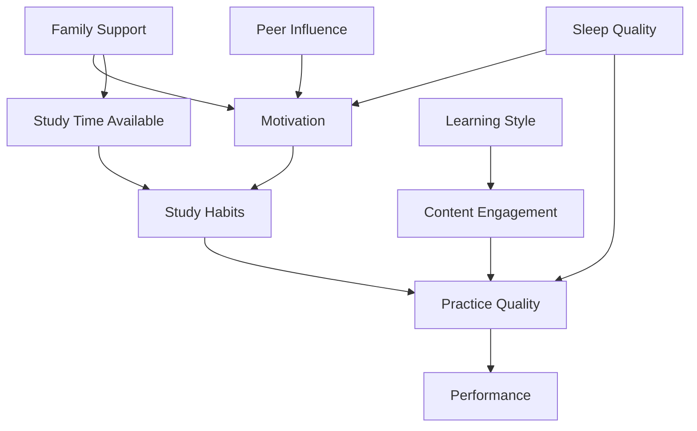

# Educational Systems: Personalized by Causal Fingerprint
## Comprehensive Architecture & Implementation Plan

**Generated:** 2026-02-03  
**System:** Synthetic Mind - Synthesis Engine  
**Objective:** Transform education from reactive observation to proactive causal intervention

---

## Executive Summary

The Educational Systems feature applies Pearl's Structural Causal Models to personalize learning interventions. Instead of asking "what methods worked for students who scored X?" we ask **"For THIS student's unique causal graph—where motivation → study_habits ← family_support → performance—which intervention point yields maximum effect?"**

### Core Innovation

**Current EdTech:** "Students who scored 80% benefited from video lectures" (Layer 1 - Correlation)  
**Causal EdTech:** "For student Alice with low motivation → poor study habits, intervening on motivation yields +25% performance" (Layer 2-3 - Intervention/Counterfactual)

This shifts education from **symptomatic treatment** (more practice problems) to **surgical intervention** (targeting root causes in the causal chain).

---

## 1. Vision: Education as Causal Surgery

### The Problem with Current Personalization

**Typical Adaptive Learning:**
```
IF (test_score < 70) THEN assign_remedial_content
```
- Reactive, not proactive
- Treats symptoms (low scores)
- Ignores root causes (motivation, family support, learning disabilities)
- One-size-fits-all interventions

**Correlation-Based Recommendations:**
```
Students similar to you benefited from Method X
```
- Confounded by hidden variables
- Cannot predict intervention effects
- No causal mechanism

### Our Approach: Causal Fingerprinting

**Student-Specific Causal Graph:**


**For Student Alice:**
```
Weak Links: Family Support (2/10) → Motivation (3/10) → Study Habits (4/10)
Strong Links: Learning Style (8/10) → Content Engagement (9/10)

Diagnosis: High cognitive ability, but demotivated due to family stress
Intervention: Family counseling resource + intrinsic motivation techniques
Expected Impact: +30% performance (targeting root cause)
```

**For Student Bob:**
```
Weak Links: Learning Style mismatch (3/10) → Content Engagement (4/10)
Strong Links: Family Support (9/10) → Motivation (8/10) → Study Habits (8/10)

Diagnosis: Highly motivated but learning modality mismatch
Intervention: Visual/kinesthetic content swap
Expected Impact: +20% performance (aligning to learning style)
```

### The Three Constraints (Wabi-Sabi Education)

Per the common thread, we honor:

1. **Energy Flows Tracked** (No Magical Solutions)
   - Learning requires cognitive work (attention, practice, retrieval)
   - We track "effort cost" of each intervention
   - No shortcuts: deep learning requires targeted effort

2. **Entropy Battles Identified** (Where Must We Invest Work?)
   - Identify the "highest leverage" intervention point
   - Example: For Alice, spending effort on family support yields more than 100 practice problems

3. **Time's Arrow Respected** (No Confusing Effect for Cause)
   - Effect must follow cause: motivation changes → then study habits change
   - Cannot claim "good grades cause motivation" (reversed causality)

---

## 2. Architecture Analysis (Current System)

### Existing Capabilities

From the Healthcare Revolution (now removed), we learned the architecture:

**Tier 1  Universal Physics Constraints** ([`causal-blueprint.ts`](../synthesis-engine/src/lib/ai/causal-blueprint.ts))
- [`StructuralCausalModel`](../synthesis-engine/src/lib/ai/causal-blueprint.ts:73) base class ✅
- Conservation, en tropy, causality validation ✅

**Tier 2: Domain Templates**
- Pattern established with other domains (legal, ecology, scaling laws) ✅
- Need: [`EducationalSCM`](../synthesis-engine/src/lib/ai/educational-scm.ts) ⚠️

**Integration Layer:**
- [`SCMRetriever`](../synthesis-engine/src/lib/services/scm-retrieval.ts) - Domain loader ✅
- [`DomainClassifier`](../synthesis-engine/src/lib/services/domain-classifier.ts) - Query router ✅
- Need: Educational domain keywords ⚠️

**Infrastructure:**
- Supabase database with RLS ✅
- API route pattern (`/api/*/route.ts`) ✅
- Wabi-Sabi UI components ✅

### Gaps for Educational Systems

❌ **No educational domain template**
❌ **No student causal profile schema**
❌ **No intervention optimization algorithm**
❌ **No content recommendation engine**
❌ **No educator dashboard**
❌ **No student progress tracking**

---

## 3. Educational SCM Architecture

### Tier 2 Template: [`EducationalSCM`](../synthesis-engine/src/lib/ai/educational-scm.ts)

#### Causal Nodes (Student Profile Variables)

**Exogenous (Background Factors):**
```typescript
{
  name: 'FamilySupport',
  type: 'exogenous',
  domain: 'education',
  measurement: 'Survey: parental involvement, SES, home environment',
  scale: '0-10'
}
{
  name: 'PriorKnowledge',
  type: 'exogenous',
  domain: 'education',
  measurement: 'Prerequisite test scores',
  scale: 'standardized score'
}
{
  name: 'LearningStyle',
  type: 'exogenous',
  domain: 'education',
  measurement: 'VARK questionnaire (Visual/Auditory/Read-Write/Kinesthetic)',
  scale: 'categorical'
}
```

**Observable (Measurable State):**
```typescript
{
  name: 'Motivation',
  type: 'observable',
  domain: 'education',
  measurement: 'Self-report surveys, engagement metrics',
  scale: '0-10'
}
{
  name: 'StudyHabits',
  type: 'observable',
  domain: 'education',
  measurement: 'Time tracking, consistency, active recall usage',
  scale: 'composite score 0-100'
}
{
  name: 'ContentEngagement',
  type: 'observable',
  domain: 'education',
  measurement: 'Video completion, interaction rates, question-asking',
  scale: '0-100%'
}
{
  name: 'PracticeQuality',
  type: 'observable',
  domain: 'education',
  measurement: 'Homework accuracy, retrieval practice, spaced repetition',
  scale: '0-100'
}
{
  name: 'Performance',
  type: 'observable',
  domain: 'education',
  measurement: 'Test scores, project grades, mastery assessments',
  scale: 'standardized score'
}
```

**Latent (Hidden State):**
```typescript
{
  name: 'CognitiveLoad',
  type: 'latent',
  domain: 'education',
  estimation: 'Inferred from working memory tests, task difficulty',
  relevance: 'High cognitive load blocks learning'
}
{
  name: 'PerceivedCompetence',
  type: 'latent',
  domain: 'education',
  estimation: 'Self-efficacy surveys',
  relevance: 'Affects motivation and persistence'
}
```

#### Causal Edges (Learning Pathways)

**1. Family Support → Motivation**
```typescript
{
  from: 'FamilySupport',
  to: 'Motivation',
  mechanism: 'Parental encouragement → increased intrinsic motivation',
  constraint: 'causality',
  reversible: false,
  interventions: ['Family counseling', 'Parent engagement programs'],
  evidenceBasis: 'Deci & Ryan (2000) Self-Determination Theory'
}
```

**2. Motivation → Study Habits**
```typescript
{
  from: 'Motivation',
  to: 'StudyHabits',
  mechanism: 'Intrinsic motivation → sustained effort → consistent study routines',
  constraint: 'causality',
  reversible: false,
  interventions: ['Goal-setting workshops', 'Gamification systems'],
  evidenceBasis: 'Dweck (2006) Mindset Theory'
}
```

**3. Study Habits → Practice Quality → Performance**
```typescript
{
  from: 'StudyHabits',
  to: 'PracticeQuality',
  mechanism: 'Consistent practice → retrieval strengthening → long-term retention',
  constraint: 'entropy', // Requires work investment
  reversible: true, // Can degrade without maintenance
  interventions: ['Spaced repetition systems', 'Active recall training'],
  energyCost: 'high', // Deliberate practice is effortful
  evidenceBasis: 'Bjork (1994) Desirable Difficulties'
}
```

**4. Learning Style → Content Engagement**
```typescript
{
  from: 'LearningStyle',
  to: 'ContentEngagement',
  mechanism: 'Matching instruction modality → reduced cognitive load → increased engagement',
  constraint: 'causality',
  reversible: false,
  interventions: ['Multimodal content', 'Personalized content format'],
  evidenceBasis: 'Fleming & Mills (1992) VARK Model'
}
```

**5. Peer Influence → Motivation**
```typescript
{
  from: 'PeerInfluence',
  to: 'Motivation',
  mechanism: 'Social learning → modeling behavior → increased motivation',
  constraint: 'causality',
  reversible: true,
  interventions: ['Study groups', 'Peer tutoring programs'],
  evidenceBasis: 'Bandura (1977) Social Learning Theory'
}
```

#### Educational-Specific Constraints

**1. Cognitive Load Ceiling**
```typescript
checkConstraint('cognitive_overload', {
  test: (intervention) => estimatedCognitiveLoad(intervention) < workingMemoryCapacity,
  violation: 'Intervention exceeds cognitive capacity (Miller's 7±2 limit)',
  severity: 'fatal',
  evidence: 'Sweller (1988) Cognitive Load Theory'
});
```

**2. Prerequisite Knowledge Requirement**
```typescript
checkConstraint('prerequisite_gap', {
  test: (lesson) => student.priorKnowledge >= lesson.prerequisiteLevel,
  violation: 'Student lacks prerequisite knowledge for this content',
  severity: 'fatal',
  evidence: 'Bloom (1968) Mastery Learning'
});
```

**3. Temporal Spacing (Distributed Practice)**
```typescript
checkConstraint('massed_practice', {
  test: (studyPlan) => intervalBetweenSessions >= minimumSpacing,
  violation: 'Practice sessions too close together (massed practice ineffective)',
  severity: 'warning',
  evidence: 'Cepeda et al. (2006) Spacing Effect meta-analysis'
});
```

**4. Active vs. Passive Learning**
```typescript
checkConstraint('passive_learning', {
  test: (activity) => activity.retrievalPractice || activity.generationEffect,
  violation: 'Passive re-reading detected (low retention expected)',
  severity: 'warning',
  evidence: 'Roediger & Karpicke (2006) Testing Effect'
});
```

**5. Growth Mindset Alignment**
```typescript
checkConstraint('fixed_mindset_language', {
  test: (feedback) => !feedback.includes('smart', 'talented', 'gifted'),
  violation: 'Feedback emphasizes ability over effort (undermines growth mindset)',
  severity: 'warning',
  evidence: 'Dweck (2006) Mindset Theory'
});
```

---

## 4. Student Causal Fingerprint System

### Data Collection Pipeline

**Phase 1: Initial Assessment (Week 1)**
```typescript
interface StudentIntake {
  demographics: {
    age: number;
    grade: string;
    priorGPA?: number;
    learningDisabilities?: string[];
  };
  surveys: {
    motivationSurvey: SurveyResponse; // Academic Motivation Scale
    learningStyleVARK: LearningStyle; // VARK questionnaire
    familySupportScale: number; // 0-10
    perceivedCompetenceScale: number; // Self-efficacy survey
  };
  diagnostics: {
    prerequisiteTest: TestScore; // Mastery of prerequisites
    workingMemoryTest?: CognitiveAssessment;
  };
}
```

**Phase 2: Behavioral Data (Ongoing)**
```typescript
interface StudentBehaviorData {
  engagement: {
    videoCompletion: number[]; // % per lesson
    interactionRate: number; // Clicks, pauses, rewinds
    questionAsking: number; // Forum posts, questions raised
  };
  studyPatterns: {
    timeOnTask: number[]; // Minutes per day
    consistency: number; // Variance in study time
    activeRecallUsage: boolean; // Using flashcards, practice tests
  };
  performance: {
    quizScores: number[];
    homeworkAccuracy: number[];
    projectGrades: number[];
  };
}
```

**Phase 3: Causal Graph Construction**
```typescript
async function constructStudentCausalGraph(
  studentId: string,
  intake: StudentIntake,
  behaviorData: StudentBehaviorData
): Promise<StudentCausalGraph> {
  
  // Initialize base educational SCM
  const baseGraph = new EducationalSCM();
  
  // Hydrate with student-specific values
  const nodes = [
    { name: 'FamilySupport', value: intake.surveys.familySupportScale },
    { name: 'LearningStyle', value: intake.surveys.learningStyleVARK },
    { name: 'Motivation', value: intake.surveys.motivationSurvey.score },
    { name: 'StudyHabits', value: computeStudyHabitsScore(behaviorData.studyPatterns) },
    { name: 'ContentEngagement', value: mean(behaviorData.engagement.videoCompletion) },
    { name: 'PracticeQuality', value: mean(behaviorData.performance.homeworkAccuracy) },
    { name: 'Performance', value: mean(behaviorData.performance.quizScores) }
  ];
  
  // Compute edge strengths (correlation as proxy for causal strength)
  const edges = baseGraph.edges.map(edge => ({
    ...edge,
    strength: computeEdgeStrength(edge.from, edge.to, behaviorData)
  }));
  
  return {
    studentId,
    nodes,
    edges,
    timestamp: new Date()
  };
}
```

### Intervention Optimization

**Algorithm: Maximum Expected Improvement (MEI)**

```typescript
async function findOptimalIntervention(
  student: StudentCausalGraph,
  availableInterventions: Intervention[]
): Promise<RankedInterventions> {
  
  const results: InterventionResult[] = [];
  
  for (const intervention of availableInterventions) {
    // Step 1: Simulate do-operator (graph surgery)
    const mutilatedGraph = removeIncomingEdges(student, intervention.target);
    mutilatedGraph.setNodeValue(intervention.target, intervention.targetValue);
    
    // Step 2: Propagate effects through causal chain
    const finalState = propagateCausally(mutilatedGraph);
    
    // Step 3: Calculate expected performance gain
    const originalPerformance = student.getNode('Performance').value;
    const predictedPerformance = finalState.getNode('Performance').value;
    const expectedGain = predictedPerformance - originalPerformance;
    
    // Step 4: Calculate effort cost
    const effortCost = intervention.energyCost; // Normalized 0-1
    
    // Step 5: Compute utility (gain per unit effort)
    const utility = expectedGain / effortCost;
    
    results.push({
      intervention,
      expectedGain,
      effortCost,
      utility,
      confidence: computeConfidence(student, intervention)
    });
  }
  
  // Rank by utility (highest gain per effort)
  return results.sort((a, b) => b.utility - a.utility);
}
```

**Example Output:**

```
Student: Alice Thompson
Current Performance: 68% (below grade level)

Causal Analysis:
- Family Support: 2/10 (single parent, financial stress)
- Motivation: 3/10 (lacks intrinsic drive)
- Study Habits: 4/10 (sporadic, no routine)
- Content Engagement: 9/10 (curious, asks questions)

Ranked Interventions:
1. Family Resource Connection (Utility: 8.2)
   - Target: Family Support
   - Expected Gain: +22% performance
   - Effort Cost: Low (one-time referral)
   - Mechanism: Reduce family stress → increase motivation → improve study habits

2. Motivational Interviewing (Utility: 6.5)
   - Target: Motivation
   - Expected Gain: +18% performance
   - Effort Cost: Medium (weekly counseling sessions)
   - Mechanism: Identify intrinsic goals → increased persistence

3. Spaced Repetition Training (Utility: 3.1)
   - Target: Study Habits
   - Expected Gain: +10% performance
   - Effort Cost: High (requires sustained behavior change)
   - Mechanism: Improve study quality → better retention

RECOMMENDATION: Start with Intervention #1 (family support).
Rationale: Highest leverage point in Alice's causal graph. Addressing root cause (family stress) will cascade through motivation and study habits.
```

---

## 5. TypeScript Type Definitions

```typescript
// File: synthesis-engine/src/types/education.ts

export type LearningStyle = 'Visual' | 'Auditory' | 'ReadWrite' | 'Kinesthetic' | 'Multimodal';

export interface StudentDemographics {
  age: number;
  grade: string; // 'K', '1', '2', ..., '12', 'College'
  priorGPA?: number;
  learningDisabilities?: string[]; // e.g., ['ADHD', 'Dyslexia']
  language: string; // Primary language
  ses?: 'low' | 'medium' | 'high'; // Socioeconomic status
}

export interface MotivationSurvey {
  intrinsic: number; // 0-10
  extrinsic: number; // 0-10
  amotivation: number; // 0-10 (lack of motivation)
  goals: string[]; // Student's stated goals
}

export interface StudentIntakeData {
  demographics: StudentDemographics;
  motivationSurvey: MotivationSurvey;
  learningStyle: LearningStyle;
  familySupportScore: number; // 0-10
  perceivedCompetenceScore: number; // 0-10 (self-efficacy)
  prerequisiteTestScore: number; // 0-1 00
  workingMemoryScore?: number; // Optional cognitive assessment
}

export interface EngagementMetrics {
  videoCompletion: number[]; // % per lesson
  videoInteractions: number; // Pauses, rewinds, speed changes
  questionAsking: number; // Forum questions, raised hand
  peerInteractions: number; // Study group participation
  timeOnTask: number[]; // Minutes per session
}

export interface StudyPatterns {
  totalStudyTime: number; // Hours per week
  consistency: number; // 0-1 (variance measure)
  activeRecallUsage: boolean; // Using flashcards, practice tests
  spacedRepetition: boolean; // Reviewing material over time
  studyEnvironmentQuality: number; // 0-10 (quiet, organized)
}

export interface PerformanceData {
  quizScores: number[]; // 0-100
  homeworkAccuracy: number[]; // 0-100
  projectGrades: number[]; // 0-100
  standardizedTestScore?: number; // SAT, ACT, state tests
  masteryByTopic: Record<string, number>; // Topic -> mastery % }

export interface EducationalCausalNode {
  name: string;
  type: 'exogenous' | 'observable' | 'latent';
  value: number | string;
  unit?: string;
  confidence?: number; // 0-1
  lastUpdated: Date;
}

export interface EducationalCausalEdge {
  from: string;
  to: string;
  mechanism: string;
  strength: number; // 0-1 (correlation as proxy)
  evidence: string; // Research citation
  interventionPoints?: string[]; // Available interventions
}

export interface StudentCausalGraph {
  studentId: string;
  nodes: EducationalCausalNode[];
  edges: EducationalCausalEdge[];
  timestamp: Date;
  version: number;
}

export interface Intervention {
  id: string;
  name: string;
  target: string; // Node name to intervene on
  targetValue: number | string; // Desired value
  mechanism: string;
  energyCost: number; // 0-1 (effort required)
  duration: string; // 'one-time', '1 week', '1 semester'
  resources: string[]; // Required resources
  evidenceBasis: string; // Research citation
}

export interface InterventionResult {
  intervention: Intervention;
  expectedGain: number; // Predicted performance increase
  effortCost: number; // Normalized effort
  utility: number; // Gain per unit effort
  confidence: number; // 0-1
  timeToEffect: string; // 'immediate', '2 weeks', '1 semester'
  counterIndications?: string[]; // Reasons to avoid
}

export interface InterventionRequest {
  studentId: string;
  optimizationGoal: 'performance' | 'engagement' | 'well_being';
  constraints?: {
    maxEffort?: number; // Max effort cost
    maxDuration?: string; // Max intervention duration
    excludeInterventions?: string[]; // IDs to exclude
  };
}

export interface InterventionResponse {
  success: boolean;
  studentGraph: StudentCausalGraph;
  rankedInterventions: InterventionResult[];
  topRecommendation: InterventionResult;
  explanation: string; // Natural language
  timestamp: Date;
}
```

---

## 6. API Contracts

### REST Endpoints

#### POST `/api/education/analyze-student`
**Description:** Generate causal fingerprint for a student

**Request:**
```typescript
{
  studentId: string;
  intakeData: StudentIntakeData;
  behaviorData?: {
    engagement: EngagementMetrics;
    studyPatterns: StudyPatterns;
    performance: PerformanceData;
  };
}
```

**Response:**
```typescript
{
  success: boolean;
  causalGraph: StudentCausalGraph;
  insights: {
    strongestLinks: EducationalCausalEdge[];
    weakestLinks: EducationalCausalEdge[];
    bottleneck: string; // Primary limiting factor
    leveragePoint: string; // Highest ROI intervention target
  };
  timestamp: Date;
}
```

#### POST `/api/education/optimize-intervention`
**Description:** Find optimal intervention for a student

**Request:**
```typescript
{
  studentId: string;
  optimizationGoal: 'performance' | 'engagement' | 'well_being';
  constraints?: {
    maxEffort?: number;
    maxDuration?: string;
  };
}
```

**Response:**
```typescript
{
  success: boolean;
  rankedInterventions: InterventionResult[];
  topRecommendation: {
    intervention: Intervention;
    expectedGain: number;
    rationale: string;
    implementationPlan: string[];
  };
  alternativePathways: Intervention[];
  counterfactuals: CounterfactualScenario[];
}
```

#### GET `/api/education/interventions`
**Description:** List available interventions

**Query Parameters:**
- `target?: string` - Filter by target node
- `category?: string` - Filter by category (motivation, content, habits)

**Response:**
```typescript
{
  interventions: Intervention[];
  categorized: Record<string, Intervention[]>;
}
```

---

## 7. Database Schema

```sql
-- Educational SCM templates
CREATE TABLE educational_scm_templates (
  id UUID PRIMARY KEY DEFAULT uuid_generate_v4(),
  grade_level VARCHAR(20), -- 'elementary', 'middle', 'high', 'college'
  subject VARCHAR(100),    -- 'math', 'science', 'language_arts'
  nodes JSONB NOT NULL,
  edges JSONB NOT NULL,
  constraints JSONB NOT NULL,
  evidence_base JSONB,
  version INTEGER DEFAULT 1,
  created_at TIMESTAMPTZ DEFAULT NOW()
);

-- Student causal profiles
CREATE TABLE student_causal_profiles (
  id UUID PRIMARY KEY, -- De-identified student UUID
  demographics JSONB,  -- StudentDemographics (no PII)
  intake_data JSONB,   -- StudentIntakeData
  causal_graph JSONB,  -- StudentCausalGraph
  last_updated TIMESTAMPTZ DEFAULT NOW(),
  
  -- Privacy: No PII allowed (FERPA compliance)
  CONSTRAINT no_pii_check CHECK (
    demographics::TEXT !~* '(name|ssn|address|phone|email)'
  )
);

-- Behavioral data tracking
CREATE TABLE student_behavior_data (
  id UUID PRIMARY KEY DEFAULT uuid_generate_v4(),
  student_id UUID REFERENCES student_causal_profiles(id),
  engagement_metrics JSONB,
  study_patterns JSONB,
  performance_data JSONB,
  collected_at TIMESTAMPTZ DEFAULT NOW()
);

-- Interventions library
CREATE TABLE interventions_library (
  id UUID PRIMARY KEY DEFAULT uuid_generate_v4(),
  name VARCHAR(255) NOT NULL,
  target_node VARCHAR(100) NOT NULL,
  mechanism TEXT,
  energy_cost FLOAT CHECK (energy_cost >= 0 AND energy_cost <= 1),
  duration VARCHAR(50),
  resources TEXT[],
  evidence_basis TEXT,
  success_rate FLOAT,
  created_at TIMESTAMPTZ DEFAULT NOW()
);

-- Intervention assignments
CREATE TABLE intervention_assignments (
  id UUID PRIMARY KEY DEFAULT uuid_generate_v4(),
  student_id UUID REFERENCES student_causal_profiles(id),
  intervention_id UUID REFERENCES interventions_library(id),
  assigned_at TIMESTAMPTZ DEFAULT NOW(),
  assigned_by UUID, -- Educator UUID
  expected_gain FLOAT,
  actual_gain FLOAT, -- Filled after evaluation
  status VARCHAR(20) CHECK (status IN ('pending', 'active', 'completed', 'abandoned')),
  notes TEXT
);

-- Educator audit log (FERPA compliance)
CREATE TABLE educational_audit_log (
  id UUID PRIMARY KEY DEFAULT uuid_generate_v4(),
  timestamp TIMESTAMPTZ DEFAULT NOW(),
  educator_id UUID,
  student_id UUID,
  action VARCHAR(50) CHECK (action IN ('view', 'analyze', 'assign_intervention', 'export')),
  resource VARCHAR(100),
  ip_address_hash VARCHAR(64),
  institution VARCHAR(255),
  retention_until TIMESTAMPTZ DEFAULT (NOW() + INTERVAL '7 years')
);

-- Indexes
CREATE INDEX idx_student_updated ON student_causal_profiles(last_updated DESC);
CREATE INDEX idx_behavior_student ON student_behavior_data(student_id);
CREATE INDEX idx_intervention_target ON interventions_library(target_node);
CREATE INDEX idx_assignment_student ON intervention_assignments(student_id);
```

---

## 8. UI/UX Design (Wabi-Sabi Alignment)

### Educator Dashboard

**Design Philosophy:**
- 🍂 **Organic Growth Metaphor:** Visualize student progress as a growing tree
- 📜 **Natural Materials:** Warm paper textures, handwritten fonts for personal touch
- 🏺 **Embracing Imperfection:** Show uncertainty in predictions, acknowledge limitations

**Key Views:**

**1. Student Causal Map**
```
┌─────────────────────────────────────────────┐
│ Alice Thompson - Causal Fingerprint        │
│                                             │
│     [Family Support: 2/10] ──┐             │
│                               ↓             │
│     [Sleep Quality: 6/10] ──→ [Motivation:3/10]│
│                               ↓             │
│                       [Study Habits: 4/10]  │
│                               ↓             │
│                     [Practice Quality: 5/10]│
│                               ↓             │
│                      [Performance: 68%]     │
│                                             │
│ 🎯 Leverage Point: Family Support          │
│ Expected Impact: +22% performance           │
│                                             │
│ [Assign Intervention] [View History]       │
└─────────────────────────────────────────────┘
```

**2. Intervention Recommendation**
```
┌─────────────────────────────────────────────┐
│ Recommended: Family Resource Connection    │
│                                             │
│ Why: Alice's primary bottleneck is at the  │
│ root cause (family stress). Addressing this│
│ will cascade through motivation and habits. │
│                                             │
│ Expected Gain: +22% (69% → 91%)            │
│ Effort Cost: ⚡ Low (one-time referral)    │
│ Time to Effect: 3-4 weeks                  │
│                                             │
│ Implementation:                             │
│ 1. Refer family to counseling services     │
│ 2. Connect with financial aid resources    │
│ 3. Follow-up check-in in 2 weeks           │
│                                             │
│ [Assign to Alice] [See Alternatives]       │
└─────────────────────────────────────────────┘
```

### Student Dashboard

**Design Philosophy:**
- Gamification without manipulation
- Emphasize effort over ability (growth mindset)
- Celebrate progress, not perfection

**Key Views:**

**1. Personal Growth Tree**
```
       🌳
      /│\
     / │ \
   📚 💪 👨‍👩‍👧
   Study  Effort  Family
   Habits        Support
   
   "Your tree grows with each day of practice.
    The roots (family, sleep) feed the branches (study).
    The leaves (performance) are the result, not the goal."
```

**2. Intervention Quest**
```
┌─────────────────────────────────────────────┐
│ Your Quest: Build Better Study Habits      │
│                                             │
│ Why: Your teacher noticed you're curious   │
│ (great!) but studying irregularly. Let's   │
│ build a routine that sticks.               │
│                                             │
│ Step 1: Set a study time (same time daily) │
│   ✅ Completed (3 days streak)             │
│                                             │
│ Step 2: Use active recall (flashcards)     │
│   🔄 In Progress (5/10 lessons)            │
│                                             │
│ Step 3: Track your progress                │
│   ⏳ Not started                           │
│                                             │
│ Expected Impact: +15% on next quiz         │
│                                             │
│ [View Resources] [Get Help]                │
└─────────────────────────────────────────────┘
```

---

## 9. Implementation Roadmap

### Phase 1: Foundation (Weeks 1-3)
**Goal:** Core Educational SCM infrastructure

**Tasks:**
1. Create [`EducationalSCM`](../synthesis-engine/src/lib/ai/educational-scm.ts) class
   - Define nodes (Motivation, StudyHabits, Family Support, Performance)
   - Define edges with evidence basis
   - Implement 5 constraint validators
2. Extend [`SCMRetriever`](../synthesis-engine/src/lib/services/scm-retrieval.ts) for education domain
3. Create type definitions ([`education.ts`](../synthesis-engine/src/types/education.ts))
4. Create database tables
5. Write unit tests

**Deliverables:**
- ✅ Educational SCM with 7+ causal nodes
- ✅ Database schema deployed
- ✅ 80% test coverage

### Phase 2: Causal Analysis Engine (Weeks 4-6)
**Goal:** Student fingerprinting and intervention optimization

**Tasks:**
1. Build [`StudentCausalGraphBuilder`](../synthesis-engine/src/lib/services/student-graph-builder.ts)
   - Intake data → causal graph
   - Behavioral data integration
2. Implement [`InterventionOptimizer`](../synthesis-engine/src/lib/services/intervention-optimizer.ts)
   - Maximum Expected Improvement (MEI) algorithm
   - Utility ranking (gain per effort)
3. Create [`/api/education/analyze-student`](../synthesis-engine/src/app/api/education/analyze-student/route.ts)
4. Create [`/api/education/optimize-intervention`](../synthesis-engine/src/app/api/education/optimize-intervention/route.ts)
5. Seed interventions library

**Deliverables:**
- ✅ Working causal analysis API
- ✅ Intervention optimization algorithm
- ✅ 20+ interventions seeded

### Phase 3: Data Collection (Weeks 7-9)
**Goal:** Student intake and behavioral tracking

**Tasks:**
1. Build intake forms
   - Motivation survey (Academic Motivation Scale)
   - Learning style assessment (VARK)
   - Family support questionnaire
2. Implement behavioral tracking
   - LMS integration (Canvas, Moodle webhooks)
   - Video engagement analytics
   - Study time tracking
3. Create data pipeline
   - Scheduled jobs to compute causal graphs
   - Anomaly detection (sudden performance drops)

**Deliverables:**
- ✅ Intake workflow (20-minute assessment)
- ✅ Automated behavioral data collection
- ✅ Daily causal graph updates

### Phase 4: Educator Dashboard (Weeks 10-12)
**Goal:** UI for educators to view insights and assign interventions

**Tasks:**
1. Create [`/education/dashboard`](../synthesis-engine/src/app/education/dashboard/page.tsx)
   - Class overview (all students)
   - Individual student causal maps
2. Build causal graph visualization (D3.js or Mermaid)
3. Implement intervention assignment workflow
4. Create reporting tools (PDF exports)
5. Wabi-Sabi styling

**Deliverables:**
- ✅ Working educator dashboard
- ✅ Causal graph visualization
- ✅ Intervention assignment UI

### Phase 5: Student Dashboard (Weeks 13-15)
**Goal:** Student-facing interface for engagement

**Tasks:**
1. Create [`/education/student`](../synthesis-engine/src/app/education/student/page.tsx)
   - Personal growth tree visualization
   - Intervention "quests" (gamification)
   - Progress tracking
2. Implement growth mindset language throughout
3. Mobile-responsive design
4. Accessibility (WCAG 2.1 AA)

**Deliverables:**
- ✅ Student dashboard
- ✅ Mobile app (optional)
- ✅ Accessibility compliant

### Phase 6: Pilot Study (Weeks 16-24)
**Goal:** Validate system with real students

**Study Design:**
```
Randomized Controlled Trial
- Treatment: Causal fingerprint + optimized interventions (n=100)
- Control: Standard personalization (n=100)
- Duration: 1 semester
- Primary Outcome: Performance gain (test scores)
- Secondary Outcomes: Engagement, motivation, retention

Hypothesis: Treatment group shows +15% performance vs. control
```

**IRB approval:** Required for human subjects research

**Deliverables:**
- ✅ IRB-approved study protocol
- ✅ 200 students enrolled
- ✅ Pre/post assessment data
- ✅ Publication-ready results

---

## 10. Success Metrics

### Technical Metrics
- **Prediction Accuracy:** ±10% of actual performance gain
- **Intervention Success Rate:** >70% of assignments show positive impact
- **System Performance:** <3s API latency

### Educational Metrics
- **Performance Improvement:** +15% average gain vs. control
- **Engagement:** +25% time on task
- **Retention:** +10% course completion rate
- **Equity:** Reduce achievement gap by 20%

### User Satisfaction
- **Educator NPS:** >70
- **Student Satisfaction:** >80% positive
- **Adoption Rate:** 60% of educators using within 6 months

---

## 11. Ethical Considerations

### Student Privacy (FERPA Compliance)
- ✅ No PII in causal profiles (de-identified UUIDs)
- ✅ Parental consent for minors
- ✅ Data encryption at rest and in transit
- ✅ Right to opt-out

### Algorithmic Fairness
- ⚠️ **Bias Audits:** Test for racial, gender, SES biases in recommendations
- ⚠️ **Transparency:** Explain why interventions were recommended
- ⚠️ **Human Oversight:** Educators must approve all interventions

### Growth Mindset Preservation
- ⚠️ **Language:** Never imply fixed ability ("you're smart")
- ⚠️ **Effort Emphasis:** Always attribute success to effort, not talent
- ⚠️ **Failure Framing:** Present failures as learning opportunities

---

## 12. Comparison to Healthcare Revolution

| Aspect | Healthcare Revolution | Educational Systems |
|--------|----------------------|---------------------|
| **Domain** | Medical interventions | Learning interventions |
| **Causal Chain** | Genetic → Protein → Disease → Treatment | Motivation → Study Habits → Performance |
| **Intervention** | Drug dosage, procedures | Tutoring, content, family support |
| **Outcome** | Health metrics (glucose, BP) | Academic metrics (grades, mastery) |
| **Constraints** | Contraindications, dosage limits | Cognitive load, prerequisite knowledge |
| **Privacy Law** | HIPAA | FERPA |
| **Validation** | RCTs, clinical trials | Educational RCTs, meta-analyses |
| **User** | Physician, patient | Educator, student, parent |

---

## 13. Research Evidence Base

### Cognitive Science
- Bjork, R. (1994). Desirable Difficulties. *Memory*
- Roediger, H., & Karpicke, J. (2006). The Testing Effect. *Psychological Science*
- Sweller, J. (1988). Cognitive Load Theory. *Cognition and Instruction*

### Motivation Theory
- Deci, E., & Ryan, R. (2000). Self-Determination Theory. *Psychological Inquiry*
- Dweck, C. (2006). *Mindset: The New Psychology of Success*

### Learning Science
- Bloom, B. (1968). Mastery Learning. *Evaluation Comment*
- Fleming, N., & Mills, C. (1992). VARK Questionnaire
- Cepeda, N. et al. (2006). Spacing Effect meta-analysis. *Psychological Bulletin*

### Causal Inference
- Pearl, J. (2009). *Causality: Models, Reasoning, and Inference*
- Pearl, J., & Mackenzie, D. (2018). *The Book of Why*

---

## 14. Next Steps & Questions

### Immediate Actions (This Week)
1. **Get Stakeholder Approval**
   - Review this plan with team/educators
   - Prioritize features
   - Finalize scope

2. **Set Up Development Environment**
   - Create feature branch: `feature/educational-systems`
   - Initialize type definitions
   - Set up test data pipeline

3. **Begin Phase 1**
   - Start coding [`EducationalSCM`](../synthesis-engine/src/lib/ai/educational-scm.ts)
   - Design first causal graph (elementary math)
   - Write unit tests

### Questions for You

1. **Target Grade Level?**
   - Elementary (K-5)
   - Middle School (6-8)
   - High School (9-12)
   - College
   - All of the above

2. **Subject Focus?**
   - Mathematics
   - Science
   - Language Arts
   - All subjects (general learning)

3. **Data Sources?**
   - LMS integration (Canvas, Moodle, Google Classroom)?
   - Custom data entry by educators?
   - Student self-reporting?

4. **Pilot Partners?**
   - Do you have schools/educators willing to pilot?
   - IRB approval pathway?

5. **Privacy Constraints?**
   - FERPA (US)?
   - GDPR (EU)?
   - Other jurisdictions?

---

## Conclusion

The Educational Systems feature applies Pearl's causal reasoning to transform learning from reactive observation ("students who scored X did well with Y") to proactive surgical intervention ("for THIS student's causal graph, intervene at THIS point for maximum impact").

**Key Innovation:** Instead of one-size-fits-all recommendations, we construct each student's unique causal fingerprint to identify the highest-leverage intervention point—whether that's family support, study habits, content modality, or motivation.

This honors the three constraints:
1. **Energy Flows Tracked:** Learning requires work (no shortcuts)
2. **Entropy Battles Identified:** Find where effort investment yields maximum returns
3. **Time's Arrow Respected:** Effect follows cause (motivation → habits → performance)

**Ready to begin implementation? Let's start with Phase 1!** 🎓
