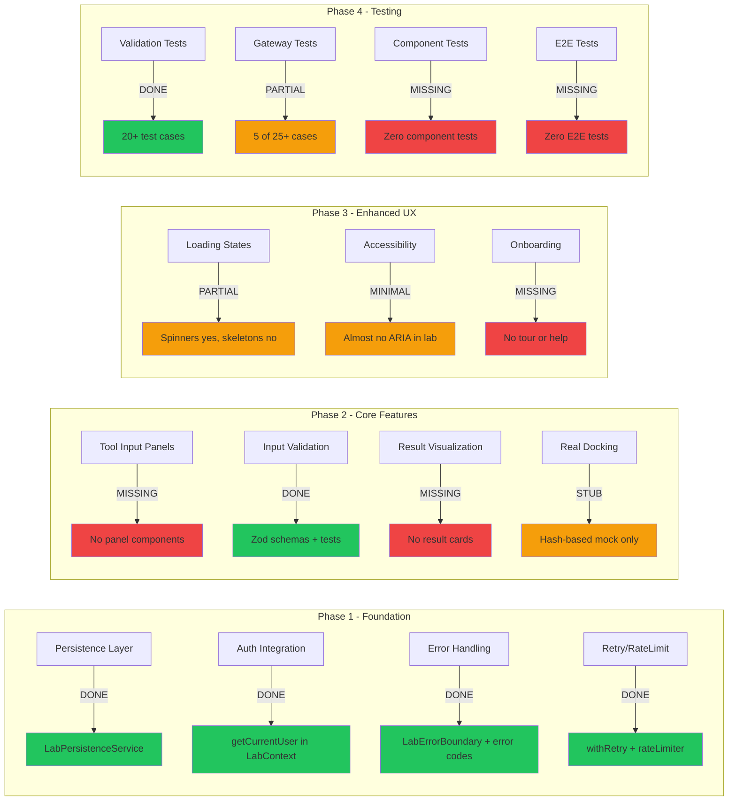

# Labs Feature: Comprehensive Implementation Audit

**Date:** 2026-02-17  
**Scope:** Audit of 9 planned items from bio-lab-production-audit.md against actual codebase  
**Status:** Complete

---

## Audit Summary

| # | Item | Verdict | Coverage |
|---|------|---------|----------|
| 1 | Phase 2: Tool Input Panels | 🔴 NOT IMPLEMENTED | 0% |
| 2 | Phase 2: Input Validation Service | 🟢 IMPLEMENTED | ~85% |
| 3 | Phase 2: Result Visualization Components | 🔴 NOT IMPLEMENTED | 0% |
| 4 | Critical Gap G1: Real Docking Engine evaluation | 🟡 PARTIALLY ADDRESSED | ~20% |
| 5 | Phase 3: Enhanced UX — Loading states, Accessibility | 🟡 PARTIALLY IMPLEMENTED | ~30% |
| 6 | Phase 4: Testing strategy | 🟡 PARTIALLY IMPLEMENTED | ~35% |
| 7 | L1-L4 Risk Analysis documentation | 🟢 DOCUMENTED | ~90% |
| 8 | Migration verification steps | 🔴 NOT IMPLEMENTED | 0% |
| 9 | Final implementation_plan.md | 🟡 PARTIALLY EXISTS | ~50% |

---

## 1. Phase 2: Tool Input Panels — 🔴 NOT IMPLEMENTED

### What was planned
Per [`bio-lab-production-audit.md`](plans/bio-lab-production-audit.md:396):
- `ProteinFetchPanel` component with form
- `SequenceAnalysisPanel` component with form
- `DockingPanel` component with form
- Panel transitions with Framer Motion

### What exists
- **No** `panels/` directory under `synthesis-engine/src/components/lab/`
- **No** dedicated panel components (ProteinFetchPanel, SequenceAnalysisPanel, DockingPanel)
- [`LabState`](synthesis-engine/src/types/lab.ts:162) has `activePanel: LabToolId | null` — the **type infrastructure** is ready
- [`LabContext`](synthesis-engine/src/lib/contexts/LabContext.tsx:89) handles `SET_ACTIVE_PANEL` action — the **state management** is ready
- [`page.tsx`](synthesis-engine/src/app/lab/page.tsx:102) uses hardcoded `handleLoadTest()` with PDB ID `'4HHB'` instead of a form-based panel

### Gap
The type system and state management support tool panels, but **zero UI panel components** have been built. Users interact via hardcoded DEV buttons on the dashboard, not through dedicated input forms.

### Recommendation
Create `synthesis-engine/src/components/lab/panels/` directory with:
- `ProteinFetchPanel.tsx` — PDB ID input with validation
- `SequenceAnalysisPanel.tsx` — sequence textarea with validation
- `DockingPanel.tsx` — PDB ID + SMILES + seed inputs
- Wire panels to `activePanel` state in LabContext

---

## 2. Phase 2: Input Validation Service — 🟢 IMPLEMENTED

### What was planned
Per [`bio-lab-production-audit.md`](plans/bio-lab-production-audit.md:400):
- Input validation with visual feedback for PDB IDs, SMILES, sequences

### What exists
- **Full Zod validation schemas** in [`lab.ts`](synthesis-engine/src/lib/validations/lab.ts)
  - [`ProteinViewerInputSchema`](synthesis-engine/src/lib/validations/lab.ts:50) — 4-char PDB ID with regex
  - [`HypothesisBuilderInputSchema`](synthesis-engine/src/lib/validations/lab.ts:66) — min/max length, variable types
  - [`ExperimentRunnerInputSchema`](synthesis-engine/src/lib/validations/lab.ts:85) — UUID validation, timeout limits
  - [`DataAnalyzerInputSchema`](synthesis-engine/src/lib/validations/lab.ts:104) — data arrays, analysis types
  - [`LiteratureSearchInputSchema`](synthesis-engine/src/lib/validations/lab.ts:128) — query validation, source filters
  - [`LLMConfigSchema`](synthesis-engine/src/lib/validations/lab.ts:36) — provider, model, temperature bounds
- **Validation helpers**: [`validateInput()`](synthesis-engine/src/lib/validations/lab.ts:235), [`formatValidationErrors()`](synthesis-engine/src/lib/validations/lab.ts:251), [`withValidation()`](synthesis-engine/src/lib/validations/lab.ts:261)
- **Comprehensive tests** in [`lab.test.ts`](synthesis-engine/src/lib/validations/__tests__/lab.test.ts) with 20+ test cases covering:
  - CausalRoleSchema, LabToolNameSchema, LLMConfigSchema
  - ProteinViewerInputSchema, HypothesisBuilderInputSchema
  - ExperimentRunnerInputSchema, DataAnalyzerInputSchema
  - Edge cases: invalid lengths, special characters, missing fields, bound violations

### Gap
- Validation schemas exist but are **not wired into any UI components** (no visual feedback on invalid input)
- Missing SMILES-specific validation schema (docking uses generic approach)

### Verdict
The validation **service** is solid. What's missing is the **UI integration** — which depends on Tool Input Panels (Item 1).

---

## 3. Phase 2: Result Visualization Components — 🔴 NOT IMPLEMENTED

### What was planned
Per [`bio-lab-production-audit.md`](plans/bio-lab-production-audit.md:403):
- `SequenceResultCard` with charts
- `DockingResultCard` with 3D pose viewer
- Result comparison views
- Result export functionality

### What exists
- **No** `results/` directory under `synthesis-engine/src/components/lab/`
- **No** SequenceResultCard or DockingResultCard components
- [`ExperimentCard`](synthesis-engine/src/app/lab/page.tsx:49) shows raw JSON truncated to 200 chars:
  ```tsx
  <pre className="text-[10px]">{JSON.stringify(experiment.result_json, null, 2).slice(0, 200)}...</pre>
  ```
- Result type interfaces ARE defined in [`types/lab.ts`](synthesis-engine/src/types/lab.ts:89):
  - `SequenceAnalysisResult` — molecular weight, isoelectric point, instability index, etc.
  - `DockingResult` — affinity, rmsd, poses array
  - `SimulationResult` — protocol code, execution metrics

### Gap
Complete gap. Types are ready but no formatted display, no charts, no comparison views, no export.

### Recommendation
Create `synthesis-engine/src/components/lab/results/` with:
- `SequenceResultCard.tsx` — property table + amino acid composition bar chart
- `DockingResultCard.tsx` — binding affinity display + pose list
- `SimulationResultCard.tsx` — code display + metrics dashboard
- Generic `ResultExporter.tsx` for JSON/CSV export

---

## 4. Critical Gap G1: Real Docking Engine — 🟡 PARTIALLY ADDRESSED

### What was planned
Per [`bio-lab-production-audit.md`](plans/bio-lab-production-audit.md:409):
- Evaluate AutoDock Vina WASM vs server-side
- Implement docking job queue
- Add progress tracking
- Create result parsing and visualization

### What exists
- [`dockLigand()`](synthesis-engine/src/lib/services/scientific-gateway.ts:396) remains a **deterministic hash-based stub**:
  - Uses `((hash << 5) - hash) + char` to generate fake affinity scores
  - Returns `engine: "Vina-Stub-v1 (Deterministic)"`
  - No real molecular docking occurs
- Mock data mapped to scientific range: -5.0 to -12.0 kcal/mol
- [`mock-cloud-lab.ts`](synthesis-engine/src/lib/services/mock-cloud-lab.ts) exists — suggests mock infrastructure is in place
- The [`DockingResult`](synthesis-engine/src/types/lab.ts:98) type is well-defined with poses, affinity, rmsd

### Gap
- **No evaluation** of AutoDock Vina WASM or server-side options has been documented
- **No docking job queue** implemented
- **No progress tracking** for docking operations
- The stub is acknowledged in code comments as "Phase 2" but no work has progressed

### Recommendation
1. Document an ADR (Architecture Decision Record) evaluating:
   - AutoDock Vina compiled to WASM via Emscripten
   - Server-side AutoDock Vina via API endpoint
   - Third-party docking API services
2. Start with server-side approach as the audit recommends

---

## 5. Phase 3: Enhanced UX — 🟡 PARTIALLY IMPLEMENTED

### What was planned
Per [`bio-lab-production-audit.md`](plans/bio-lab-production-audit.md:417):
- Skeleton components for all panels
- Progress bars for long operations
- Optimistic UI updates
- Liquid Glass loading animations
- ARIA labels on all interactive elements
- Keyboard navigation
- Focus management
- High-contrast mode support

### What exists

#### Loading States (~40%)
- [`StatusBadge`](synthesis-engine/src/app/lab/page.tsx:16) with `Loader2` spinning animation for pending state
- `isLoading` state with spinner on "Load Protein" button
- `AnimatePresence` and `motion` transitions between views
- CSS skeleton shimmer keyframes defined in [`bio-lab-production-audit.md`](plans/bio-lab-production-audit.md:510) spec but **not implemented** in actual CSS
- **No** skeleton loader components exist
- **No** progress bars for long operations (sequence analysis, docking)

#### Accessibility (~15%)
- **Minimal** ARIA support in lab components:
  - Lab page: no `aria-label`, no `role` attributes, no `tabIndex`
  - LabSidebar: no aria attributes found
  - LabNotebook: no aria attributes found
- Other parts of the app have better coverage (ThemeToggle, FeatureRail, segmented control)
- **No** keyboard navigation in lab
- **No** focus management
- **No** high-contrast mode

### Gap
Loading states exist at a basic level (spinners). Skeleton loaders, progress bars, and accessibility are largely missing from lab-specific components.

---

## 6. Phase 4: Testing Strategy — 🟡 PARTIALLY IMPLEMENTED

### What was planned
Per [`bio-lab-production-audit.md`](plans/bio-lab-production-audit.md:437):
- ScientificGateway tests (25+ cases)
- LabContext tests (10+ cases)
- Validator tests (15+ cases)
- Component tests for all lab components
- E2E tests with Playwright

### What exists

| Test File | Status | Cases |
|-----------|--------|-------|
| [`lab.test.ts`](synthesis-engine/src/lib/validations/__tests__/lab.test.ts) | ✅ Exists | ~20+ cases |
| [`scientific-gateway.test.ts`](synthesis-engine/src/lib/services/__tests__/scientific-gateway.test.ts) | ✅ Exists | ~5 cases |
| [`retry.test.ts`](synthesis-engine/src/lib/utils/__tests__/retry.test.ts) | ✅ Exists | Coverage for withRetry |
| [`rate-limiter.test.ts`](synthesis-engine/src/lib/utils/__tests__/rate-limiter.test.ts) | ✅ Exists | Coverage for rate limiting |
| LabContext tests | ❌ Missing | 0 |
| LabPage component tests | ❌ Missing | 0 |
| LabSidebar component tests | ❌ Missing | 0 |
| LabNotebook component tests | ❌ Missing | 0 |
| ProteinViewer component tests | ❌ Missing | 0 |
| HypothesisBuilder component tests | ❌ Missing | 0 |
| LabErrorBoundary tests | ❌ Missing | 0 |
| E2E tests (Playwright) | ❌ Missing | 0 |

### Gap
- Validation tests are solid (~20+ cases)
- Scientific gateway has basic tests (~5 cases, far from the 25+ target)
- **Zero** component tests for any lab UI component
- **Zero** E2E tests
- **Zero** LabContext reducer tests

### Overall coverage: ~35% of planned testing strategy

---

## 7. L1-L4 Risk Analysis — 🟢 DOCUMENTED

### What was planned
Risk analysis across likelihood and impact levels.

### What exists
[`bio-lab-production-audit.md` Part 7](plans/bio-lab-production-audit.md:591) contains:

| Risk | Likelihood | Impact | Mitigation |
|------|-----------|--------|------------|
| AutoDock Vina WASM complexity | High | High | Start server-side |
| Pyodide performance issues | Medium | Medium | Web Worker support |
| Supabase connection limits | Low | High | Connection pooling |
| NGL viewer memory leaks | Medium | Medium | Proper cleanup |
| Large PDB file handling | Medium | Medium | File size limits |

Additionally, [`implementation_plan_v2.md`](plans/implementation_plan_v2.md:165) has its own risk section.

### Gap
- Risks are documented but not categorized as formal L1-L4 levels
- No risk register with tracking IDs or ownership assignments
- No probability × impact scoring matrix

### Verdict
Risk analysis is substantially documented. The formal L1-L4 categorization is a labeling exercise on existing content.

---

## 8. Migration Verification Steps — 🔴 NOT IMPLEMENTED

### What was planned
Steps to verify database migrations work correctly during deployment.

### What exists
- [`LabPersistenceService`](synthesis-engine/src/lib/services/lab-persistence.ts) uses Supabase client for CRUD
- The types reference `lab_experiments` table structure
- **No** migration SQL files found for the lab_experiments table
- **No** migration verification scripts
- **No** migration rollback procedures
- The existing `crucible/scripts/migrate-*.ts` files are for the crucible module, not the lab

### Gap
Complete gap. No database migration files, no verification steps, no rollback procedures for the Bio-Lab persistence layer.

### Recommendation
1. Create Supabase migration: `create table lab_experiments (...)`
2. Add migration verification script that checks:
   - Table exists with correct columns
   - RLS policies are active
   - Indexes are in place
3. Add rollback migration

---

## 9. Final implementation_plan.md — 🟡 PARTIALLY EXISTS

### What was planned
A comprehensive implementation plan document.

### What exists
- [`bio-lab-production-audit.md`](plans/bio-lab-production-audit.md) — Comprehensive 649-line audit with:
  - Architectural overview, gap analysis, testing strategy, implementation phases 1-4, design specs, file structure recommendations, risk assessment, success metrics
- [`implementation_plan_v2.md`](plans/implementation_plan_v2.md) — 195-line plan for Automated Scientist pipeline (different scope — focuses on data foundations, extraction, compute, not bio-lab UI)
- **No** single `implementation_plan.md` that consolidates bio-lab next steps

### Gap
The `bio-lab-production-audit.md` effectively IS the implementation plan, but it hasn't been updated to reflect what's been implemented since it was written. A dedicated `implementation_plan.md` consolidating current state + remaining work doesn't exist.

### Recommendation
Write a concise `implementation_plan.md` that references the audit, marks completed items, and provides a clear remaining work checklist.

---

## Implementation Status Heatmap



---

## Priority Action Items

### Immediate (unblocks other work)
1. **Build Tool Input Panels** — ProteinFetchPanel, SequenceAnalysisPanel, DockingPanel
2. **Wire validation schemas to panels** — connect existing Zod schemas to new UI
3. **Build Result Visualization Cards** — SequenceResultCard, DockingResultCard

### Short-term
4. **Add LabContext reducer tests** — 10+ cases for state management
5. **Add component tests** — at least for LabPage and LabErrorBoundary
6. **Create migration SQL** — lab_experiments table with RLS
7. **Add ARIA labels** to all lab interactive elements

### Medium-term
8. **Document docking engine ADR** — evaluate AutoDock Vina options
9. **Write consolidated implementation_plan.md**
10. **Add skeleton loaders and progress bars**
11. **Expand scientific-gateway tests** to 25+ cases

---

## Files Audited

| File | Path |
|------|------|
| Lab page | `synthesis-engine/src/app/lab/page.tsx` |
| Lab layout | `synthesis-engine/src/app/lab/layout.tsx` |
| LabContext | `synthesis-engine/src/lib/contexts/LabContext.tsx` |
| Lab types | `synthesis-engine/src/types/lab.ts` |
| Validation schemas | `synthesis-engine/src/lib/validations/lab.ts` |
| Validation tests | `synthesis-engine/src/lib/validations/__tests__/lab.test.ts` |
| LabErrorBoundary | `synthesis-engine/src/components/lab/LabErrorBoundary.tsx` |
| LabSidebar | `synthesis-engine/src/components/lab/LabSidebar.tsx` |
| LabNotebook | `synthesis-engine/src/components/lab/LabNotebook.tsx` |
| ProteinViewer | `synthesis-engine/src/components/lab/ProteinViewer.tsx` |
| HypothesisBuilder | `synthesis-engine/src/components/lab/HypothesisBuilder.tsx` |
| ScientificGateway | `synthesis-engine/src/lib/services/scientific-gateway.ts` |
| Gateway tests | `synthesis-engine/src/lib/services/__tests__/scientific-gateway.test.ts` |
| Lab persistence | `synthesis-engine/src/lib/services/lab-persistence.ts` |
| Retry utility | `synthesis-engine/src/lib/utils/retry.ts` |
| Rate limiter | `synthesis-engine/src/lib/utils/rate-limiter.ts` |
| Audit plan | `plans/bio-lab-production-audit.md` |
| Impl plan v2 | `plans/implementation_plan_v2.md` |
