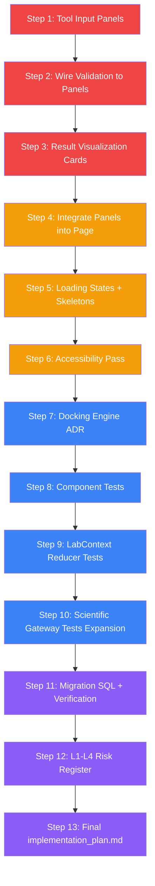

# Labs Feature: Step-by-Step Implementation Plan

**Date:** 2026-02-17  
**Based on:** [labs-feature-implementation-audit.md](labs-feature-implementation-audit.md)  
**Status:** Ready for execution

---

## Execution Order & Dependencies



Legend: 🔴 Critical | 🟡 High | 🔵 Medium | 🟣 Documentation

---

## Step 1: Create Tool Input Panel Components

**Priority:** 🔴 Critical  
**Files to create:**
- `synthesis-engine/src/components/lab/panels/ProteinFetchPanel.tsx`
- `synthesis-engine/src/components/lab/panels/SequenceAnalysisPanel.tsx`
- `synthesis-engine/src/components/lab/panels/DockingPanel.tsx`

**Requirements:**
- Each panel renders a form matching the tool's input type from [`types/lab.ts`](../synthesis-engine/src/types/lab.ts)
- `ProteinFetchPanel`: Single input for PDB ID (4-char alphanumeric), fetch button, loading state
- `SequenceAnalysisPanel`: Textarea for amino acid sequence, analyze button
- `DockingPanel`: PDB ID input + SMILES string input + optional seed number, dock button
- All panels use Liquid Glass styling classes: `lab-panel`, `lab-card-interactive`
- All panels accept `onSubmit` callback prop
- Use Framer Motion `AnimatePresence` for panel mount/unmount transitions
- Each panel dispatches `SET_ACTIVE_PANEL` via LabContext

**Integration point:** LabSidebar tool click → `SET_ACTIVE_TOOL` → page.tsx renders corresponding panel

---

## Step 2: Wire Zod Validation Schemas to Panels

**Priority:** 🔴 Critical  
**Files to modify:**
- `synthesis-engine/src/components/lab/panels/ProteinFetchPanel.tsx`
- `synthesis-engine/src/components/lab/panels/SequenceAnalysisPanel.tsx`
- `synthesis-engine/src/components/lab/panels/DockingPanel.tsx`

**Requirements:**
- Import schemas from [`validations/lab.ts`](../synthesis-engine/src/lib/validations/lab.ts): `ProteinViewerInputSchema`, etc.
- On each keystroke/blur, run `schema.safeParse()` and show inline error messages
- Use [`formatValidationErrors()`](../synthesis-engine/src/lib/validations/lab.ts:251) for user-friendly messages
- Disable submit button when validation fails
- Visual feedback: red border + error text below invalid fields, green check on valid
- Add a new SMILES validation to `validations/lab.ts` if missing (basic bracket/parenthesis balance check)

---

## Step 3: Build Result Visualization Components

**Priority:** 🔴 Critical  
**Files to create:**
- `synthesis-engine/src/components/lab/results/SequenceResultCard.tsx`
- `synthesis-engine/src/components/lab/results/DockingResultCard.tsx`
- `synthesis-engine/src/components/lab/results/SimulationResultCard.tsx`
- `synthesis-engine/src/components/lab/results/ResultDispatcher.tsx`

**Requirements:**
- `SequenceResultCard`: Display molecular weight, isoelectric point, instability index as labeled values. Show amino acid composition as a simple horizontal bar chart using CSS/inline styles (no charting library needed initially).
- `DockingResultCard`: Show binding affinity prominently (large number with unit), RMSD, pose list as a table. Badge showing engine name.
- `SimulationResultCard`: Code block for protocol code, stdout/stderr in expandable sections, execution time and metrics as key-value pairs.
- `ResultDispatcher`: Takes `LabExperiment` and renders the appropriate card based on `tool_name`. Falls back to raw JSON for unknown types.
- All cards use `lab-card` / `lab-result-card` CSS classes from Liquid Glass spec.

---

## Step 4: Integrate Panels and Results into Lab Page

**Priority:** 🟡 High  
**Files to modify:**
- `synthesis-engine/src/app/lab/page.tsx`

**Requirements:**
- Replace hardcoded `handleLoadTest()` with panel-driven approach:
  - When `state.activeTool` is set, render the corresponding Panel component instead of the dashboard hero
  - Panel `onSubmit` triggers the actual API call (fetch protein, analyze sequence, dock ligand)
- Replace raw JSON in `ExperimentCard` with `ResultDispatcher`
- Keep dashboard view as default when no tool is active
- Wire sidebar tool selection → panel display → submit → result card flow end-to-end

---

## Step 5: Add Loading States and Skeleton Components

**Priority:** 🟡 High  
**Files to create:**
- `synthesis-engine/src/components/lab/common/LabSkeleton.tsx`

**Files to modify:**
- `synthesis-engine/src/app/lab/page.tsx`
- `synthesis-engine/src/components/lab/panels/*.tsx`

**Requirements:**
- `LabSkeleton`: Reusable skeleton loader with Liquid Glass shimmer effect. Variants: `text`, `card`, `input`, `chart`.
- Add skeleton to each panel while API calls are in progress
- Add skeleton to result cards while loading
- Add a progress indicator for long operations (sequence analysis, docking) showing elapsed time
- Ensure the existing `Loader2` spinner usage is consistent across all loading states

---

## Step 6: Accessibility Pass

**Priority:** 🟡 High  
**Files to modify:**
- All files in `synthesis-engine/src/components/lab/`
- `synthesis-engine/src/app/lab/page.tsx`

**Requirements:**
- Add `aria-label` to all buttons (sidebar tools, mode switcher pills, action buttons)
- Add `role="tablist"` to mode switcher, `role="tab"` to each pill, `aria-selected` to active
- Add `role="navigation"` to sidebar, `role="main"` to content area
- Add `aria-live="polite"` to experiment history and result areas for screen reader announcements
- Add `tabIndex={0}` and keyboard event handlers to all interactive non-button elements
- Add focus ring styles (already partially in Liquid Glass — verify they apply)
- Ensure all form inputs have associated `<label>` elements or `aria-label`

---

## Step 7: Docking Engine Architecture Decision Record

**Priority:** 🔵 Medium  
**Files to create:**
- `plans/adr-docking-engine.md`

**Requirements:**
Document evaluation of three approaches:
1. **AutoDock Vina via WASM** — compile with Emscripten, run client-side
   - Pros: No server needed, offline capable
   - Cons: Complex build, limited to small molecules, memory constraints
2. **Server-side AutoDock Vina API** — Next.js API route calling Vina binary
   - Pros: Full feature set, no client constraints
   - Cons: Server infrastructure needed, latency
3. **Third-party docking API** — e.g., DockThor, SwissDock
   - Pros: Maintained by experts, validated results
   - Cons: Dependency, rate limits, cost

Include recommendation with rationale. Note current stub in [`scientific-gateway.ts:396`](../synthesis-engine/src/lib/services/scientific-gateway.ts:396).

---

## Step 8: Component Tests

**Priority:** 🔵 Medium  
**Files to create:**
- `synthesis-engine/src/components/lab/__tests__/LabErrorBoundary.test.tsx`
- `synthesis-engine/src/components/lab/panels/__tests__/ProteinFetchPanel.test.tsx`
- `synthesis-engine/src/components/lab/panels/__tests__/SequenceAnalysisPanel.test.tsx`
- `synthesis-engine/src/components/lab/panels/__tests__/DockingPanel.test.tsx`
- `synthesis-engine/src/components/lab/results/__tests__/ResultDispatcher.test.tsx`

**Requirements:**
- Test each panel renders all form fields
- Test validation error display on invalid input
- Test submit button disabled state
- Test onSubmit callback with correct payload
- Test LabErrorBoundary catches errors and renders fallback UI
- Test ResultDispatcher routes to correct card based on tool_name
- Use React Testing Library + Vitest
- Mock LabContext with `LabProvider` wrapper

---

## Step 9: LabContext Reducer Tests

**Priority:** 🔵 Medium  
**Files to create:**
- `synthesis-engine/src/lib/contexts/__tests__/LabContext.test.ts`

**Requirements:**
- Test all 14 action types in the reducer:
  - `SET_OFFLINE`, `SET_LOADING`, `SET_ACTIVE_TOOL`, `SET_ACTIVE_PANEL`
  - `LOAD_STRUCTURE`, `ADD_EXPERIMENT`, `UPDATE_EXPERIMENT`, `SET_EXPERIMENT_HISTORY`
  - `TOGGLE_SIDEBAR`, `TOGGLE_NOTEBOOK`, `SET_ERROR`, `CLEAR_ERROR`
  - `SET_LLM_CONFIG`, `SET_MODEL_SETTINGS_OPEN`
- Test initial state shape
- Test that `UPDATE_EXPERIMENT` correctly merges partial updates
- Test that `ADD_EXPERIMENT` prepends to history
- Target: 10+ test cases minimum

---

## Step 10: Expand Scientific Gateway Tests

**Priority:** 🔵 Medium  
**Files to modify:**
- `synthesis-engine/src/lib/services/__tests__/scientific-gateway.test.ts`

**Requirements:**
- Current: ~5 test cases. Target: 20+ cases.
- Add tests for:
  - `fetchProteinStructure()` — success, network error, invalid PDB ID, timeout
  - `analyzeSequence()` — valid sequence, empty sequence, Pyodide failure
  - `dockLigand()` — deterministic output verification, input hashing
  - `getTools()` — tool definition structure validation
  - Edge cases: concurrent calls, offline behavior

---

## Step 11: Migration SQL and Verification

**Priority:** 🟣 Documentation  
**Files to create:**
- `synthesis-engine/supabase/migrations/YYYYMMDD_create_lab_experiments.sql`
- `synthesis-engine/scripts/verify-lab-migration.ts`

**Requirements:**
- SQL migration creating `lab_experiments` table:
  - Columns matching [`LabExperiment`](../synthesis-engine/src/types/lab.ts:131) interface
  - RLS policy: users can only access their own experiments
  - Index on `user_id` and `created_at`
  - Index on `tool_name` for analytics
- Verification script that:
  - Checks table exists
  - Checks all columns present with correct types
  - Checks RLS is enabled
  - Checks indexes exist
  - Reports pass/fail

---

## Step 12: L1-L4 Formal Risk Register

**Priority:** 🟣 Documentation  
**Files to create or update:**
- Section in `plans/labs-implementation-plan.md` (this file, appendix)

Formalize existing risks from [`bio-lab-production-audit.md:591`](bio-lab-production-audit.md:591) into:

| ID | Risk | Level | Likelihood | Impact | Owner | Mitigation | Status |
|----|------|-------|-----------|--------|-------|------------|--------|
| L1 | AutoDock Vina WASM complexity exceeds budget | L1-Critical | High | High | Engineering | Start server-side; WASM as future enhancement | Open |
| L2 | Pyodide execution timeout on complex sequences | L2-High | Medium | Medium | Engineering | Add Web Worker + 30s timeout + fallback | Open |
| L3 | Supabase connection pool exhaustion | L3-Medium | Low | High | Platform | Connection pooling + retry with backoff | Mitigated |
| L4 | NGL viewer memory leak on repeated loads | L4-Low | Medium | Medium | Frontend | Proper cleanup in useEffect return | Mitigated |
| L2 | Large PDB files cause browser OOM | L2-High | Medium | High | Frontend | File size limit of 10MB + streaming | Open |
| L3 | No migration rollback causes data loss | L3-Medium | Low | High | Platform | Create rollback SQL + verification script | Open |

---

## Step 13: Write Final implementation_plan.md

**Priority:** 🟣 Documentation  
**Files to create:**
- `plans/labs-final-implementation-plan.md`

**Requirements:**
- Consolidate the audit findings, this plan, and progress tracking
- Include current state summary with checkmarks
- Reference all created files
- Provide definition of done for production readiness
- Include success metrics from [`bio-lab-production-audit.md:603`](bio-lab-production-audit.md:603)

---

## Appendix: File Creation Summary

### New files to create (13 files)
```
synthesis-engine/src/components/lab/panels/
├── ProteinFetchPanel.tsx          (Step 1)
├── SequenceAnalysisPanel.tsx      (Step 1)
├── DockingPanel.tsx               (Step 1)
└── __tests__/
    ├── ProteinFetchPanel.test.tsx  (Step 8)
    ├── SequenceAnalysisPanel.test.tsx (Step 8)
    └── DockingPanel.test.tsx      (Step 8)

synthesis-engine/src/components/lab/results/
├── SequenceResultCard.tsx         (Step 3)
├── DockingResultCard.tsx          (Step 3)
├── SimulationResultCard.tsx       (Step 3)
├── ResultDispatcher.tsx           (Step 3)
└── __tests__/
    └── ResultDispatcher.test.tsx  (Step 8)

synthesis-engine/src/components/lab/common/
└── LabSkeleton.tsx                (Step 5)

synthesis-engine/src/components/lab/__tests__/
└── LabErrorBoundary.test.tsx      (Step 8)

synthesis-engine/src/lib/contexts/__tests__/
└── LabContext.test.ts             (Step 9)
```

### Files to modify (5 files)
```
synthesis-engine/src/app/lab/page.tsx                    (Steps 4, 5, 6)
synthesis-engine/src/lib/validations/lab.ts              (Step 2 — add SMILES schema)
synthesis-engine/src/lib/services/__tests__/scientific-gateway.test.ts  (Step 10)
synthesis-engine/src/components/lab/LabSidebar.tsx        (Step 6 — ARIA)
synthesis-engine/src/components/lab/LabNotebook.tsx       (Step 6 — ARIA)
```

### Documentation files (3 files)
```
plans/adr-docking-engine.md                    (Step 7)
plans/labs-final-implementation-plan.md        (Step 13)
synthesis-engine/supabase/migrations/...sql    (Step 11)
synthesis-engine/scripts/verify-lab-migration.ts (Step 11)
```
