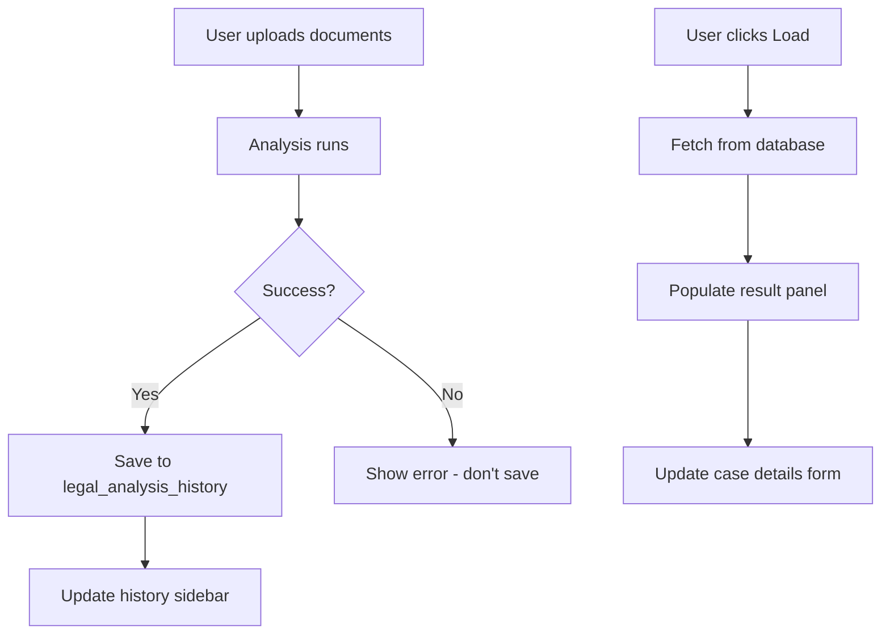

# Legal Causation Analyzer - UI Enhancement & History Feature Plan

## Status: Legal Analysis Feature ✅ WORKING
- Analysis completes in ~2-3 minutes
- All performance fixes applied (25 pairs max)
- Streaming and error handling optimized

---

## Phase 1: UI Enhancements (Current Issues from Screenshots)

### Issue 1: Causal Chain Cards - Text Overflow
**Problem**: Action and Harm text extends beyond card boundaries
**Location**: Chains 1-16 in the results panel

**Fix**:
- Add `overflow-hidden` and `text-ellipsis` for long text
- Show full text in expandable accordion or tooltip
- Add "Harm" column properly styled within card bounds

### Issue 2: Harm Column Cutoff
**Problem**: Harm descriptions on the right side are cut off
**Fix**:
- Restructure card layout to stack Action and Harm vertically
- Or use responsive grid that wraps on smaller widths

### Issue 3: Collapsible Sections
**Need**: With 16 chains, users need to collapse/expand sections
**Fix**:
- Add collapsible accordion for each causal chain
- Default: First 3 expanded, rest collapsed
- "Expand All" / "Collapse All" button

### Implementation Files
- `synthesis-engine/src/app/legal/page.tsx`

---

## Phase 2: Analysis History Feature

### Following Demis-Workflow Protocol

```
Draft → Critique → Identify Critical Gaps → Simulate Data Flow
```

### Critical Gap Analysis
| Gap Type | Item | Action |
|----------|------|--------|
| Database Migration | New `legal_analysis_history` table | ⚠️ USER ACTION REQUIRED |
| Environment Variable | None needed | ✅ |
| API Changes | Add GET endpoint for history | Document in route.ts |

---

### Database Schema (Migration Required)

```sql
-- Supabase Migration: Legal Analysis History
CREATE TABLE IF NOT EXISTS legal_analysis_history (
  id UUID PRIMARY KEY DEFAULT gen_random_uuid(),
  case_id TEXT NOT NULL,
  case_title TEXT NOT NULL,
  jurisdiction TEXT,
  case_type TEXT,
  document_names TEXT[] NOT NULL,
  
  -- Summary data
  chains_count INTEGER NOT NULL DEFAULT 0,
  causation_established BOOLEAN NOT NULL DEFAULT false,
  confidence DECIMAL(3,2) NOT NULL DEFAULT 0,
  
  -- Full analysis result (JSON)
  analysis_result JSONB NOT NULL,
  
  -- Timestamps
  created_at TIMESTAMPTZ NOT NULL DEFAULT NOW(),
  updated_at TIMESTAMPTZ NOT NULL DEFAULT NOW()
);

-- Index for fast lookups
CREATE INDEX idx_legal_history_created ON legal_analysis_history(created_at DESC);
CREATE INDEX idx_legal_history_case_title ON legal_analysis_history(case_title);

-- Enable RLS
ALTER TABLE legal_analysis_history ENABLE ROW LEVEL SECURITY;

-- Public read policy (adjust based on auth requirements)
CREATE POLICY "Allow public read" ON legal_analysis_history FOR SELECT USING (true);
CREATE POLICY "Allow public insert" ON legal_analysis_history FOR INSERT WITH CHECK (true);
```

---

### UI Design: History Sidebar

```
┌─────────────────────────────────────────────────────────────────┐
│  📜 Analysis History                              [Hide]        │
├─────────────────────────────────────────────────────────────────┤
│  🕐 Recent Analyses                                             │
│  ┌─────────────────────────────────────────────────────────┐   │
│  │  People v. Jan Jun M. Guro                              │   │
│  │  Criminal • 16 chains • 94% confidence                  │   │
│  │  Jan 26, 2026                                 [Load]    │   │
│  └─────────────────────────────────────────────────────────┘   │
│  ┌─────────────────────────────────────────────────────────┐   │
│  │  Smith v. ABC Corp                                      │   │
│  │  Civil • 8 chains • 87% confidence                      │   │
│  │  Jan 25, 2026                                 [Load]    │   │
│  └─────────────────────────────────────────────────────────┘   │
│                                                                 │
│  [Load More...]                                                 │
└─────────────────────────────────────────────────────────────────┘
```

---

### Implementation Plan

#### Step 1: Database Migration
**File**: `synthesis-engine/supabase/migrations/add_legal_history.sql`
**Action**: USER MUST run in Supabase SQL Editor

#### Step 2: API Endpoint
**File**: `synthesis-engine/src/app/api/legal-reasoning/route.ts`
- Add GET handler to fetch history
- Add POST handler to save analysis (already exists, just persist)

#### Step 3: History Service
**File**: `synthesis-engine/src/lib/services/legal-history.ts`
- `saveAnalysis(result: LegalCase): Promise<void>`
- `getHistory(limit: number): Promise<HistoryEntry[]>`
- `loadAnalysis(id: string): Promise<LegalCase>`

#### Step 4: UI Component
**File**: `synthesis-engine/src/app/legal/page.tsx`
- Add collapsible history sidebar
- Add "Load" button functionality
- Add auto-save after analysis completes

---

### Data Flow (Causal Verification)



---

## Execution Order

1. **UI Fixes** (can do immediately - no dependencies)
   - Fix causal chain card layout
   - Add collapsible accordions
   - Improve responsive design

2. **Database Migration** ⚠️ USER ACTION
   - Create migration file
   - User must run in Supabase SQL Editor
   - Document in "Next Steps"

3. **History Service & API** (after migration confirmed)
   - Implement save/load functions
   - Add REST endpoints

4. **History UI** (after API working)
   - Add sidebar component
   - Wire up load/save actions

---

## Next Steps for User

1. ✅ Legal Analysis is working!
2. 📝 Review this plan
3. 🔄 Approve UI fixes to proceed
4. ⚠️ Be ready to run database migration when created
