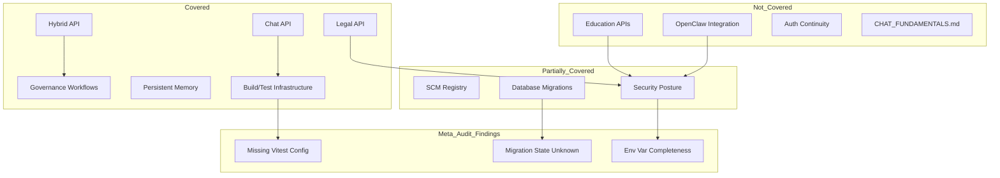

# Meta-Audit: Comprehensive Architecture & Code Audit (2026-02-14)

**Meta-Audit Date:** 2026-02-14  
**Subject:** `synthesis-engine/docs/audits/comprehensive-audit-2026-02-14.md`  
**Methodology:** Demis-Workflow (Hassabis-Style Test-Time Reasoning)  
**Auditor:** Architect Mode (MASA High-Dens Core Architect)

---

## Executive Summary

The comprehensive audit report demonstrates **strong methodological rigor** and **substantial evidence-based findings**. However, this meta-audit identifies **several gaps, omissions, and areas requiring clarification** that affect the audit's completeness and actionability.

**Overall Meta-Assessment:**
| Dimension | Rating | Notes |
|-----------|--------|-------|
| **Coverage Completeness** | Moderate | Missing key areas: education APIs, OpenClaw security, Vitest config |
| **Evidence Quality** | Strong | Concrete command outputs, file paths, code snippets |
| **Prioritization Logic** | Strong | 30/60/90 day roadmap is well-structured |
| **Actionability** | Moderate | Some fixes lack specific implementation guidance |
| **MASA Alignment** | Strong | Correctly identifies Pearlian vs Lewisian gaps |

---

## L1-L4 Analysis (Demis-Workflow Framework)

### L1 - Impact Assessment

**Question:** What is the scope and coverage of the audit?

| Area | Covered | Gap Identified |
|------|---------|----------------|
| Core API Routes (chat/hybrid/legal) | ✅ | - |
| Governance Workflows | ✅ | - |
| Persistent Memory v1.1 | ✅ | - |
| Build/Test Infrastructure | ✅ | Missing Vitest config analysis |
| Security Posture | Partial | OpenClaw WebSocket security not assessed |
| Education API Surface | ❌ | **Not covered** - 12+ routes unexamined |
| SCM Registry APIs | Partial | Promotion governance mentioned, not deep-dived |
| Database Migration State | Partial | Count given, but no applied-vs-pending verification |

**Critical Gap:** The audit does not mention the **absence of a `vitest.config.ts` file** in the project root. This is likely the root cause of path alias resolution failures, not merely missing alias configuration.

### L2 - Risk Assessment

**Question:** Are the audit findings accurate and do they identify true risks?

#### Verified Findings ✅

1. **Feature flags default-off** - Confirmed in [`feature-flags.ts`](synthesis-engine/src/lib/config/feature-flags.ts:18-22):
   ```typescript
   MASA_CAUSAL_PRUNING_V1: parseBoolean(process.env.MASA_CAUSAL_PRUNING_V1, false),
   MASA_COMPACTION_AXIOM_V1: parseBoolean(process.env.MASA_COMPACTION_AXIOM_V1, false),
   // ... all default to false
   ```

2. **Unauthenticated benchmark-runs route** - Confirmed in [`route.ts`](synthesis-engine/src/app/api/benchmark-runs/route.ts:7):
   ```typescript
   const key = process.env.SUPABASE_SERVICE_ROLE_KEY || process.env.NEXT_PUBLIC_SUPABASE_ANON_KEY;
   ```

3. **Path alias configuration exists** - Confirmed in [`tsconfig.json`](synthesis-engine/tsconfig.json:25-28):
   ```json
   "paths": {
     "@/*": ["./src/*"]
   }
   ```

4. **Vitest imports used consistently** - All test files correctly import from `vitest`, not Jest (verified across 23 test files).

#### Questionable Findings ⚠️

1. **Jest/Vitest mixing claim**: The audit states "Jest globals imported under Vitest" but code inspection shows clean Vitest imports. This may be outdated or from a different context.

2. **Build failure root cause**: The `styled-jsx` error may be a symptom of deeper dependency tree corruption, not just missing module. The audit should recommend checking `package-lock.json` integrity.

#### Missing Risk Assessments ❌

1. **No `.gitignore` verification**: The audit flags `.env.local` secrets but doesn't confirm if `.env.local` is properly gitignored.

2. **OpenClaw WebSocket exposure**: The [`openclaw-bridge.ts`](synthesis-engine/src/lib/services/openclaw-bridge.ts) uses WebSocket connections but security posture is unassessed.

3. **Education API authentication**: Routes like `/api/education/plans` handle sensitive student data but auth posture is unexamined.

### L3 - Calibration Assessment

**Question:** Is severity classification appropriate and are priorities well-calibrated?

#### Well-Calibrated ✅

| Finding | Severity | Assessment |
|---------|----------|------------|
| Build failure | Critical | Correct - blocks all deployment |
| Secrets in `.env.local` | Critical | Correct - immediate rotation needed |
| Test suite instability | Critical | Correct - CI untrustworthy |
| Unauthenticated privileged routes | High | Correct - data exposure risk |
| 274 lint warnings | High | Appropriate - tech debt signal |
| Oversized files | Medium | Appropriate - maintainability concern |

#### Potentially Under-Calibrated ⚠️

1. **Header-based user attribution** (Medium → High): The audit rates this as High, but spoofing risk in production could be Critical if no edge protection exists.

2. **Trace-integrity signing TODO** (Medium → High): For a system claiming scientific integrity, unsigned traces undermine the core value proposition.

### L4 - Critical Gaps Assessment

**Question:** What did the audit miss that blocks progress?

#### Missing Critical Gaps ❌

1. **No Vitest configuration file exists**
   - The project lacks `vitest.config.ts` 
   - Path aliases in `tsconfig.json` don't automatically apply to Vitest
   - **Fix required:** Create Vitest config with explicit alias resolution

2. **Migration application status unknown**
   - 31 migration files exist but applied-vs-pending state is unverified
   - Session handoff shows migrations but no confirmation of Supabase state

3. **Environment variable completeness**
   - 31 unique `process.env` keys detected
   - No verification that all required keys are documented in `.env.example`

4. **Governance workflow functionality**
   - Workflows exist but their execution success/failure rates are unmeasured
   - No assessment of sentinel alert quality (false positive rates)

---

## Gap Analysis: Audit vs Architecture Summary

Cross-referencing the audit against [`MASA_ARCHITECTURE_CURRENT_STATE_SUMMARY_2026-02-12.md`](MASA-Theoretical-Foundation/MASA_ARCHITECTURE_CURRENT_STATE_SUMMARY_2026-02-12.md):

### Covered by Both Documents ✅

| Component | Audit | Architecture Summary |
|-----------|-------|---------------------|
| Chat/Hybrid/Legal surfaces | ✅ | ✅ |
| Governance workflows | ✅ | ✅ |
| Persistent memory v1.1 | ✅ | ✅ |
| Feature flags (default-off) | ✅ | ✅ |
| Mock cloud lab simulation | ✅ | ✅ |
| Pearl-style intervention gating | ✅ | ✅ |

### In Architecture Summary but Missing from Audit ❌

| Component | Architecture Summary Reference | Audit Gap |
|-----------|-------------------------------|-----------|
| Education flows | Section 4.1, 4.7 | Not assessed |
| OpenClaw dashboard integration | Section 5 | Not assessed |
| Auth/persistence continuity | Section 4.8 | Partially covered |
| CHAT_FUNDAMENTALS.md doctrine | Section 4.7 | Not mentioned |
| Factual grounding improvements | Section 4.2 | Not covered |

### In Audit but Not in Architecture Summary ⚠️

| Finding | Implication |
|---------|-------------|
| Build broken | Architecture summary assumes working codebase |
| Test suite broken | Governance validation may be unreliable |
| 274 lint warnings | Code quality not reflected in architecture claims |

---

## Remediation Roadmap Critique

### Day 0-30 (Stabilize) - Assessment

| Task | Specific Enough? | Missing Detail |
|------|------------------|----------------|
| Fix build deterministically | ⚠️ Partial | No specific `styled-jsx` fix steps |
| Repair test infrastructure | ⚠️ Partial | Doesn't mention creating `vitest.config.ts` |
| Immediate secrets hygiene | ✅ Yes | - |
| Lock down risky APIs | ✅ Yes | - |
| Add rate limiting | ⚠️ Partial | No implementation guidance |

### Recommended Additions to Roadmap

```markdown
### Day 0-7 (Emergency Stabilization)

1. **Create Vitest configuration**
   - Create `vitest.config.ts` with path alias resolution
   - Remove Jest dependencies if fully migrated to Vitest
   
2. **Verify .gitignore coverage**
   ```bash
   git check-ignore -v .env.local
   ```
   
3. **Verify migration application state**
   - Query Supabase for applied migrations
   - Document gap between files and applied state

### Day 8-30 (Security Hardening)

4. **Audit OpenClaw WebSocket security**
   - Verify TLS usage
   - Check authentication on WebSocket endpoints
   
5. **Assess Education API auth posture**
   - Review all `/api/education/*` routes
   - Verify student data protection
```

---

## Evidence Quality Assessment

### Strong Evidence ✅

1. **Command outputs**: `npm run lint`, `npm run build`, `npx vitest run` outputs quoted
2. **File paths**: Specific files identified with line-level evidence
3. **Code snippets**: Actual code shown for security issues
4. **Quantified metrics**: 274 warnings, 2094 LOC, 8 failed suites

### Weak Evidence ⚠️

1. **"Live-looking keys"**: Audit claims keys look live but doesn't verify against actual services
2. **"Simulated streaming"**: Mentioned but no latency measurements
3. **"Cold-start penalties"**: Claimed but no performance data

### Missing Evidence ❌

1. **No dependency tree analysis**: `styled-jsx` error root cause unexplored
2. **No network security scan**: TLS, CORS, headers unassessed
3. **No database security review**: RLS policies, service role usage patterns

---

## Recommendations for Audit Improvement

### High Priority

1. **Add Vitest configuration analysis**
   - Note absence of `vitest.config.ts`
   - Provide template configuration

2. **Verify .gitignore effectiveness**
   - Confirm `.env.local` is ignored
   - Check for other sensitive file patterns

3. **Assess Education API surface**
   - 12+ routes unexamined
   - Student data protection critical

4. **Document migration state**
   - Query Supabase for applied migrations
   - Calculate pending migration count

### Medium Priority

5. **Add OpenClaw security assessment**
   - WebSocket authentication
   - External service exposure

6. **Measure governance workflow effectiveness**
   - Run sentinel workflows
   - Document alert quality

7. **Performance baseline**
   - Measure actual cold-start times
   - Profile oversized route handlers

---

## Mermaid Diagram: Audit Coverage Map



---

## Final Meta-Assessment

### Audit Strengths

1. **Methodological rigor**: Clear structure, evidence-based findings
2. **Prioritization logic**: 30/60/90 day roadmap is actionable
3. **Security consciousness**: Correctly identifies critical exposures
4. **MASA alignment**: Understands Pearlian vs Lewisian distinction

### Audit Weaknesses

1. **Coverage gaps**: Education, OpenClaw, auth continuity unexamined
2. **Root cause analysis**: Build/test failures not fully diagnosed
3. **Verification gaps**: Claims not always validated against code
4. **Missing configuration analysis**: Vitest config absence not noted

### Recommended Actions

| Priority | Action | Owner |
|----------|--------|-------|
| P0 | Create `vitest.config.ts` with alias resolution | Code Mode |
| P0 | Verify `.env.local` gitignore status | Code Mode |
| P1 | Assess Education API security | Architect Mode |
| P1 | Document migration application state | Code Mode |
| P2 | Add OpenClaw security assessment | Architect Mode |
| P2 | Measure governance workflow effectiveness | Code Mode |

---

## Conclusion

The comprehensive audit is **directionally correct and methodologically sound**, but **incomplete in coverage and shallow in root cause analysis**. The most critical gap is the **missing Vitest configuration file**, which is likely the primary cause of test infrastructure failures rather than merely alias configuration issues.

**Next Step:** Switch to Code Mode to implement the P0 fixes identified in this meta-audit.

---

*Meta-audit completed using Demis-Workflow L1-L4 framework. Session handoff state acknowledged. Critical gaps flagged for user action.*
