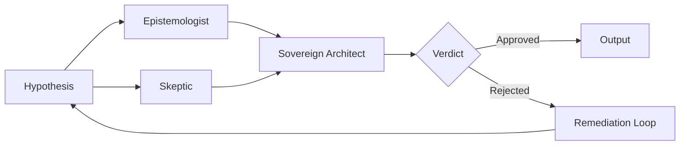

# Synthesis Engine - Comprehensive Codebase Analysis

## Executive Summary

The **Synthesis Engine** is a sophisticated Next.js 15 application implementing a novel AI-powered scientific hypothesis generation and causal reasoning platform. The project, branded as "Causal Architect" (formerly "Synthetic Mind"), integrates multiple advanced theoretical frameworks including:

- **Judea Pearl's Causal Inference** (Ladder of Causation)
- **David Deutsch's Epistemology** (Hard-to-Vary explanations from "The Fabric of Reality")
- **Hong's Mathematical Frameworks** (Log-concave distributions, MCMC exploration)
- **MASA (Multi-Agent Scientific Audit)** architecture

---

## Architecture Overview

```mermaid
flowchart TB
    subgraph Frontend [Frontend Layer - React/Next.js]
        LP[Landing Page]
        CC[Causal Chat Interface]
        ES[Epistemic Session UI]
        PS[PDF Synthesis Page]
    end

    subgraph API [API Routes Layer]
        CCA[/api/causal-chat]
        SYN[/api/synthesize]
        EPI[/api/epistemic/*]
        BM[/api/benchmark-runs]
    end

    subgraph Core [Core AI Engine]
        SE[Synthesis Engine]
        HG[Hypothesis Generator]
        MA[MASA Auditor]
        NE[Novelty Evaluator]
        HR[Hong Recombination]
    end

    subgraph Causal [Causal Reasoning Layer]
        SCM[Structural Causal Model]
        CS[Causal Solver]
        CFG[Counterfactual Generator]
        CI[Constraint Injector]
        DC[Domain Classifier]
    end

    subgraph Services [Services Layer]
        OMS[Oracle Mode Service]
        SCA[Streaming Causal Analyzer]
        ME[Mechanism Extractor]
        SS[Session Service]
        CP[Chat Persistence]
    end

    subgraph Data [Data Layer]
        SUP[(Supabase)]
        FS[File Sessions]
    end

    subgraph External [External Services]
        ANT[Anthropic Claude]
        GEM[Google Gemini]
    end

    Frontend --> API
    API --> Core
    API --> Causal
    Core --> Services
    Causal --> Services
    Services --> Data
    Core --> External
    Causal --> External
```

---

## Technology Stack

### Core Framework
| Technology | Version | Purpose |
|------------|---------|---------|
| Next.js | 15.5.9 | Full-stack React framework |
| React | 19.2.3 | UI library |
| TypeScript | 5.x | Type safety |
| Tailwind CSS | 3.4.17 | Styling |

### AI/ML Services
| Provider | SDK Version | Usage |
|----------|-------------|-------|
| Anthropic Claude | 0.71.2 | Primary LLM (claude-sonnet-4-5-20250929) |
| Google Gemini | 0.24.1 | Fallback LLM (gemini-2.0-flash-exp) |

### Database & Auth
| Service | Version | Purpose |
|---------|---------|---------|
| Supabase SSR | 0.8.0 | Server-side auth & sessions |
| Supabase JS | 2.90.1 | Database client |

### Visualization & UI
| Library | Purpose |
|---------|---------|
| D3.js 7.9.0 | Graph visualization |
| @xyflow/react 12.10.0 | Flow diagrams |
| Framer Motion 12.29.2 | Animations |
| Three.js / React Three Fiber | 3D visualizations |
| Recharts 3.6.0 | Charts |

### Scientific Computing
| Library | Purpose |
|---------|---------|
| mathjs 15.1.0 | Mathematical operations |
| Pyodide 0.29.1 | Python runtime in browser |
| unpdf 1.4.0 | PDF extraction |

---

## Core Modules Deep Dive

### 1. Synthesis Engine ([`src/lib/ai/synthesis-engine.ts`](synthesis-engine/src/lib/ai/synthesis-engine.ts))

The heart of the application implementing Hong-inspired hypothesis generation:

**Key Functions:**
- [`extractConcepts()`](synthesis-engine/src/lib/ai/synthesis-engine.ts:65) - Extracts thesis, arguments, entities from documents
- [`detectContradictions()`](synthesis-engine/src/lib/ai/synthesis-engine.ts:122) - Identifies tensions between source claims
- [`generateNovelIdeas()`](synthesis-engine/src/lib/ai/synthesis-engine.ts:204) - Creates competing hypotheses resolving contradictions
- [`calculateCalibratedConfidence()`](synthesis-engine/src/lib/ai/synthesis-engine.ts:305) - Hong log-concave confidence scoring
- [`refineNovelIdea()`](synthesis-engine/src/lib/ai/synthesis-engine.ts:438) - Iterative hypothesis refinement

**Architecture Pattern:** Pipeline-based processing with self-correction loops

### 2. Causal Blueprint ([`src/lib/ai/causal-blueprint.ts`](synthesis-engine/src/lib/ai/causal-blueprint.ts))

Implements Pearl's Structural Causal Model (SCM) with tiered constraints:

**Tier 1 (Universal Physics):**
- Conservation of Energy (1st Law of Thermodynamics)
- Entropy Increase (2nd Law of Thermodynamics)
- Causality / Arrow of Time

**Tier 2 (Domain-Specific):**
- [`BiologicalEcologyTemplate`](synthesis-engine/src/lib/ai/biological-ecology-template.ts) - Forest ecology constraints
- [`SelfishGeneTemplate`](synthesis-engine/src/lib/ai/selfish-gene-template.ts) - Evolutionary biology
- [`CognitivePsychologyTemplate`](synthesis-engine/src/lib/ai/cognitive-psychology-template.ts) - Kahneman/Tversky biases
- [`ScalingLawsTemplate`](synthesis-engine/src/lib/ai/scaling-laws-template.ts) - Geoffrey West's power laws

### 3. MASA Auditor ([`src/lib/ai/masa-auditor.ts`](synthesis-engine/src/lib/ai/masa-auditor.ts))

Multi-Agent Scientific Audit system with three personas:



**Agents:**
1. **The Epistemologist** - Evaluates Deutschian explanatory depth
2. **The Skeptic** - Adversarial bias/fallacy detection
3. **The Sovereign Architect** - Hegelian synthesis of perspectives

### 4. Causal Chat System

**API Route:** [`/api/causal-chat`](synthesis-engine/src/app/api/causal-chat/route.ts)

**Flow:**
1. Domain Classification (fast regex + LLM fallback)
2. SCM Retrieval (select appropriate causal template)
3. Constraint Injection (ground LLM in causal laws)
4. Streaming LLM Generation with real-time density analysis
5. Do-Calculus interventions (Graph surgery)
6. Counterfactual scenario generation
7. Persistence to Supabase

**Key Components:**
- [`DomainClassifier`](synthesis-engine/src/lib/services/domain-classifier.ts) - Routes queries to appropriate SCM
- [`ConstraintInjector`](synthesis-engine/src/lib/services/constraint-injector.ts) - Builds grounded prompts
- [`CausalSolver`](synthesis-engine/src/lib/services/causal-solver.ts) - Implements do-calculus
- [`StreamingCausalAnalyzer`](synthesis-engine/src/lib/services/streaming-causal-analyzer.ts) - Real-time quality metrics

### 5. Hong Recombination ([`src/lib/ai/hong-recombination.ts`](synthesis-engine/src/lib/ai/hong-recombination.ts))

MCMC-based hypothesis space exploration:

**Properties:**
- Irreducible Markov chain
- Linear diameter O(n) transitions
- Metropolis-Hastings acceptance criteria

**Configuration:**
```typescript
interface HongRecombinationConfig {
  numSamples: number;      // MCMC iterations (default: 10)
  burnIn: number;          // Samples to discard (default: 2)
  temperature: number;     // M-H temperature (default: 0.5)
  maxProposals: number;    // Per sample (default: 3)
}
```

---

## API Routes

| Route | Method | Purpose |
|-------|--------|---------|
| `/api/causal-chat` | POST | Main chat with causal reasoning |
| `/api/causal-chat/sessions/[id]` | GET/DELETE | Session management |
| `/api/synthesize` | POST | PDF-based hypothesis synthesis |
| `/api/epistemic/chat` | POST | Epistemic agent interactions |
| `/api/epistemic/session` | POST | Session lifecycle |
| `/api/benchmark-runs` | GET | Performance benchmarks |
| `/api/verify-phase3` | POST | Validation endpoints |

---

## Frontend Architecture

### Pages
| Path | Component | Description |
|------|-----------|-------------|
| `/` | [`page.tsx`](synthesis-engine/src/app/page.tsx) | Landing page with Wabi-Sabi design |
| `/chat` | [`chat/page.tsx`](synthesis-engine/src/app/chat/page.tsx) | Causal chat interface |
| `/epistemic` | [`epistemic/page.tsx`](synthesis-engine/src/app/epistemic/page.tsx) | Epistemic research mode |
| `/hybrid` | [`hybrid/page.tsx`](synthesis-engine/src/app/hybrid/page.tsx) | Hybrid synthesis mode |
| `/pdf-synthesis` | [`pdf-synthesis/page.tsx`](synthesis-engine/src/app/pdf-synthesis/page.tsx) | PDF analysis |
| `/benchmarks` | [`benchmarks/page.tsx`](synthesis-engine/src/app/benchmarks/page.tsx) | Performance dashboard |

### Component Library

**Causal Chat:**
- [`CausalChatInterface`](synthesis-engine/src/components/causal-chat/CausalChatInterface.tsx) - Main chat UI
- [`TruthStream`](synthesis-engine/src/components/causal-chat/visuals/TruthStream.tsx) - Message display with density
- [`CausalGauge`](synthesis-engine/src/components/causal-chat/visuals/CausalGauge.tsx) - Density visualization
- [`InterventionTutorial`](synthesis-engine/src/components/causal-chat/InterventionTutorial.tsx) - User onboarding

**Landing:**
- [`Hero`](synthesis-engine/src/components/landing/Hero.tsx) - Animated hero with Causal Gauge demo
- [`Features`](synthesis-engine/src/components/landing/Features.tsx) - Feature cards
- [`CausalLattice`](synthesis-engine/src/components/landing/CausalLattice.tsx) - Visualization

---

## Data Models ([`src/types/index.ts`](synthesis-engine/src/types/index.ts))

### Core Types

```typescript
interface NovelIdea {
  id: string;
  thesis: string;
  description: string;
  mechanism: string;
  prediction: string;
  bridgedConcepts: string[];
  confidence: number;
  explanationDepth: number;
  isLogConcave?: boolean;
  masaAudit?: MasaAudit;
  crucialExperiment?: string;
  // ... more fields
}

interface SynthesisResult {
  sources: Array<{name, type, mainThesis, keyArguments, concepts}>;
  contradictions: Contradiction[];
  novelIdeas: NovelIdea[];
  structuredApproach?: StructuredApproach;
  consciousnessState?: ConsciousnessState;
}
```

### Causal Types

```typescript
interface CausalChatMessage {
  id: string;
  role: 'user' | 'assistant' | 'system';
  content: string;
  domainClassified?: string;
  scmTier1Used?: string[];
  scmTier2Used?: string[];
  confidenceScore?: number;
  causalGraph?: { nodes: any[]; edges: any[] };
}
```

---

## Design Patterns

### 1. **Adapter Pattern** - AI Provider Abstraction
```typescript
// src/lib/ai/anthropic.ts
interface ClaudeModel {
  generateContent(prompt: string): Promise<...>;
  generateContentStream(prompt: string): AsyncIterable<...>;
}

class ClaudeAdapter implements ClaudeModel { ... }
class GeminiAdapter implements ClaudeModel { ... }
```

### 2. **Pipeline Pattern** - Synthesis Flow
```
PDF → Concepts → Contradictions → Ideas → Refinement → Audit → Output
```

### 3. **Event Sourcing** - Streaming Updates
```typescript
// src/lib/streaming-event-emitter.ts
type StreamEvent = 
  | { event: 'ingestion_start', files: number }
  | { event: 'hypothesis_generated', hypothesis: HypothesisNode }
  | { event: 'consciousness_update', state: ConsciousnessState }
  // ...
```

### 4. **Strategy Pattern** - Domain Templates
```typescript
// Different causal constraint templates per domain
StructuralCausalModel          // Base (Tier 1 physics)
├── BiologicalEcologyTemplate  // Forest ecology
├── SelfishGeneTemplate        // Evolution
├── CognitivePsychologyTemplate // Behavioral economics
└── ScalingLawsTemplate        // Power laws
```

### 5. **Bayesian State Machine** - Oracle Mode
```typescript
// Beta-Binomial conjugate prior model
class BayesianStateEngine {
  update(result: CausalDensityResult): void;
  getProbability(): number; // P(Oracle | Evidence)
  shouldActivate(threshold: number): boolean;
}
```

---

## Theoretical Foundations

### Pearl's Ladder of Causation
The system operates on three rungs:

| Rung | Level | Operations |
|------|-------|------------|
| 1 | Association | P(Y\|X) - Observational data |
| 2 | Intervention | P(Y\|do(X)) - Do-calculus |
| 3 | Counterfactual | P(Y_x\|X',Y') - What-if scenarios |

### Deutsch's Epistemology
- **Hard-to-Vary**: Explanations where each element plays a functional role
- **Explanatory Depth**: Deep causal mechanisms over surface predictions
- **Crucial Experiments**: Single tests that distinguish competing theories

### Hong's Mathematical Framework
- **Log-Concave Distributions**: Quality metrics with unimodal concentration
- **MCMC Exploration**: Hypothesis space sampling with Metropolis-Hastings
- **Pattern Equivalence Classes**: Avoiding similar prior art

---

## Testing Infrastructure

**Framework:** Vitest (Jest-compatible)

**Test Files:**
- [`mechanism-extractor.test.ts`](synthesis-engine/src/lib/services/__tests__/mechanism-extractor.test.ts)
- [`oracle-mode-service.test.ts`](synthesis-engine/src/lib/services/__tests__/oracle-mode-service.test.ts)

**Scripts:**
- [`verify_l3_persistence.ts`](synthesis-engine/scripts/verify_l3_persistence.ts) - Persistence verification
- [`verify-db-connection.ts`](synthesis-engine/scripts/verify-db-connection.ts) - Database health
- [`interpretability_experiment.ts`](synthesis-engine/scripts/interpretability_experiment.ts) - AI interpretability

---

## Environment Configuration

```env
# Required
ANTHROPIC_API_KEY=sk-ant-...
NEXT_PUBLIC_SUPABASE_URL=https://xxx.supabase.co
NEXT_PUBLIC_SUPABASE_ANON_KEY=eyJ...

# Optional
CAUSAL_AI_PROVIDER=anthropic|gemini
GOOGLE_API_KEY=... (if using Gemini)
```

---

## Identified Strengths

1. **Rigorous Theoretical Foundation** - Grounded in Pearl's causality and Deutsch's epistemology
2. **Multi-Agent Auditing** - Robust hypothesis validation via MASA
3. **Domain-Aware Reasoning** - Tiered causal templates for different fields
4. **Real-Time Streaming** - SSE-based progressive updates
5. **Provider Abstraction** - Easy LLM provider switching
6. **Comprehensive Type System** - Strong TypeScript definitions

---

## Potential Improvements

1. **Test Coverage** - Currently limited test files; expand unit and integration tests
2. **Error Boundaries** - Add React error boundaries for graceful UI failures
3. **Rate Limiting** - Implement proper rate limiting for external API calls
4. **Caching Layer** - Add Redis/Upstash for expensive computations
5. **Observability** - Integrate structured logging and metrics (OpenTelemetry)
6. **Documentation** - JSDoc comments and API documentation (OpenAPI)
7. **Edge Runtime** - Optimize for edge deployment where possible
8. **Database Migrations** - Formal schema migration system for Supabase

---

## Project Metrics

| Metric | Value |
|--------|-------|
| Total Source Files | ~100+ TypeScript files |
| API Routes | 8 |
| React Components | 30+ |
| Type Definitions | 50+ interfaces |
| Services | 20+ |
| Domain Templates | 4 |

---

## Conclusion

The Synthesis Engine is a well-architected scientific reasoning platform that successfully merges advanced AI capabilities with rigorous epistemological principles. The codebase demonstrates sophisticated understanding of causal inference, hypothesis generation, and multi-agent coordination. Key areas for growth include expanded testing, observability infrastructure, and edge optimization.

---

*Analysis completed: 2026-02-03*
*Analyst: Kilo Code Architect Mode*
