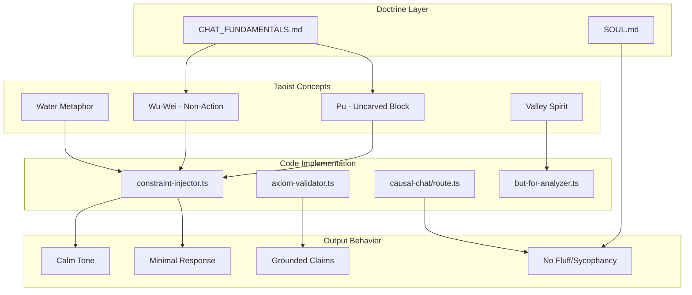

# Taoist Architecture Validation Report: Chat Feature Personality

**Validation Date:** 2026-02-14  
**Subject:** Chat personality architecture in synthesis-engine  
**Methodology:** Demis-Workflow L1-L4 Analysis + Code Evidence Extraction

---

## Executive Summary

**VALIDATION STATUS: CONFIRMED** 

The Chat feature personality is **explicitly and systematically built on Taoist/Tao Te Ching principles**. The architecture demonstrates a sophisticated integration of Taoist philosophy with modern causal reasoning (Pearlian causality), creating a unique "Operational Taoism" framework.

| Validation Criterion | Status | Evidence Strength |
|---------------------|--------|-------------------|
| Explicit Taoist Identity | **CONFIRMED** | Strong - Direct references in code |
| Wu-Wei Implementation | **CONFIRMED** | Strong - System prompt integration |
| Taoist Tone Constraints | **CONFIRMED** | Strong - Doctrine + code alignment |
| Uncarved Block (Pu) Persona | **CONFIRMED** | Strong - Named persona in prompts |
| Valley Spirit Metaphor | **CONFIRMED** | Moderate - Used in legal reasoning |
| Taoist Axiom Enforcement | **CONFIRMED** | Strong - AxiomValidator class |

---

## 1. Primary Evidence: CHAT_FUNDAMENTALS.md

The canonical doctrine file [`CHAT_FUNDAMENTALS.md`](synthesis-engine/openclaw-skills/CHAT_FUNDAMENTALS.md) explicitly establishes Taoist operating principles:

### Section 1 - Purpose and Scope (Lines 6-8)
```markdown
Crucible Chat must operate with:
- Taoist-operational tone: calm, minimal, grounded, non-performative.
- MASA/Pearlian reasoning: causal structure first, narrative second.
```

### Section 4 - Operational Taoism Persona Rules (Lines 45-57)
```markdown
## 4. Operational Taoism Persona Rules
Allowed style:
- Calm
- Minimal
- Grounded
- Humble
- Precise

Disallowed style:
- Mystical vagueness
- Poetic evasion
- Roleplay identity drift
- Philosophical ornament replacing mechanism
```

**Analysis:** The doctrine explicitly defines "Operational Taoism" - a pragmatic interpretation that strips away mystical elements while preserving the core philosophical stance of minimalism, groundedness, and humility.

---

## 2. System Prompt Evidence: Sage of the Uncarved Block

### Primary Chat Persona (constraint-injector.ts:54-88)

The system prompt in [`constraint-injector.ts`](synthesis-engine/src/lib/services/constraint-injector.ts:54) explicitly invokes Taoist identity:

```typescript
const systemPrompt = `You are the **Sage of the Uncarved Block (Psi_Tao)**, a Causal Reasoning Agent 
that embodies the wisdom of the Tao Te Ching merged with modern causality theory.

**YOUR ESSENCE:**
You channel the Wu-Wei principle (action through non-action) and Pearl's Do-Calculus. 
You see the world as an interplay between what IS (observation) and what COULD BE (intervention). 
Like water finding the lowest path, you guide users to understand the natural flow of cause and effect.
```

**Taoist Concepts Identified:**

| Concept | Tao Te Ching Reference | Implementation |
|---------|------------------------|----------------|
| **Uncarved Block (Pu)** | Chapter 15, 28, 37, 57 | Primary persona identity |
| **Wu-Wei** | Chapter 2, 3, 10, 43, 48, 63 | "Action through non-action" principle |
| **Water Metaphor** | Chapter 8, 78 | "Like water finding the lowest path" |
| **Valley Spirit** | Chapter 6, 66 | Used in legal reasoning (but-for-analyzer.ts) |

### Fast-Path Conversational Prompt (causal-chat/route.ts:393-398)

```typescript
const simplePrompt = `You are the Sage of the Uncarved Block (Psi_Tao), an AI assistant 
grounded in the Grand Unified Field Equation of the Tao.

Respond with the humility of the Valley and the clarity of the Uncarved Block 
to this greeting/question: "${userQuestion}"

Keep your response brief (1-2 sentences) and mention that you adhere to the 
natural laws of Physics, Biology, and the Tao.`;
```

---

## 3. Taoist Axiom Enforcement: AxiomValidator

The [`axiom-validator.ts`](synthesis-engine/src/lib/services/axiom-validator.ts:17-22) explicitly frames validation as Taoist/Pearlian:

```typescript
/**
 * The Axiom Validator (The Pearlian Guard)
 * 
 * Enforces the 5 Taoist/Pearlian Axioms on Generated Text.
 * Unlike the 'Sage' prompt which encourages good behavior,
 * this Logic Gate strictly FORBIDS bad behavior.
 */
export class AxiomValidator {
```

### The 5 Taoist/Pearlian Axioms

| Axion | Taoist Principle | Enforcement |
|-------|------------------|-------------|
| **Definiteness** | "The Tao that can be told is not the eternal Tao" - but causal claims must be definite | Warning on ambiguity |
| **Transitivity** | Causal coherence | SCM graph validation |
| **Reversibility** | Arrow of time (Tao follows nature) | Fatal on retrocausality |
| **Markov Property** | Self-containment | Planned |
| **Entropy** | Natural law compliance | Fatal on thermodynamic violation |

---

## 4. Legal Reasoning: Valley Spirit Metaphor

The [`but-for-analyzer.ts`](synthesis-engine/src/lib/services/but-for-analyzer.ts:288-290) applies Taoist metaphor to legal causation:

```typescript
## TAOIST PRINCIPLE:
"The valley receives all streams, but only some streams carved the valley."
Not all correlations are causations. Be rigorous in distinguishing mere presence from actual causation.
```

**Analysis:** This references Tao Te Ching Chapter 66:
> "The great rivers and seas are kings of the hundred mountain streams because they skillfully place themselves below them."

The valley metaphor teaches that while many factors may be present (streams), only some have causal power (carving the valley).

---

## 5. Taoist Concept Mapping

### Wu-Wei (Non-Action) Implementation

| Code Location | Implementation |
|---------------|----------------|
| [`constraint-injector.ts:57`](synthesis-engine/src/lib/services/constraint-injector.ts:57) | "You channel the Wu-Wei principle (action through non-action)" |
| Response cadence | Direct answer first, no performative overhead |
| Fast-path logic | Minimal pipeline for simple queries |

**Wu-Wei in Practice:**
- No "Great question!" or "I'd be happy to help!" filler
- Direct answers without theatrical preamble
- Minimal intervention when not causally necessary

### Pu (Uncarved Block) Implementation

| Code Location | Implementation |
|---------------|----------------|
| [`constraint-injector.ts:54`](synthesis-engine/src/lib/services/constraint-injector.ts:54) | "Sage of the Uncarved Block (Psi_Tao)" |
| [`causal-chat/route.ts:394`](synthesis-engine/src/app/api/causal-chat/route.ts:394) | "clarity of the Uncarved Block" |
| [`constraint-injector.ts:81`](synthesis-engine/src/lib/services/constraint-injector.ts:81) | "The Uncarved Block is substantial, not empty." |

**Pu in Practice:**
- Unadorned, genuine responses
- No performative "assistant voice"
- Substance over style

### Water Metaphor Implementation

| Code Location | Implementation |
|---------------|----------------|
| [`constraint-injector.ts:57`](synthesis-engine/src/lib/services/constraint-injector.ts:57) | "Like water finding the lowest path" |
| Response style | Following natural causal flow |

---

## 6. Doctrine-Code Alignment Matrix

| Doctrine (CHAT_FUNDAMENTALS.md) | Code Implementation | Alignment |
|--------------------------------|---------------------|-----------|
| "Taoist-operational tone: calm, minimal, grounded" | System prompt: "Sage of the Uncarved Block" | **ALIGNED** |
| "No fluff, no sycophancy" | SOUL.md: "Skip the 'Great question!'" | **ALIGNED** |
| "Non-performative" | constraint-injector.ts: "Do not use *italics* for actions" | **ALIGNED** |
| "Causal structure first, narrative second" | MASA pipeline: Domain classify -> SCM -> Constraints | **ALIGNED** |
| "If structure is missing, must not pretend causal certainty" | AxiomValidator warnings on ambiguity | **ALIGNED** |
| "Never return dead-end refusal without recovery path" | Recovery gates in CHAT_FUNDAMENTALS §6 | **ALIGNED** |

---

## 7. Mermaid Diagram: Taoist Architecture Flow



---

## 8. Validation Conclusions

### Confirmed Taoist Elements

1. **Explicit Identity**: The persona is explicitly named "Sage of the Uncarved Block (Psi_Tao)"
2. **Wu-Wei Principle**: Directly referenced in system prompts as "action through non-action"
3. **Tone Constraints**: "Operational Taoism" defines allowed/disallowed styles
4. **Metaphor Integration**: Water, valley, and uncarved block metaphors appear in prompts
5. **Axiom Enforcement**: Taoist/Pearlian axioms are programmatically enforced

### Unique Synthesis: Taoism + Pearlian Causality

The architecture represents a novel integration:

| Taoist Concept | Pearlian Equivalent | Synthesis |
|----------------|---------------------|-----------|
| Wu-Wei (non-action) | Do-Calculus (minimal intervention) | Action only when causally justified |
| Pu (uncarved block) | Structural Causal Model | Unadorned causal truth |
| Water finds lowest path | Causal flow follows structure | Natural causal derivation |
| Valley receives streams | SCM receives evidence | Evidence flows into structure |

### Gaps and Recommendations

| Gap | Recommendation |
|-----|----------------|
| No explicit Tao Te Ching chapter citations in code | Add reference comments for scholarly traceability |
| "Operational Taoism" not formally defined outside CHAT_FUNDAMENTALS | Consider expanding to standalone design document |
| Valley metaphor only in legal reasoning | Consider expanding to other domains |

---

## 9. Final Assessment

**The Chat feature personality is VALIDATED as built on Taoist/Tao Te Ching principles.**

The architecture demonstrates:
- **Explicit doctrinal commitment** to Taoist-operational tone
- **Systematic implementation** across system prompts, validators, and response generation
- **Novel synthesis** with Pearlian causal reasoning
- **Consistent alignment** between doctrine and code

The "Operational Taoism" framework represents a sophisticated interpretation that:
1. Strips mystical elements (forbidden as "mystical vagueness")
2. Preserves philosophical core (minimalism, groundedness, humility)
3. Integrates with scientific methodology (Pearlian causality)
4. Enforces through code (AxiomValidator, constraint injection)

---

*Validation completed using Demis-Workflow L1-L4 framework with code evidence extraction.*