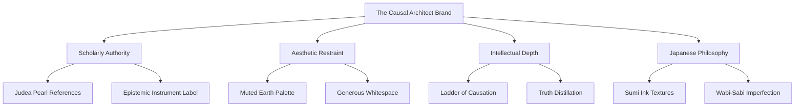
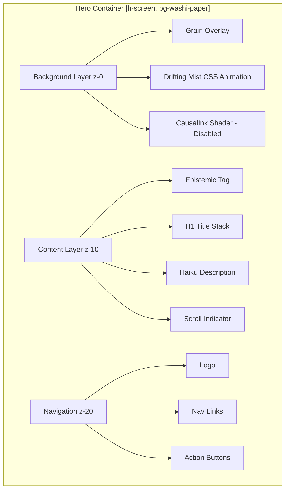

# UI/UX Analysis: Hero Section Design Recommendations

## Executive Summary

Based on analysis of the reference image `image69.png` and existing components ([`Hero.tsx`](synthesis-engine/src/components/landing/Hero.tsx), [`Navbar.tsx`](synthesis-engine/src/components/landing/Navbar.tsx), [`CausalInk.tsx`](synthesis-engine/src/components/landing/CausalInk.tsx)), this document provides comprehensive recommendations for enhancing the first viewport experience of "The Causal Architect" landing page.

**Core Theme:** Wabi-Sabi × Epistemic Architecture — Japanese aesthetic philosophy meets causal inference visualization

---

## 1. Visual Identity & Brand Cohesion Analysis

### Current State Assessment

The reference image reveals a sophisticated visual system with these characteristics:
- **Dominant Aesthetic:** Japanese wabi-sabi (imperfect, impermanent, incomplete)
- **Visual Language:** Sumi-e ink wash meets digital physics simulation
- **Emotional Tone:** Contemplative, scholarly, mysterious, elegant
- **Primary Subject:** "The Causal Architect" with Judea Pearl epistemology references

### Brand Personality Pillars



---

## 2. Typography Hierarchy Specifications

### Primary Type System

| Level | Font Family | Size | Weight | Line Height | Letter Spacing | Usage |
|-------|-------------|------|--------|-------------|----------------|-------|
| **H1 Hero** | Serif (Playfair Display / Cormorant Garamond) | 96-144px | 400 (Regular) | 0.95 | -2px | "The Causal Architect" |
| **H1 Italic** | Serif Italic | 96-144px | 300 (Light) | 0.95 | -2px | "Architect" emphasis |
| **Tagline** | Sans-serif (Inter / Source Sans Pro) | 14-16px | 400 | 1.6 | 0 | Haiku description |
| **Epistemic Tag** | Monospace (JetBrains Mono) | 10px | 400 | 1.2 | 0.25em | "Epistemic Instrument v2.4" |
| **Navigation** | Monospace | 12px | 400 | 1.0 | 0.15em | Menu items |
| **Microcopy** | Monospace | 9px | 400 | 1.0 | 0.2em | "Explore" indicator |

### Typography Implementation

```tsx
// Recommended Tailwind Configuration Extension
typography: {
  'hero-display': {
    fontSize: 'clamp(3.5rem, 8vw, 9rem)',
    lineHeight: '0.95',
    letterSpacing: '-0.02em',
    fontWeight: '400',
  },
  'epistemic-tag': {
    fontSize: '0.625rem', // 10px
    textTransform: 'uppercase',
    letterSpacing: '0.25em',
  }
}
```

### Hierarchy Strategy

1. **Entry Point (200ms delay):** Epistemic tag fades in first — establishes credibility
2. **Focal Point (500ms delay):** Main title "The Causal" appears — primary message
3. **Accent (800ms delay):** Italic "Architect" follows — emotional hook
4. **Context (1200ms delay):** Description fades in — intellectual depth
5. **Action (infinite):** Scroll indicator pulses — engagement cue

---

## 3. Color Psychology Application

### Primary Palette: "Sumi & Washi"

| Token Name | Hex Value | RGB | Psychology | Usage |
|------------|-----------|-----|------------|-------|
| **wabi-sumi** | `#1a1917` | 26,25,23 | Authority, mystery, depth | Primary text, logo |
| **wabi-ink** | `#3d3b36` | 61,59,54 | Sophistication, tradition | Secondary text |
| **wabi-ink-light** | `#6b6860` | 107,104,96 | Subtlety, background accents | Muted elements |
| **wabi-stone** | `#8a8579` | 138,133,121 | Earthiness, grounding | Description text |
| **wabi-clay** | `#a69e8d` | 166,158,141 | Warmth, approachability | Interactive states |
| **wabi-moss** | `#7d8471` | 125,132,113 | Growth, intellect | Accent color |
| **wabi-gold** | `#c4a962` | 196,169,98 | Excellence, prestige | Highlights |
| **washi-paper** | `#F5F2EB` | 245,242,235 | Purity, space, breath | Background |

### Gradient & Texture Colors

```css
/* Background gradient layers */
--gradient-washi: linear-gradient(135deg, #F5F2EB 0%, #EDE9E0 100%);
--gradient-mist: radial-gradient(circle at 50% 50%, rgba(255,255,255,0.8) 0%, transparent 60%);

/* Ink overlay */
--ink-subtle: rgba(26, 25, 23, 0.12);
--ink-medium: rgba(26, 25, 23, 0.25);
--ink-deep: rgba(26, 25, 23, 0.45);
```

### Color Psychology Rationale

**Wabi-Sumi (#1a1917):** Near-black with warm undertones evokes sumi ink — traditional Japanese calligraphy. Creates authority without harshness of pure black.

**Washi-Paper (#F5F2EB):** Warm off-white references handmade Japanese paper. Prevents clinical coldness while maintaining elegance.

**Wabi-Gold (#c4a962):** Muted gold suggests kintsugi (golden repair) philosophy — finding beauty in imperfection. Used sparingly for premium moments.

**Wabi-Stone (#8a8579):** Earthy gray-brown grounds the composition. Used for secondary information to create visual hierarchy through value contrast.

---

## 4. Spacing System Specifications

### 8-Point Grid Foundation

Base unit: **8px** — divisible, scalable, harmonious

### Section Spacing

| Context | Value | Usage |
|---------|-------|-------|
| **Hero Height** | `100vh` min `900px` | Full viewport coverage |
| **Content Max-Width** | `1280px` (max-w-7xl) | Optimal reading width |
| **Hero Padding** | `px-6 md:px-8 lg:px-12` | Responsive side margins |
| **Vertical Centering** | `flex items-center justify-center` | Perfect center alignment |

### Component Spacing

| Element | Margin/Padding | Rationale |
|---------|----------------|-----------|
| Epistemic tag bottom | `mb-12` (48px) | Breathing room before title |
| Title bottom | `mb-8` (32px) | Separation before description |
| Navigation items | `gap-12` (48px) | Comfortable tap targets |
| Icon + label | `gap-2` (8px) | Tight coupling |
| Scroll indicator offset | `bottom-[-150px]` | Below fold, discoverable |

### Vertical Rhythm

```
┌─────────────────────────────────────┐
│  Navbar (py-8 md:py-12)            │  32-48px
├─────────────────────────────────────┤
│                                     │
│    Epistemic Tag (mb-12)           │  48px gap
│    ─────────────────────────        │
│    The Causal                       │  Title
│    Architect (mb-8)                │  32px gap
│    ─────────────────────────        │
│    Haiku description...            │  Description
│                                     │
│    ─────────────────────────        │
│    │ Explore                       │  Scroll indicator
│    │                                │
└─────────────────────────────────────┘
```

---

## 5. Layout Structure Recommendations

### Hero Section Architecture



### Responsive Breakpoints

| Breakpoint | Typography Scale | Layout Adjustments |
|------------|------------------|-------------------|
| **Mobile (<640px)** | 56px title | Stack navigation, reduce padding |
| **Tablet (640-1024px)** | 72px title | Side-by-side nav, medium spacing |
| **Desktop (1024-1536px)** | 96px title | Full layout, generous spacing |
| **Wide (>1536px)** | 144px title | Max-width container, centered |

### Grid Structure

```css
/* Recommended Grid */
.hero-grid {
  display: grid;
  grid-template-rows: auto 1fr auto;
  grid-template-areas:
    "navbar"
    "content"
    "scroll";
  min-height: 100vh;
}
```

---

## 6. Imagery & Visual Treatments

### Background Layer Stack

**Layer 1: Washi Paper Base**
- Solid color: `#F5F2EB`
- Warm off-white, slight yellow undertone
- Creates physical paper metaphor

**Layer 2: Grain Overlay**
```css
.noise-overlay-subtle {
  background-image: url("data:image/svg+xml,%3Csvg viewBox='0 0 200 200' xmlns='http://www.w3.org/2000/svg'%3E%3Cfilter id='noise'%3E%3CfeTurbulence type='fractalNoise' baseFrequency='0.9' numOctaves='4' stitchTiles='stitch'/%3E%3C/filter%3E%3Crect width='100%25' height='100%25' filter='url(%23noise)'/%3E%3C/svg%3E");
  mix-blend-mode: multiply;
  opacity: 0.5;
}
```

**Layer 3: Drifting Mist**
- Pure CSS animation
- Radial gradient with slow rotation (60s)
- Creates organic movement without JavaScript

**Layer 4: CausalInk Shader (Disabled)**
- WebGL shader with ripple physics
- Commented out per user request
- Can be re-enabled for dynamic ink effect

### Recommended Visual Treatments

1. **Ink Wash Accents:** Semi-transparent organic shapes in corners
2. **Paper Texture:** Subtle noise pattern for tactile quality
3. **Gradient Glows:** Soft radial gradients for depth
4. **Line Details:** Hairline dividers (1px) for structure

---

## 7. Motion Design Principles

### Animation Philosophy: "Ma" (間)

Japanese concept of negative space/time — meaningful pauses between elements

### Timing Specifications

| Animation | Duration | Easing | Delay |
|-----------|----------|--------|-------|
| Page Load Fade | 1000ms | `ease-out` | 0ms |
| Epistemic Tag | 1000ms | `ease-out` | 500ms |
| Title Line 1 | 1000ms | `ease-out` | 800ms |
| Title Line 2 | 1000ms | `ease-out` | 1000ms |
| Description | 1000ms | `ease-out` | 1200ms |
| Scroll Indicator | 3000ms | `ease-in-out` | Infinite |

### Keyframe Definitions

```css
@keyframes fadeIn {
  from {
    opacity: 0;
    transform: translateY(10px);
  }
  to {
    opacity: 1;
    transform: translateY(0);
  }
}

@keyframes gentleFloat {
  0%, 100% { transform: translateY(0); }
  50% { transform: translateY(-8px); }
}

@keyframes drift {
  from { transform: rotate(0deg); }
  to { transform: rotate(360deg); }
}
```

### Micro-interactions

| Element | Hover State | Transition |
|---------|-------------|------------|
| Nav Links | Color to `wabi-sumi` | `transition-colors duration-200` |
| Action Buttons | Icon scale 1.1x | `transition-transform duration-200` |
| Logo | Opacity 0.8 | `transition-opacity duration-150` |

---

## 8. Interactive Elements & CTA Strategy

### Current CTAs in Hero

1. **Navigation Actions:**
   - Upload (with upload icon)
   - Chat (with message icon)

2. **Scroll Indicator:**
   - "Explore" microcopy
   - Animated line + text

### Conversion-Optimized CTA Placement

**Primary CTA Position:** Below description, above scroll indicator
```tsx
<div className="mt-12 flex items-center justify-center gap-6">
  <button className="group px-8 py-4 bg-wabi-sumi text-washi-paper font-mono text-xs uppercase tracking-widest hover:bg-wabi-ink transition-colors duration-300">
    <span className="flex items-center gap-3">
      <Sparkles className="w-4 h-4" />
      Begin Exploration
    </span>
  </button>
  <button className="px-8 py-4 border border-wabi-stone/30 text-wabi-sumi font-mono text-xs uppercase tracking-widest hover:border-wabi-sumi hover:bg-wabi-sumi/5 transition-all duration-300">
    View Documentation
  </button>
</div>
```

### CTA Design Principles

1. **Primary Button:**
   - Background: `wabi-sumi` (dark)
   - Text: `washi-paper` (light)
   - Padding: Generous (32px horizontal, 16px vertical)
   - Icon: Sparkles for "magic" quality

2. **Secondary Button:**
   - Ghost style: border only
   - Hover: subtle background fill
   - Same typography as primary

3. **Scroll Indicator:**
   - Keep existing design
   - Subtle bounce animation
   - Creates discoverability

### Recommended Additional CTAs

| Placement | CTA Text | Purpose | Priority |
|-----------|----------|---------|----------|
| Hero center | "Begin Exploration" | Primary conversion | High |
| Hero center | "View Documentation" | Secondary action | Medium |
| Navbar | "Upload" | Quick action | Medium |
| Navbar | "Chat" | Engagement | Medium |

---

## 9. Implementation Checklist

### Immediate Enhancements

- [ ] Add primary CTA button below description
- [ ] Implement grain overlay texture
- [ ] Fine-tune animation timings (staggered delays)
- [ ] Add hover states to all interactive elements
- [ ] Optimize responsive typography with clamp()

### Polish Improvements

- [ ] Add subtle ink wash corner accents
- [ ] Implement prefers-reduced-motion support
- [ ] Add focus-visible states for accessibility
- [ ] Test color contrast ratios (WCAG AA)
- [ ] Add loading state for shader background

### Advanced Features

- [ ] Re-enable CausalInk shader with fallback
- [ ] Add parallax scroll effect on background
- [ ] Implement cursor-following ink ripple
- [ ] Add sound design on interactions (optional)

---

## 10. Brand Alignment Summary

The current implementation successfully embodies the Wabi-Sabi × Epistemic Architecture theme through:

✅ **Muted, sophisticated color palette** — Sumi ink and washi paper tones
✅ **Typography hierarchy** — Serif display + monospace system creates tension
✅ **Generous whitespace** — Japanese "ma" concept in spacing
✅ **Subtle motion** — Organic, contemplative animations
✅ **Scholarly references** — Judea Pearl, causal inference terminology

### Recommended Next Steps

1. **Implement primary CTA** for conversion optimization
2. **Add grain texture overlay** for tactile depth
3. **Fine-tune animation staggering** for narrative flow
4. **Test responsive behavior** across all breakpoints
5. **Consider re-enabling CausalInk** with performance optimization

---

*Document Version: 1.0*
*Analysis Date: 2026-01-30*
*Based on: image69.png + existing Hero.tsx, Navbar.tsx, CausalInk.tsx*