# System Dynamics Schematic

## Grand Unified Field Equation: Causal Structure

This document contains a Mermaid.js diagram definition representing the system dynamics
of the forest-fungal network model.

### Variables

| Symbol | Name | Category | Description |
|--------|------|----------|-------------|
| v | Growth Velocity | Growth | Rate of biomass accumulation |
| D | Stand Density | Structure | Forest stand density/structure |
| S | Node Stability | State | Core stability metric for each node |
| K_net | Network Coupling | Network | Mycorrhizal network connection matrix |
| Eq | Equalization Factor | Network | Resource redistribution via fungal network |
| H_int | Human Intervention | External | Anthropogenic impacts (logging, land use) |
| E_dist | External Disturbance | External | Environmental disturbances (fire, storms) |
| B_pump | Biotic Pump | Thermodynamic | Forest-driven moisture recycling |
| ΔT | Temperature Differential | Thermodynamic | Temperature stress factor |

### Feedback Loops

1. **Growth/Structure Loop** (Reinforcing): v → D → S → v
2. **Network Loop** (Stabilizing): K_net → Eq → S
3. **External Forcing** (Destabilizing): H_int → K_net, E_dist → S
4. **Thermodynamic Pathway**: B_pump → ΔT → S

### Mermaid Diagram

```mermaid
flowchart TB
    subgraph Growth_Structure["🌱 Growth/Structure Loop"]
        v["v<br/>Growth Velocity"]
        D["D<br/>Stand Density"]
    end

    subgraph Network["🔗 Network Loop"]
        K_net["K_net<br/>Network Coupling"]
        Eq["Eq<br/>Equalization"]
    end

    subgraph External["⚠️ External Forcing"]
        H_int["H_int<br/>Human Intervention"]
        E_dist["E_dist<br/>External Disturbance"]
    end

    subgraph Thermodynamic["🌡️ Thermodynamic"]
        B_pump["B_pump<br/>Biotic Pump"]
        dT["ΔT<br/>Temperature"]
    end

    subgraph Core["🎯 Core State"]
        S["S<br/>Node Stability"]
    end

    %% Growth/Structure Loop (positive feedback)
    v -->|"+"| D
    D -->|"+"| S
    S -->|"+"| v

    %% Network Loop
    K_net -->|"+"| Eq
    Eq -->|"+"| S

    %% External Forcing
    H_int -->|"−"| K_net
    E_dist -->|"−"| S

    %% Thermodynamic pathway
    B_pump -->|"−"| dT
    dT -->|"−"| S

    %% Cross-loop interactions
    S -.->|"+"| K_net
    D -.->|"+"| B_pump

    %% Styling
    style S fill:#FF9800,stroke:#E65100,color:#fff,stroke-width:3px
    style v fill:#4CAF50,stroke:#2E7D32,color:#fff
    style D fill:#8BC34A,stroke:#558B2F,color:#fff
    style K_net fill:#2196F3,stroke:#1565C0,color:#fff
    style Eq fill:#2196F3,stroke:#1565C0,color:#fff
    style H_int fill:#F44336,stroke:#C62828,color:#fff
    style E_dist fill:#F44336,stroke:#C62828,color:#fff
    style B_pump fill:#9C27B0,stroke:#6A1B9A,color:#fff
    style dT fill:#9C27B0,stroke:#6A1B9A,color:#fff
```

### Mathematical Representation

The causal structure above maps to the Grand Unified Field Equation:

$$
\frac{dS_i}{dt} = f(v_i, D_i) - g(E_{dist}, \Delta T) - \gamma \sum_j L_{ij} S_j
$$

Where:
- $f(v_i, D_i)$ represents the Growth/Structure contribution
- $g(E_{dist}, \Delta T)$ represents external forcing and thermodynamic stress
- $\gamma \sum_j L_{ij} S_j$ represents network-mediated resource equalization
- $L_{ij} = D_{ij} - K_{net,ij}$ is the Graph Laplacian

### Interpretation

**Reinforcing Loops:**
- The Growth/Structure loop (v → D → S → v) creates positive feedback where stable, dense forests promote further growth

**Balancing Mechanisms:**
- Network coupling (K_net → Eq → S) redistributes resources from stable to unstable nodes
- The Graph Laplacian ensures conservation: total system stability is redistributed, not created

**Disruption Pathways:**
- Human intervention disrupts network connectivity (H_int → K_net)
- External disturbances directly reduce node stability (E_dist → S)
- Climate stress operates through the biotic pump mechanism (B_pump → ΔT → S)
