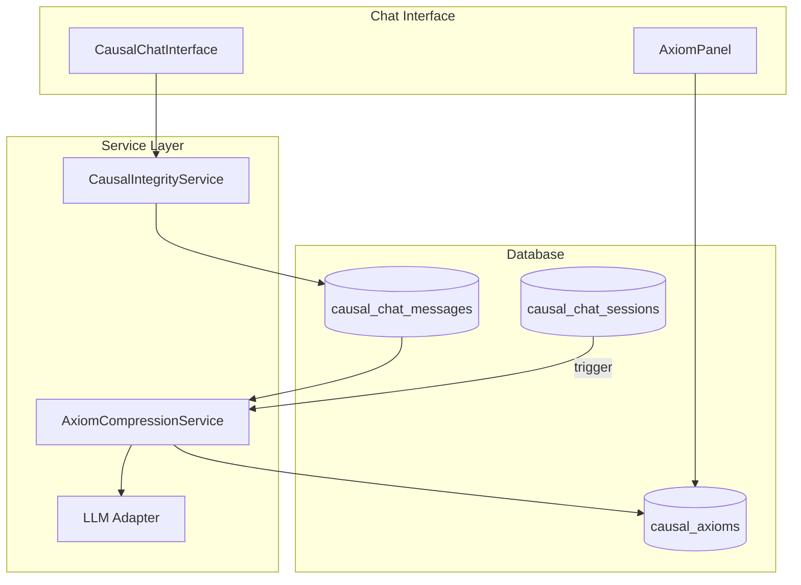

# Walkthrough: Phase 1 - Fractal Memory (Axiom Compression)

## Overview
Phase 1 implements the "Fractal Memory" feature that distills high-quality chat sessions into persistent causal axioms. This transforms ephemeral conversations into reusable scientific knowledge.

## What Was Built

### 1. AxiomCompressionService
**Location**: [`src/lib/services/axiom-compression-service.ts`](../synthesis-engine/src/lib/services/axiom-compression-service.ts)

A service that:
- Compresses L3 (Counterfactual) messages into concise axioms
- Uses LLM to extract core causal insights
- Deduplicates similar axioms
- Stores results in the `causal_axioms` table

**Key Methods**:
- `compressSession(sessionId)` - Compress entire session
- `extractFromMessage(message)` - Real-time single message extraction
- `qualifiesForExtraction(message)` - Check if message is L3 with high confidence

### 2. Database Migration
**Location**: [`supabase/migrations/20260129_add_axiom_compression_trigger.sql`](../synthesis-engine/supabase/migrations/20260129_add_axiom_compression_trigger.sql)

Adds:
- `status` column to `causal_chat_sessions` (active/completed/compressed)
- `causal_density` JSONB column to `causal_chat_messages`
- Trigger for automatic compression queueing
- `causal_session_stats` view for analytics

### 3. AxiomPanel UI
**Location**: [`src/components/causal-chat/visuals/AxiomPanel.tsx`](../synthesis-engine/src/components/causal-chat/visuals/AxiomPanel.tsx)

A collapsible panel that:
- Displays extracted axioms with confidence scores
- Shows source message count
- Allows export to text file
- Auto-refreshes when panel opens

## Verification Results

### Build Status
```bash
npm run build
# Expected: Success (no TypeScript errors)
```

### Database Schema
All migrations are ready but require manual execution (see Critical Gaps below).

## Critical Gaps - USER ACTION REQUIRED

### ⚠️ 1. Database Migration (REQUIRED)
You MUST run the SQL migration in Supabase before the feature works:

**Steps**:
1. Go to your Supabase Dashboard → SQL Editor
2. Open the file: [`supabase/migrations/20260129_add_axiom_compression_trigger.sql`](../synthesis-engine/supabase/migrations/20260129_add_axiom_compression_trigger.sql)
3. Copy the entire SQL content
4. Paste into SQL Editor and click "Run"
5. Verify success message

**What This Enables**:
- `causal_density` column stores evaluation results per message
- `status` column tracks session lifecycle
- Automatic compression triggering when sessions complete
- Session statistics view

### ⚠️ 2. Environment Variables
Ensure these are set in your `.env.local`:
```bash
# Required for LLM-based axiom extraction
ANTHROPIC_API_KEY=your_key_here

# Or use Gemini alternative
GOOGLE_API_KEY=your_key_here
CAUSAL_AI_PROVIDER=gemini  # or 'anthropic'

# Supabase (should already be configured)
NEXT_PUBLIC_SUPABASE_URL=your_url
NEXT_PUBLIC_SUPABASE_ANON_KEY=your_key
SUPABASE_SERVICE_ROLE_KEY=your_service_key  # Optional, for admin operations
```

### ⚠️ 3. AxiomPanel Integration
Add the AxiomPanel to your chat interface:

**In `CausalChatInterface.tsx`**:
```tsx
import { AxiomPanel } from './visuals/AxiomPanel';

// Add state for panel
const [isAxiomPanelOpen, setIsAxiomPanelOpen] = useState(false);

// Add to JSX (near header)
<AxiomPanel 
  sessionId={currentSessionId}
  isOpen={isAxiomPanelOpen}
  onToggle={() => setIsAxiomPanelOpen(!isAxiomPanelOpen)}
/>
```

## Next Steps for You

1. **Run Database Migration** (5 minutes)
   - Execute the SQL in Supabase SQL Editor
   - Verify `causal_density` column appears in `causal_chat_messages`

2. **Integrate AxiomPanel** (10 minutes)
   - Import and add to CausalChatInterface
   - Pass the current session ID

3. **Test Compression** (5 minutes)
   - Start a chat with L3 (counterfactual) reasoning
   - Example prompt: "What would happen to forest ecosystems if mycorrhizal networks didn't exist?"
   - Mark session as completed
   - Check AxiomPanel for extracted truths

4. **Verify API Keys** (2 minutes)
   - Ensure ANTHROPIC_API_KEY or GOOGLE_API_KEY is set
   - Test with a simple chat message

## How It Works

```
User Chat → CausalIntegrityService evaluates → L3 detected → 
AxiomCompressionService extracts → LLM distills → 
causal_axioms table stores → AxiomPanel displays
```

## Troubleshooting

| Issue | Solution |
|-------|----------|
| "Failed to load axioms" | Check Supabase credentials, run migration |
| No axioms extracted | Ensure messages have L3 density (use counterfactual language) |
| Duplicate axioms | Normal - deduplication prevents exact matches |
| Panel won't open | Check that sessionId is passed correctly |

## Architecture



## Success Criteria

- [ ] Migration executed successfully
- [ ] AxiomPanel renders without errors
- [ ] L3 messages trigger axiom extraction
- [ ] Axioms display with confidence scores
- [ ] Export function works

## Phase 2 Preview

Next phase implements **Real-time Causal Density Streaming**:
- Density updates stream as text generates
- Gauge animates in real-time
- Enhanced SSE events

Stay tuned for the next walkthrough!
