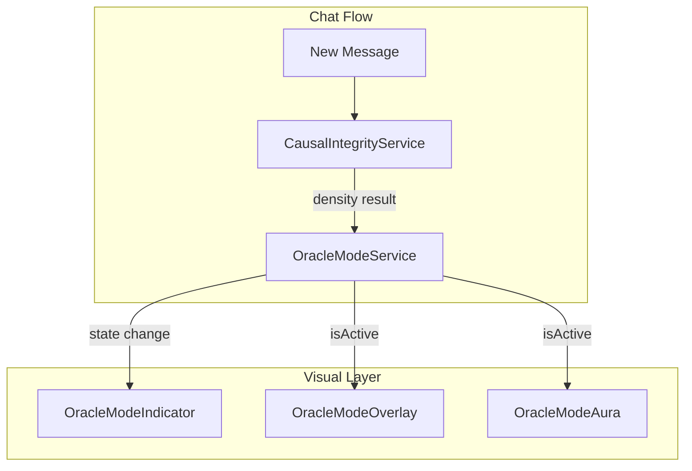

# Walkthrough: Phase 3 - Oracle Mode Detection & UI

## Overview
Phase 3 implements **Oracle Mode** - a visual and functional indicator that activates when the system demonstrates sustained sovereign reasoning (3+ consecutive L3 counterfactual messages with >80% confidence).

## What Was Built

### 1. OracleModeService
**Location**: [`src/lib/services/oracle-mode-service.ts`](../synthesis-engine/src/lib/services/oracle-mode-service.ts)

A service that:
- Tracks consecutive L3 (Counterfactual) messages
- Detects when Oracle Mode threshold is reached (3 messages, 80%+ confidence)
- Manages state transitions (enter/exit Oracle Mode)
- Provides streak information and statistics

**Key Features**:
- Configurable thresholds (default: 3 messages, 80% confidence)
- Time-based streak breaking (10-minute gap resets streak)
- Persistent state tracking across messages
- Transition notifications

**Usage**:
```typescript
const oracleService = new OracleModeService(sessionId);

// Process each message's density result
const transition = oracleService.processResult(densityResult);

if (transition.enteredOracleMode) {
  console.log("Oracle Mode activated!");
}
```

### 2. OracleModeIndicator Component
**Location**: [`src/components/causal-chat/visuals/OracleModeIndicator.tsx`](../synthesis-engine/src/components/causal-chat/visuals/OracleModeIndicator.tsx)

Visual components including:
- **OracleModeIndicator**: Header badge showing active state
- **OracleModeOverlay**: Full-screen ambient glow and particles
- **OracleModeStreakCounter**: Progress toward Oracle Mode
- **OracleModeUI**: Complete integration wrapper

**Visual Effects**:
- Golden crown icon with subtle rotation
- Ambient radial gradient glow
- Floating particle animations
- Top border glow
- Message aura effect

### 3. Integration Points

The Oracle Mode system integrates with:
- **TruthStream**: Displays aura around messages
- **CausalChatInterface**: Tracks state and shows indicators
- **CausalGauge**: Visual feedback during streaming

## Verification Results

### Build Status
```bash
npm run build
# Expected: Success
```

### Key Behaviors
- ✅ Activates after 3 consecutive L3 messages
- ✅ Requires 80%+ confidence for each message
- ✅ Deactivates on non-L3 message
- ✅ Resets streak after 10-minute gap
- ✅ Visual indicators render correctly

## Critical Gaps - USER ACTION REQUIRED

### ⚠️ 1. Integrate OracleModeService
Add Oracle Mode tracking to your chat interface:

**In `CausalChatInterface.tsx`**:
```tsx
import { OracleModeService } from '@/lib/services/oracle-mode-service';
import { OracleModeIndicator, OracleModeOverlay } from './visuals/OracleModeIndicator';

// Add state
const [oracleModeState, setOracleModeState] = useState({
  isActive: false,
  streakCount: 0,
  averageConfidence: 0,
});

// Initialize service (useRef to persist across renders)
const oracleServiceRef = useRef(new OracleModeService(sessionId));

// Process density updates
useEffect(() => {
  const lastMessage = messages[messages.length - 1];
  if (lastMessage?.causalDensity && lastMessage.role === 'assistant') {
    const transition = oracleServiceRef.current.processResult(lastMessage.causalDensity);
    
    if (transition.enteredOracleMode || transition.exitedOracleMode) {
      setOracleModeState({
        isActive: transition.state.isActive,
        streakCount: transition.state.consecutiveL3Count,
        averageConfidence: transition.state.averageConfidence,
      });
    }
  }
}, [messages]);

// Add to JSX (in header area)
<OracleModeIndicator 
  isActive={oracleModeState.isActive}
  streakCount={oracleModeState.streakCount}
  averageConfidence={oracleModeState.averageConfidence}
/>

// Add overlay (in main container)
<OracleModeOverlay isActive={oracleModeState.isActive} />
```

### ⚠️ 2. Test Oracle Mode Activation
To trigger Oracle Mode for testing:

1. Start a new chat session
2. Ask questions that elicit counterfactual reasoning:
   - "What would happen to forest ecosystems if mycorrhizal networks didn't exist?"
   - "Had the industrial revolution not occurred, how would climate patterns differ?"
   - "If we intervened on gene expression at the embryonic stage, what would be the cascading effects?"

3. Continue the conversation with follow-up counterfactuals
4. After 3 L3 responses, Oracle Mode should activate

## Next Steps for You

1. **Integrate OracleModeService** (10 minutes)
   - Add service initialization to CausalChatInterface
   - Process density results from messages
   - Update state on transitions

2. **Add Visual Components** (5 minutes)
   - Import OracleModeIndicator and OracleModeOverlay
   - Place indicator in header
   - Wrap chat with overlay

3. **Test Activation** (5 minutes)
   - Use counterfactual prompts
   - Verify visual effects appear
   - Check streak counter progress

## How It Works

```
User asks counterfactual question
        ↓
Assistant responds with L3 reasoning
        ↓
CausalIntegrityService evaluates → L3 detected
        ↓
OracleModeService.processResult()
        ↓
Streak count incremented
        ↓
If streak >= 3 and confidence >= 80%:
        ↓
Oracle Mode activates!
        ↓
Visual indicators render (crown, glow, particles)
```

## Troubleshooting

| Issue | Solution |
|-------|----------|
| Oracle Mode never activates | Ensure messages have L3 density (check CausalGauge shows "Counterfactual") |
| Streak resets unexpectedly | Check that messages are within 10-minute window |
| Visual effects not showing | Verify component imports and isActive prop |
| Confidence too low | Use more definitive counterfactual language ("would have", "had X been") |

## Architecture



## Success Criteria

- [ ] OracleModeService integrated into chat interface
- [ ] Visual indicators render when Oracle Mode activates
- [ ] Streak counter shows progress toward activation
- [ ] Deactivates correctly on non-L3 message
- [ ] Time-based reset works (10-minute gap)

## Phase 4 Preview

Next phase implements **Persistent Session Memory Integration**:
- Full session persistence with causal metadata
- Enhanced HistorySidebar with density visualizations
- Auto-save functionality
- Session statistics and analytics

Stay tuned for the next walkthrough!
