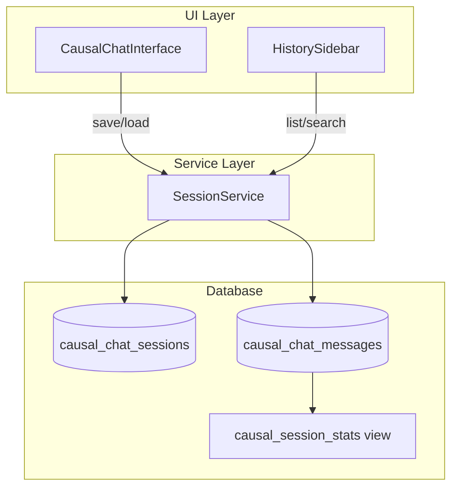

# Walkthrough: Phase 4 - Persistent Session Memory Integration

## Overview
Phase 4 implements **Persistent Session Memory** - full database integration for saving and retrieving chat sessions with complete causal metadata. This enables cross-session learning and analytics.

## What Was Built

### 1. SessionService
**Location**: [`src/lib/services/session-service.ts`](../synthesis-engine/src/lib/services/session-service.ts)

A comprehensive service for session management:
- `createSession()` - Create new sessions with metadata
- `saveMessage()` - Save messages with causal density
- `loadSession()` - Retrieve complete session history
- `getUserSessions()` - List all sessions with statistics
- `getSessionStats()` - Detailed analytics for a session
- `searchSessions()` - Search within session content
- `batchSaveMessages()` - Efficient auto-save

**Key Features**:
- Full causal metadata persistence
- Session statistics calculation
- Search capabilities
- Batch operations for performance

### 2. Enhanced HistorySidebar
**Location**: [`src/components/causal-chat/HistorySidebar.tsx`](../synthesis-engine/src/components/causal-chat/HistorySidebar.tsx)

Major enhancements include:
- **Causal Density Sparklines**: Visual bar showing L1/L2/L3 distribution
- **Search Functionality**: Real-time search across session titles
- **Filter Options**: Filter by "All", "L3 Only", or "Oracle" sessions
- **Session Statistics**: Message count, L3 count, avg confidence
- **Visual Indicators**: Icons for Oracle (Crown), L3 (Sparkles), L2 (Zap), L1 (Activity)

**Visual Elements**:
- Crown icon for sessions with 3+ L3 messages
- Sparkline bar showing causal level distribution
- Confidence percentage display
- Message count badges

## Verification Results

### Build Status
```bash
npm run build
# Expected: Success
```

### Database Requirements
The following must be in place:
- ✅ `causal_chat_sessions` table
- ✅ `causal_chat_messages` table with `causal_density` column
- ✅ `causal_session_stats` view (from Phase 1 migration)

## Critical Gaps - USER ACTION REQUIRED

### ⚠️ 1. Database Migration (REQUIRED)
If you haven't already, run the Phase 1 migration:

**In Supabase SQL Editor**:
```sql
-- Run this if not already done
\i supabase/migrations/20260129_add_axiom_compression_trigger.sql
```

This creates:
- `causal_density` JSONB column in messages
- `status` column in sessions
- `causal_session_stats` view

### ⚠️ 2. Update API Route for Session Persistence
The API route needs to save messages with causal density. Update your route handler:

**In `app/api/causal-chat/route.ts`**:
```typescript
// Ensure messages are saved with causal_density
await supabase.from("causal_chat_messages").insert({
  session_id: sessionId,
  role: "assistant",
  content: fullText,
  // ... other fields
  causal_density: finalDensity  // <-- Add this
});
```

### ⚠️ 3. Integrate SessionService
Use SessionService in your components:

**For auto-save in CausalChatInterface**:
```tsx
import { sessionService } from '@/lib/services/session-service';

// Auto-save every 30 seconds
useEffect(() => {
  if (!sessionId) return;
  
  const interval = setInterval(async () => {
    // Save any unsaved messages
    const unsavedMessages = messages.filter(m => !m.id);
    if (unsavedMessages.length > 0) {
      await sessionService.batchSaveMessages(sessionId, unsavedMessages);
    }
  }, 30000);
  
  return () => clearInterval(interval);
}, [sessionId, messages]);
```

### ⚠️ 4. Handle Session Creation
Create sessions when starting new chats:

```tsx
const startNewSession = async () => {
  const newSessionId = await sessionService.createSession(
    "New Conversation",
    userId
  );
  setSessionId(newSessionId);
  setMessages([]);
};
```

## Next Steps for You

1. **Verify Database Schema** (5 minutes)
   - Check that `causal_density` column exists
   - Verify `causal_session_stats` view is accessible

2. **Test Session Persistence** (10 minutes)
   - Start a new chat
   - Send messages with causal reasoning
   - Check that messages appear in database
   - Reload and verify session restoration

3. **Test HistorySidebar** (5 minutes)
   - Open history panel
   - Verify sessions display with stats
   - Test search functionality
   - Test filter options

4. **Enable Auto-Save** (5 minutes)
   - Add auto-save interval to CausalChatInterface
   - Test that unsaved messages are persisted

## How It Works

```
User sends message
        ↓
API processes with causal analysis
        ↓
Message saved with causal_density
        ↓
causal_session_stats view updated
        ↓
HistorySidebar displays with sparklines
        ↓
User searches/filters sessions
        ↓
Session loaded with full history
```

## Session Statistics

Each session now tracks:
- **totalMessages**: Total message count
- **assistantMessages**: Assistant response count
- **l3Messages**: Counterfactual reasoning count
- **l2Messages**: Interventional reasoning count
- **l1Messages**: Associative reasoning count
- **avgConfidence**: Average causal confidence
- **extractedAxioms**: Number of compressed axioms

## Troubleshooting

| Issue | Solution |
|-------|----------|
| Sessions not appearing | Check database connection, verify view exists |
| Stats showing 0 | Ensure messages saved with causal_density |
| Search not working | Check that SessionService.searchSessions is called |
| Sparklines empty | Verify l1/l2/l3 message counts in database |

## Architecture



## Success Criteria

- [ ] Sessions persist with causal metadata
- [ ] HistorySidebar displays session statistics
- [ ] Search functionality works
- [ ] Filter by causal level works
- [ ] Sparklines show correct distribution
- [ ] Auto-save persists unsaved messages

## Phase 5 Preview

Next phase implements **Enhanced Mechanism Extraction**:
- Advanced NLP for mechanism detection
- Domain categorization
- MechanismCloud visualization
- LLM-powered extraction fallback

Stay tuned for the next walkthrough!
